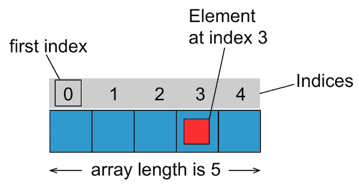

# Java 数组

> 原文： [https://javatutorial.net/java-array](https://javatutorial.net/java-array)

在本教程中，我将向您展示如何在 Java 中创建和使用数组

数组是同一类型的变量的集合。 数组有多种用途。 例如，您可能希望将所有价格存储在一个数组中。 但是使数组真正有用的是可以使用存储在数组中的值的方式。

在 Java 中声明新数组的一般形式如下：

```java
type arrayName[] = new type[numberOfElements];
```

其中`type`是基本类型（请在[教程](http://javatutorial.net/java-primitive-types "Java Primitive Types")中了解有关基本类型的更多信息）或对象。`numberOfElements`是将存储到数组中的元素数。 此值不能更改。 Java 不支持动态数组。 如果需要灵活，动态的结构来保存对象，则可能需要使用某些 Java 集合。 有关更多详细信息，请参见 [Java 集合教程](https://javatutorial.net/choose-the-right-java-collection)。

## 总览

Java 支持一维或多维数组。



数组中的每个项目都称为元素，并且每个元素都通过其数字索引进行访问。 如上图所示，编号从 0 开始。例如，第 4 个元素将在索引 3 处访问。

## 初始化数组

让我们创建一个数组来存储一个 5 人的小公司中所有雇员的薪水。

```java
int salaries[] = new int[5];
```

数组的类型（在本例中为`int`）适用于数组中的所有值。 您不能在一个数组中混合类型。

## 将值放入数组

现在我们已经初始化了`salaries`数组，我们想要在其中添加一些值。 我们可以在初始化期间执行以下操作：

```java
int salaries[] = {50000, 75340, 110500, 98270, 39400};
```

或稍后再执行以下操作：

```java
int salaries[] = new int[5];
salaries[0] = 50000;
salaries[1] = 75340;
salaries[2] = 110500;
salaries[3] = 98270;
salaries[4] = 39400;
```

## 遍历数组

您可以像这样调用特定元素的值来使用它：

```java
System.out.println("The value of the 4th element in the array is " + salaries[3]);
```

这将产生输出：

```java
The value of the 4th element in the array is 98270
```

也可以使用`for`循环或`while`循环遍历数组中所有元素的值。 在我们先前的教程 [Java 循环](http://javatutorial.net/java-loops "Java Loops")中进一步了解循环

```java
public class ArrayExample {
	public static void main(String[] args) {
		int salaries[] = {50000, 75340, 110500, 98270, 39400};
		for(int i=0; i<salaries.length; i++) {
			System.out.println("The element at index " + i + " has the value of " + salaries[i]);
		}
	}
}
```

上面程序产生的输出是：

```java
The element at index 0 has the value of 50000
The element at index 1 has the value of 75340
The element at index 2 has the value of 110500
The element at index 3 has the value of 98270
The element at index 4 has the value of 39400
```

注意`salaries.length`的使用。 Java 中的数组具有`length`属性，该属性返回数组的长度。