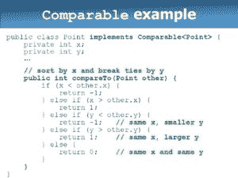

# Java 比较器示例

> 原文： [https://javatutorial.net/java-comparator-example](https://javatutorial.net/java-comparator-example)

在本教程中，我们将讨论 Java 比较器及其示例。

## 什么是 Java 比较器？

Java `Comparator`是用于比较 Java 对象的接口。 在`java.util.comparator`包中，Java `Comparator`的`compare(Object 01, Object 02)`方法比较两个 Java 对象。

通过使用可配置的方法，Java `Comparator`可以以正数、零或负数返回比较结果。 由于不限于检查数字，因此可以将 Java `Comparator`用于比较任何对象。 使用`java.io.Serializable`，可以将 Java 比较器同样用于有效地比较序列化的信息结构。

Java `Comparator`类似于`Comparable`接口，但可用于交换排序顺序，其中`Comparable`可通过常规顺序（如字典序）进行排序。

## 语法

```java
public int compare(Object obj1, Object obj2)
```

如何使用 Java 比较器？

[`TreeSet`](https://javatutorial.net/java-treeset-example)和[`TreeMap`](https://javatutorial.net/java-treemap-example) 都以自然顺序存储元素。 不管怎样，比较器明确地描述了用于排序的顺序。

比较器接口具有两种技术的特征：`compare()`和`equals()`。存在`compare()`方法，专注于请求的两个组成部分：

## `compare`方法

int compare（Object obj1，Object obj2）

`obj1`和`obj2`得到比较。 如果对象相等，则此方法返回零。 如果`obj1`比`obj2`更大，它将返回正数。 否则返回负数。

通过实现`compare()`，可以修改比较的方式。 例如，要按反向进行排序，可以使比较器反转比较结果。



## `equals`方法

存在`equals()`方法，用于测试对象是否与调用比较器相符 -

`boolean equals(Object obj)`

`obj`是检查是否相等的对象。 如果`obj`和被调用对象都是`Comparator`，并且使用类似的方法，则该方法返回真。 否则，它返回`false`。

废除`equals()`是多余的，大多数直接比较器都不会这样做。

## Java 比较器示例

```java
import java.util.*;

class Dog implements Comparator<Dog>, Comparable<Dog> {
   private String name;
   private int age;
   Dog() {
   }

   Dog(String n, int a) {
      name = n;
      age = a;
   }

   public String getDogName() {
      return name;
   }

   public int getDogAge() {
      return age;
   }

   // Overriding the compareTo method
   public int compareTo(Dog d) {
      return (this.name).compareTo(d.name);
   }

   // Overriding the compare method to sort the age 
   public int compare(Dog d, Dog d1) {
      return d.age - d1.age;
   }
}

public class Example {

   public static void main(String args[]) {
      // Takes a list o Dog objects
      List<Dog> list = new ArrayList<Dog>();

      list.add(new Dog("Shaggy", 3));
      list.add(new Dog("Lacy", 2));
      list.add(new Dog("Roger", 10));
      list.add(new Dog("Tommy", 4));
      list.add(new Dog("Tammy", 1));
      Collections.sort(list);   // Sorts the array list

      for(Dog a: list)   // printing the sorted list of names
         System.out.print(a.getDogName() + ", ");

      // Sorts the array list using comparator
      Collections.sort(list, new Dog());
      System.out.println(" ");

      for(Dog a: list)   // printing the sorted list of ages
         System.out.print(a.getDogName() +"  : "+ a.getDogAge() + ", ");
   }
}
```

```java
OUTPUT:
```

```java
Lacy, Roger, Shaggy, Tammy, Tommy,
Tammy  : 1, Lacy  : 2, Shaggy  : 3, Tommy  : 4, Roger  : 10,
```

#### Java 比较器的工作示例。

```java
import java.util.ArrayList; 
import java.util.Collections; 
import java.util.Iterator; 
import java.util.List; 
import java.util.Comparator; 

class Student { 

    // instance member variables 
    String Name; 
    int Age; 

    // parameterized constructor 
    public Student(String Name, Integer Age) { 
        this.Name = Name; 
        this.Age = Age; 
    } 

    public String getName() { 
        return Name; 
    } 

    public void setName(String Name) { 
        this.Name = Name; 
    } 

    public Integer getAge() { 
        return Age; 
    } 

    public void setAge(Integer Age) { 
        this.Age = Age; 
    } 

    // overriding toString() method 
    @Override
    public String toString() { 
        return "Customer{" + "Name=" + Name + ", Age=" + Age + '}'; 
    } 

    static class CustomerSortingComparator implements Comparator<Student> { 

        @Override
        public int compare(Student customer1, Student customer2) { 

            // for comparison 
            int NameCompare = customer1.getName().compareTo(customer2.getName()); 
            int AgeCompare = customer1.getAge().compareTo(customer2.getAge()); 

            // 2-level comparison using if-else block 
            if (NameCompare == 0) { 
                return ((AgeCompare == 0) ? NameCompare : AgeCompare); 
            } else { 
                return NameCompare; 
            } 
        } 
    } 

    public static void main(String[] args) { 

        // create ArrayList to store Student 
        List<Student> al = new ArrayList<>(); 

        // create customer objects using constructor initialization 
        Student obj1 = new Student("Ajay", 27); 
        Student obj2 = new Student("Sneha", 23); 
        Student obj3 = new Student("Simran", 37); 
        Student obj4 = new Student("Ajay", 22); 
        Student obj5 = new Student("Ajay", 29); 
        Student obj6 = new Student("Sneha", 22); 

        // add customer objects to ArrayList 
        al.add(obj1); 
        al.add(obj2); 
        al.add(obj3); 
        al.add(obj4); 
        al.add(obj5); 
        al.add(obj6); 

        // before Sorting arraylist: iterate using Iterator 
        Iterator<Student> custIterator = al.iterator(); 

        System.out.println("Before Sorting:\n"); 
        while (custIterator.hasNext()) { 
            System.out.println(custIterator.next()); 
        } 

        // sorting using Collections.sort(al, comparator); 
        Collections.sort(al, new CustomerSortingComparator()); 

        // after Sorting arraylist: iterate using enhanced for-loop 
        System.out.println("\n\nAfter Sorting:\n"); 
        for (Student customer : al) { 
            System.out.println(customer); 
        } 
    } 
}
```

**输出**：

```java
Unsorted
111 bbbb london
131 aaaa nyc
121 cccc jaipur

Sorted by rollno
111 bbbb london
121 cccc jaipur
131 aaaa nyc

Sorted by name
131 aaaa nyc
111 bbbb london
121 cccc jaipu
```