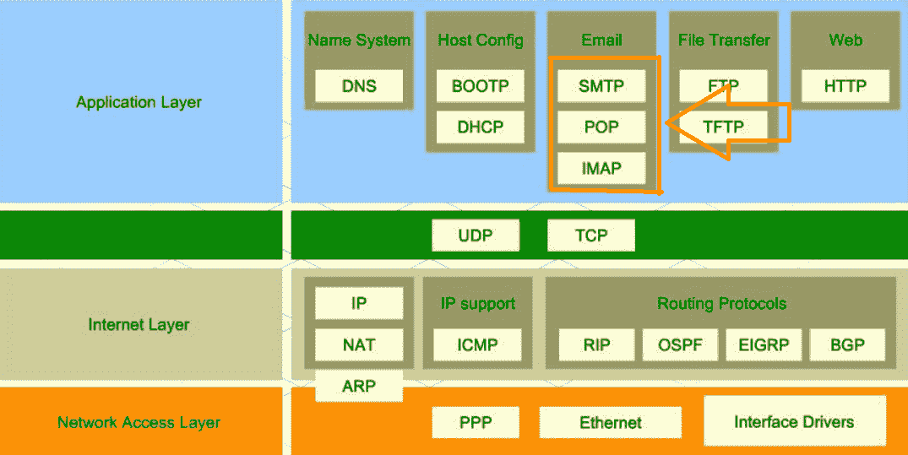
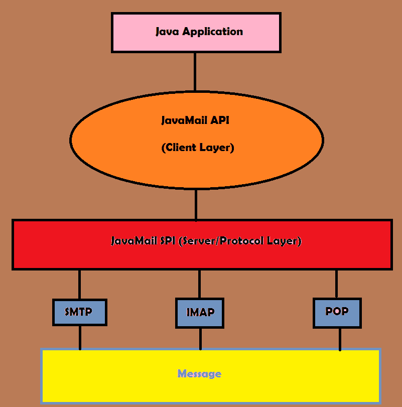

# Java 发送电子邮件示例

> 原文： [https://javatutorial.net/java-send-mail-example](https://javatutorial.net/java-send-mail-example)

JavaMail API 使平台和协议无关的框架，旨在帮助构建消息传递和邮件应用程序。 它是可选软件包，可用于 [Java](https://javatutorial.net/install-java-9-eclipse) SE 平台，也包含在 Java EE 平台中。


JavaMail 在许多情况下都非常有用。 例如，当用户单击“忘记密码”（通过向用户设置的相应电子邮件发送电子邮件），注册网站中的事件（通过电子邮件发送有关该事件的更多详细信息）时，可以使用该功能。

## JavaMail API 中使用的主要协议

*   SMTP
*   POP
*   IMAP

如果您有使用计算机网络的经验，则可能听说过其中的一些（如果不是全部）。 但是，如果您没有计算机网络的经验，那么让我为您分解这些协议。

## 应用层

在具体介绍电子邮件协议的解释之前，让我首先为您介绍计算机网络中各层的简单示意图。



网络层

您可以看到 SMTP，POP，IMAP 和基本上所有电子邮件协议都在应用程序层下。

传输层的协议为应用程序提供主机到主机的通信服务。

网络层是一组方法，协议和规范，用于在必要时通过网络将源数据包从源主机传输到 IP 地址指定的目标主机。

网络访问层中的协议为系统提供了将数据传递到直接连接的网络上的其他设备的方法。

既然您知道每一层的用途是什么，我们就可以开始更深入地了解什么是 SMTP，POP，IMAP。

### SMTP

SMTP 代表简单邮件传输协议。 它是一种标准的互联网协议，用于跨互联网协议网络的电子邮件传输。 还有本身不是协议的 SMTPS。 SMTPS 本质上是受 SSL 保护的 SMTP 连接。

### POP

POP 代表邮局协议，是本地电子邮件客户端用来通过 TCP / IP 连接从远程服务器检索电子邮件的应用程序层互联网标准协议。 POP 支持下载和删除访问远程邮箱的要求。

### IMAP

IMAP 代表互联网消息访问协议。 电子邮件客户端使用的一种互联网标准协议，它通过 TCP / IP 连接从邮件服务器检索电子邮件。 它还允许电子邮件客户端访问远程邮件服务器上的电子邮件。 传入的电子邮件被发送到电子邮件服务器，该服务器将消息存储在收件人的电子邮件框中。

## JavaMail 架构

现在该介绍 Java 邮件架构了。



使用 JavaMail API 的 Java 应用程序工作流程

从图中可以看到，JavaMail API 是客户端层。 它直接与 SPI（服务器/协议层）相关联，然后在 SMTP，IMAP 或 POP 之间进行选择，并在选择协议后发送消息。

## 使用 JavaMail API 发送电子邮件的示例

在我们开始之前，请确保您已经安装了必要的[`.jar`文件](http://www.java2s.com/Code/Jar/j/Downloadjavamail144jar.htm)。 也可以在 [Oracle 网站](https://javaee.github.io/javamail/)上找到它们。 去那里下载最新版本。 另外，您可能需要下载 [fakeSTMP](http://nilhcem.com/FakeSMTP/index.html) 。 fakeSTMP 用于测试目的。 对于此示例，您需要在计算机上安装 SMTP。

为了能够通过您的 gmail 帐户发送邮件，您应该在 Google 帐户安全设置中允许使用不安全的应用程序（从 gmail 的角度来说就是您的应用程序）。


### `EmailSender.java`

要导入所有必需的库，您需要导入 4 件事。

```java
import java.util.*;  
import javax.mail.*;  
import javax.mail.internet.*;  
import javax.activation.*;
```

之后，我只需要创建一个主要方法即可将变量放入其中。 将接收电子邮件，发件人电子邮件和主机的电子邮件。

```java
public class EmailSender {
    public static void main(String[] args) {
        String destinationEmail = "yanicha93@gmail.com";
        String senderEmail      = "yanicha93@gmail.com";
        String host             = "localhost";
    }
}
```

接下来的几行将负责获取会话对象。

```java
Properties properties = System.getProperties():
properties.setProperty("mail.smtp.host", host);
Session session = Session.getDefaultInstance(properties);
```

**创建会话对象的目的是什么？**

该会话是您如何与邮件主机进行交互的上下文。 这可能包括调试邮件主机的输出，超时和身份验证机制。

最后，我们正在发送实际的消息。

```java
        try {
            MimeMessage message = new MimeMessage(session);
            message.setFrom(new InternetAddress(senderEmail));
            message.addRecipient(Message.RecipientType.TO, new InternetAddress(destinationEmail));
            message.setSubject("Hello");
            message.setText("Hey, ignore this email, this is just an example");
            Transport.send(message);
            System.out.println("Sent Successfully");
        } 
        catch (MessagingException mex) {
            mex.printStackTrace();
        }
```

在这里，我们正在创建一条消息，紧接着设置发送电子邮件的人（在本例中为`senderEmail`。此后，我们只需使用`message.addRecipient()`方法添加目标电子邮件即可。然后，设置邮件的主题 电子邮件（您可以将其设置为任意内容），然后我们设置文本（同样，您可以将其设置为任意内容）。然后，我们只需发送邮件即可。

好的！ 我们发送了消息。

### 完整的代码段：

```java
import java.util.*;  
import javax.mail.*;  
import javax.mail.internet.*;  
import javax.activation.*; 

public class EmailSender {
    public static void main(String[] args) {
        String destinationEmail = "yanicha93@gmail.com";
        String senderEmail      = "yanicha93@gmail.com";
        String host             = "localhost";
        Properties properties = System.getProperties();
        properties.setProperty("mail.smtp.host", host);
        Session session = Session.getDefaultInstance(properties);

        try {
            MimeMessage message = new MimeMessage(session);
            message.setFrom(new InternetAddress(senderEmail));
            message.addRecipient(Message.RecipientType.TO, new InternetAddress(destinationEmail));
            message.setSubject("Hello");
            message.setText("Hey, ignore this email, this is just an example");
            Transport.send(message);
            System.out.println("Sent Successfully");
        } 
        catch (MessagingException mex) {
            mex.printStackTrace();
        }
    }
}
```