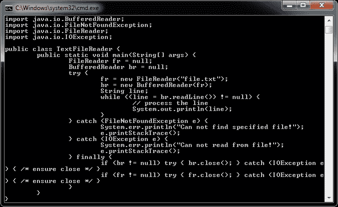

# Java 读取文件示例

> 原文： [https://javatutorial.net/java-read-file-example](https://javatutorial.net/java-read-file-example)

在此示例中，我将向您展示如何使用 Java 编程语言读取文件。



以下示例显示了如何逐行读取文件。 这种方法对于读取大型文本文件是安全的，因为一次只能将一行加载到内存中。 尽管有多种读取 Java 文件的方法，但是此示例在新版本以及早期 Java 版本上都可以很好地工作。

```java
FileReader fr = null;
BufferedReader br = null;
try {
	fr = new FileReader("file.txt");
	br = new BufferedReader(fr);
	String line;
	while ((line = br.readLine()) != null) {
		// process the line
		System.out.println(line);
	}
} catch (FileNotFoundException e) {
	System.err.println("Can not find specified file!");
	e.printStackTrace();
} catch (IOException e) {
	System.err.println("Can not read from file!");
	e.printStackTrace();
} finally {
	if (br != null) try { br.close(); } catch (IOException e) { /* ensure close */ }
	if (fr != null) try { fr.close(); } catch (IOException e) { /* ensure close */ }
}

```

在 Java 中，关闭流很重要。 因此，我在此示例中包含了正确的异常处理。