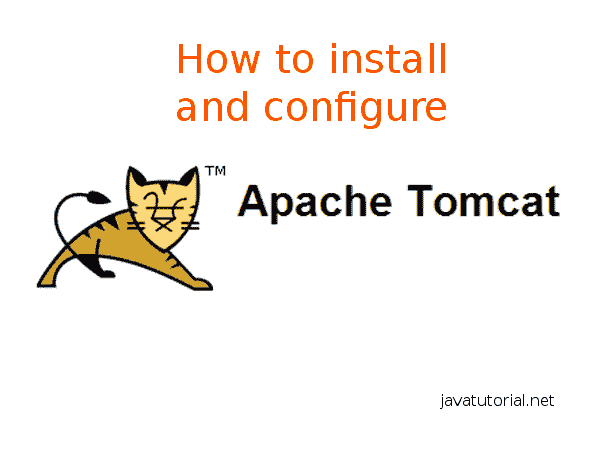

# 如何安装和配置 Tomcat 8

> 原文： [https://javatutorial.net/how-to-install-and-configure-tomcat-8](https://javatutorial.net/how-to-install-and-configure-tomcat-8)

Apache Tomcat 是当今最常见，最流行的基于 Java 的 Web 容器。 在本教程中，我将向您展示如何**安装 Tomcat 8** 并调整配置文件。



如何安装和配置 Apache Tomcat

Tomcat 的主要优点是占地面积小，配置简单以及社区参与的历史悠久。 通常情况下，开发人员可以在 5 到 10 分钟内（包括下载时间）启动功能正常的 Tomcat 安装并运行。 Tomcat 几乎不需要开箱即用的配置就可以在开发机器上正常运行，但是也可以对其进行重大调整以在高负载，高可用性的生产环境中实现出色的性能。 您可以创建大型 Tomcat 集群来可靠地处理大量流量。 由于 Tomcat 的简单性和轻巧性，它经常在商业生产环境中使用。

下表显示了 Tomcat 版本及其规格

| Tomcat 版本 | Servlet | JSP | EL | WebSocket | 所需的最低 Java 版本 |
| --- | --- | --- | --- | --- | --- |
| 3.3.x | 2.2 | 1.1 | – | – | 1.1 |
| 4.1.x | 2.3 | 1.2 | – | – | 1.3 |
| 5.5.x | 2.4 | 2.0 | – | – | 1.4 |
| 6.0.x | 2.5 | 2.1 | 2.1 | – | 5.0 |
| 7.0.x | 3.0 | 2.2 | 2.2 | – | 6 |
| 8.0.x | 3.1 | 2.3 | 3.0 | 1.0 | 7 |

## 下载 Tomcat

转到 [http://tomcat.apache.org/download-80.cgi](http://tomcat.apache.org/download-80.cgi) 并向下滚动到“二进制发行版 -&gt; 核心”。 对于 Windows，您可以在服务安装程序或 32 位或 64 位 ZIP 版本之间进行选择。 如果您想将 Tomcat 作为 Windows 服务运行而不是安装程序，那么如果要手动运行服务器或与 IDE 集成，请选择 ZIP 下载。

如果您在 Linux 或 OSX 上运行，请下载非 Windows zip，即 zip。

## 启用 Tomcat 管理器

Tomcat 管理器使您可以轻松管理应用程序并监视服务器状态。

要启用它，请在您喜欢的文本编辑器中打开文件`conf/tomcat-users.xml`，然后在`<tomcat-users>`和`</tomcat-users>`标签之间放置以下行：

```java
<user username="admin" password="admin" roles="manager-gui,admin-gui" />
```

当然，您可以根据需要设置用户名和密码。

启动服务器后，可以在`http://localhost:8080/manager`下访问管理器应用程序。

## 更改 Servlet 编译器以使用 Java 8

默认情况下，即使 Tomcat 8.0 在 Java SE 8 上运行，它也会编译具有 Java SE 6 语言支持的 JavaServer Pages（JSP）。您可以在`conf/web.xml`文件中更改此设置。 在文件中搜索文本`org.apache.jasper.servlet.JspServlet`。 包含此文本的标签下方是两个`<init-param>`标签。 将两个值都从 1.6 更改为 1.8

```java
<init-param>
    <param-name>compilerSourceVM</param-name>
    <param-value>1.8</param-value>
</init-param>
<init-param>
    <param-name>compilerTargetVM</param-name>
    <param-value>1.8</param-value>
</init-param>
```

## 如何启动和停止 Tomcat 服务器

完成所有配置后，需要启动 Tomcat 才能使用它。 如果您使用 Windows 作为托管 OS，则可能需要先阅读本教程[如何在 Windows 10](https://javatutorial.net/set-java-home-windows-10) 中设置`JAVA_HOME`，然后再继续启动 Tomcat 服务器。

启动 Tomcat 很容易，只需进入`/bin`文件夹并为 Windows 执行`startup.bat`或为 Linux 或 OSX 运行`startup.sh`。

您还可以选择从 Eclipse IDE 中启动 tomcat。 请参考本教程，以获取有关[如何从 eclipse 配置和运行 Tomcat 的更多信息](https://javatutorial.net/run-tomcat-from-eclipse)。

要停止 Tomcat，请在 Windows 操作系统上执行`shutdown.bat`，在 Linux 或 OSX 系统上执行`shutdown.sh`。