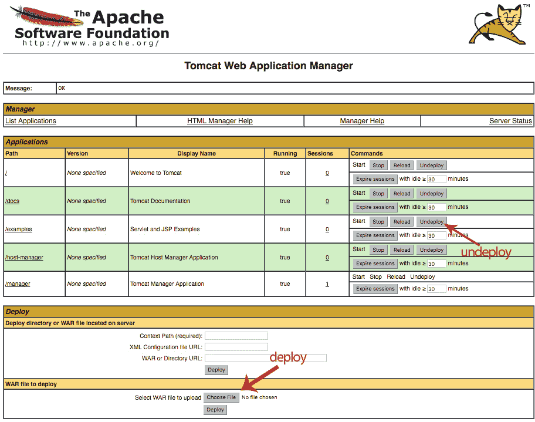

# 如何在 Tomcat 中部署和取消部署应用程序

> [https://javatutorial.net/how-to-deploy-and-undeploy-applications-in-tomcat](https://javatutorial.net/how-to-deploy-and-undeploy-applications-in-tomcat)

在本教程中，我将向您展示如何使用两种不同的方法在 Apache Tomcat 中部署和取消部署 Java EE Web 应用程序。

## 在 Tomcat 中手动部署和取消部署应用程序

在 Tomcat 中手动部署应用程序很简单 - 只需将`.war`文件放在 Tomcat 的`webapp`目录中即可。 如果您的 Tomcat 正在运行，它将把`.war`文件解压缩到一个没有 WAR 扩展名的同名文件夹中。 如果它没有运行，则部署将在启动服务器之后进行。

在部署过程中检查服务器日志中的错误始终是一个好习惯。 可能是因为您的应用程序缺少某些依赖项，或者您构建的文件`.war`文件的结构不正确–在这种情况下，部署将不会成功。

取消部署应用程序就像逆转流程一样简单。 只需从`webapp`目录中删除`.war`文件，稍后 Tomcat 会为您清除所有解压缩的文件。

## 使用 Tomcat 管理器部署和取消部署应用程序

您可以使用图形管理器界面来部署或取消部署应用程序。 如果您没有启用管理器，则可以在我们之前的 [Tomcat 配置](https://javatutorial.net/how-to-install-and-configure-tomcat-8)教程中了解更多有关如何执行此操作的信息。

使用 Tomcat 管理器部署和取消部署应用程序

1\. 打开浏览器，然后转到`http://localhost:8080/manager/html`

2\. 输入在`conf/tomcat-users.xml`文件中指定的用户名和密码

3\. 单击“要部署的 WAR 文件”部分中的“选择文件”按钮。 浏览您的`.war`文件，然后单击“部署”按钮

4\. 要取消部署应用程序，请单击其旁边的“取消部署”按钮