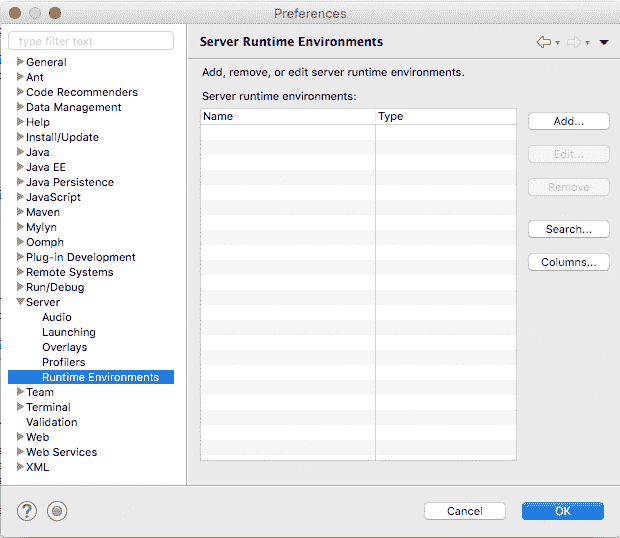
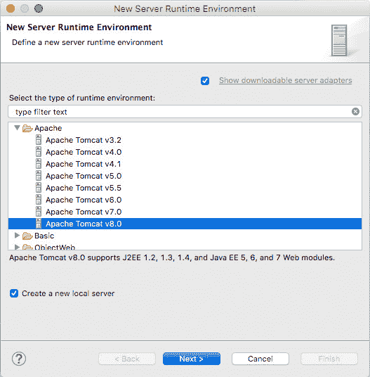
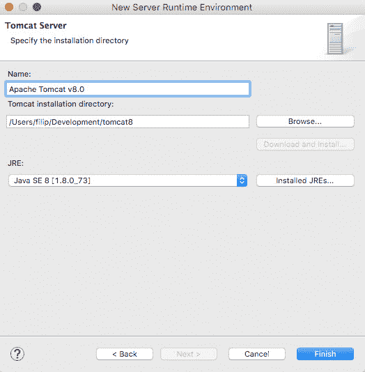
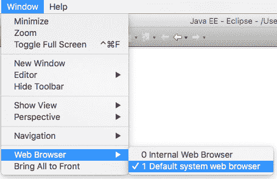
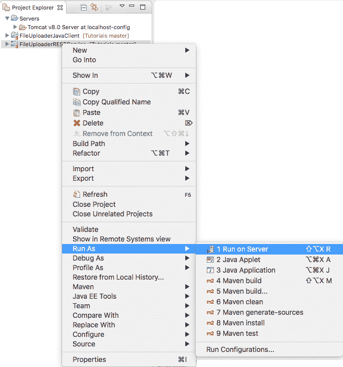

# 从 Eclipse 运行 Tomcat

> 原文： [https://javatutorial.net/run-tomcat-from-eclipse](https://javatutorial.net/run-tomcat-from-eclipse)

在本教程中，我将向您展示如何从 Eclipse [IDE](https://javatutorial.net/choose-your-java-ide-eclipse-netbeans-and-intellij-idea) 设置和运行 Apache Tomcat 8。

那么，为什么要从 Eclipse 中运行 Tomcat 呢？ 有几个原因。 首先，您可以直接调试应用程序，而无需在调试模式下运行 Tomcat 独立服务器。 其次，您可以在部署应用程序之前在其应用程序上运行 JUnit 测试。 第三，您可以直接从 Eclipse 部署应用程序。

如果尚未安装 Apache Tomcat 8，[请查看我以前关于如何安装和配置 Tomcat 8 的教程](https://javatutorial.net/how-to-install-and-configure-tomcat-8)。

## 在 Eclipse 中设置 Tomcat

**注意**：在执行以下步骤之前，请确保您正在运行较新版本的 Eclipse IDE。 早于 Eclipse Luna 4.4 的 Eclipse 版本默认不支持 Tomcat 8。 在本教程中，我已将 Eclipse Mars 2 用于 Java EE 开发人员。

1\.  在 Eclipse for Java EE 中，转到 Windows 操作系统中的“窗口 -&gt; 首选项”（或在 Mac 上为“Eclipse -&gt; 首选项”）

2\.  转到“服务器”，然后单击“运行时环境”。

3\.  单击“添加...”按钮。

4\.  在 Apache 树中，选择 Tomcat 8，然后选中“创建新的本地服务器”复选框。

5\.  在下一个屏幕上，单击“浏览...”，然后选择您的 Tomcat 安装目录。 在 JRE 下拉列表中，选择本地 Java 8 SE 安装，然后单击“完成”按钮进行确认。

**提示**：Eclipse 将使用内置浏览器打开您的 Web 应用程序。 您可以将此设置更改为更方便的浏览器，例如 Google Chrome 或 Firefox。 为此，请转到“窗口 -&gt; Web 浏览器”，然后选择“默认系统 Web 浏览器”

## 在本地服务器上从 Eclipse 运行应用程序

现在，您已经配置了 Tomcat 以在 Eclipse 中运行，您可以轻松地在此服务器上运行应用程序。 为此，请在“项目资源管理器”中右键单击您的项目，然后转到“运行方式 -&gt; 在服务器上运行”

在下一个屏幕上，选择您的 Apache Tomcat8。这将部署您的 App，并在浏览器窗口中为您打开它。