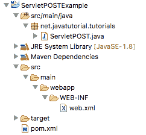
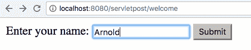
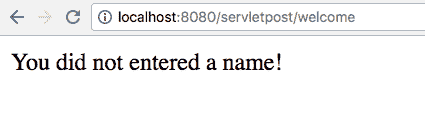

# Java Servlet POST 示例

> 原文： [https://javatutorial.net/java-servlet-post-example](https://javatutorial.net/java-servlet-post-example)

本示例演示了如何使用 Servlet 的`doPost()`方法来处理 POST 请求

在我们以前的教程的 [Java Servlet 实现示例](https://javatutorial.net/java-servlet-example)中我展示了`doGet()`方法的使用。 现在，我将向您展示如何使用`doPost()`方法来处理表单 POST 提交。 Java Servlet 可以处理各种类型的请求。 下面的列表显示了所有方法及其用途

| **方法** | **SERVLET 方法** | **目的** |
| --- | --- | --- |
| GET | `doGet()` | 在指定的 URL 检索资源 |
| HEAD | `doHead()` | 与 GET 相同，只返回标头 |
| POST | `doPost()` | 通常用于 Web 表单提交 |
| PUT | `doPut()` | 将提供的实体存储在 URL |
| DELETE | `doDelete()` | 删除 URL 标识的资源 |
| OPTIONS | `doOptions()` | 返回允许的 HTTP 方法 |
| TRACE | `doTrace()` | 用于诊断 |

## 项目结构

在我们的项目中，我们确实需要三个文件。`pom.xml` – 设置 Maven 依赖关系和构建属性，`web.xml` – 将 Servlet 和 Servlet 本身配置为 java 类



Servlet POST 示例项目结构

## `pom.xml`文件

```java
<project xmlns="http://maven.apache.org/POM/4.0.0" xmlns:xsi="http://www.w3.org/2001/XMLSchema-instance"
	xsi:schemaLocation="http://maven.apache.org/POM/4.0.0 http://maven.apache.org/xsd/maven-4.0.0.xsd">
	<modelVersion>4.0.0</modelVersion>

	<groupId>net.javatutorial.tutorials</groupId>
	<artifactId>ServletPOSTExample</artifactId>
	<version>1</version>
	<packaging>war</packaging>

	<name>Servlet POST Example</name>
	<url>https://javatutorial.net</url>

	<properties>
		<project.build.sourceEncoding>UTF-8</project.build.sourceEncoding>
	</properties>

	<dependencies>
		<dependency>
			<groupId>javax.servlet</groupId>
			<artifactId>javax.servlet-api</artifactId>
			<version>3.1.0</version>
			<scope>provided</scope>
		</dependency>
	</dependencies>

	<build>
		<finalName>servletpost</finalName>
        <sourceDirectory>src/main/java</sourceDirectory>

        <plugins>
            <plugin>
                <groupId>org.apache.maven.plugins</groupId>
                <artifactId>maven-war-plugin</artifactId>
                <version>2.3</version>
                <configuration>
                    <warSourceDirectory>src/main/webapp</warSourceDirectory>
                </configuration>
            </plugin>
            <plugin>
                <groupId>org.apache.maven.plugins</groupId>
                <artifactId>maven-compiler-plugin</artifactId>
                <version>3.1</version>
                <configuration>
                    <source>1.8</source>
                    <target>1.8</target>
                </configuration>
            </plugin>
        </plugins>
    </build>
</project>
```

与上一教程一样，我们将 Servlet 的依赖项`javax.servlet-api`和`maven-war-plugin`的依赖关系用于构建网络应用

## 在`web.xml`文件中映射 Servlet

```java
<?xml version="1.0" encoding="UTF-8"?>

<web-app xmlns="http://xmlns.jcp.org/xml/ns/javaee" 
	xmlns:xsi="http://www.w3.org/2001/XMLSchema-instance"
	xsi:schemaLocation="http://xmlns.jcp.org/xml/ns/javaee http://xmlns.jcp.org/xml/ns/javaee/web-app_3_1.xsd"
	version="3.1">

	<display-name>Simple Servlet Application</display-name>

	<servlet>
		<servlet-name>servletPost</servlet-name>
		<servlet-class>net.javatutorial.tutorials.ServletPOST</servlet-class>
		<load-on-startup>1</load-on-startup>
	</servlet>

	<servlet-mapping>
		<servlet-name>servletPost</servlet-name>
		<url-pattern>/welcome</url-pattern>
	</servlet-mapping>

</web-app>
```

Servlet 被赋予一个名为`ServletPost`的名称，该名称指向 Java 类`ServletPOST`。

在 servlet 映射中，我们将 url `/welcome`分配给 servlet

## Servlet 类

```java
package net.javatutorial.tutorials;

import java.io.IOException;
import java.io.PrintWriter;

import javax.servlet.ServletException;
import javax.servlet.http.HttpServlet;
import javax.servlet.http.HttpServletRequest;
import javax.servlet.http.HttpServletResponse;

public class ServletPOST extends HttpServlet {

	private static final long serialVersionUID = -1641096228274971485L;

	@Override
	protected void doGet(HttpServletRequest request, HttpServletResponse response) 
			throws ServletException, IOException {

		// set response headers
		response.setContentType("text/html");
		response.setCharacterEncoding("UTF-8");

		// create HTML form
		PrintWriter writer = response.getWriter();
		writer.append("<!DOCTYPE html>\r\n")
			  .append("<html>\r\n")
			  .append("		<head>\r\n")
			  .append("			<title>Form input</title>\r\n")
			  .append("		</head>\r\n")
			  .append("		<body>\r\n")
			  .append("			<form action=\"welcome\" method=\"POST\">\r\n")
			  .append("				Enter your name: \r\n")
			  .append("				<input type=\"text\" name=\"user\" />\r\n")
			  .append("				<input type=\"submit\" value=\"Submit\" />\r\n")
			  .append("			</form>\r\n")
			  .append("		</body>\r\n")
			  .append("</html>\r\n");
	}

	@Override
	protected void doPost(HttpServletRequest request, HttpServletResponse response) 
			throws ServletException, IOException {
		String user = request.getParameter("user");

		response.setContentType("text/html");
		response.setCharacterEncoding("UTF-8");

		// create HTML response
		PrintWriter writer = response.getWriter();
		writer.append("<!DOCTYPE html>\r\n")
			  .append("<html>\r\n")
			  .append("		<head>\r\n")
			  .append("			<title>Welcome message</title>\r\n")
			  .append("		</head>\r\n")
			  .append("		<body>\r\n");
		if (user != null && !user.trim().isEmpty()) {
			writer.append("	Welcome " + user + ".\r\n");
			writer.append("	You successfully completed this javatutorial.net example.\r\n");
		} else {
			writer.append("	You did not entered a name!\r\n");
		}
		writer.append("		</body>\r\n")
			  .append("</html>\r\n");
	}	

}

```

在上面的代码中，`doGet()`方法用于显示表单。 客户端（浏览器）使用 GET 请求调用网址 http://yoururl.com:8080/servletpost/welcome ，它显示以下形式



输入表单

该 servlet 在客户端的浏览器中呈现为 HTML，如下所示：

```java
<!DOCTYPE html>
<html>
		<head>
			<title>Form input</title>
		</head>
		<body>
			<form action="welcome" method="POST">
				Enter your name: 
				<input type="text" name="user" />
				<input type="submit" value="Submit" />
			</form>
		</body>
</html>

```

提交后，将调用 servlet 中的`doPost()`方法。 在这里，我们根据用户的输入来建立响应。 如果正确填写了姓名字段，则用户会收到问候消息


响应后

…或警告消息（如果表单中的名称字段留空）



如果缺少名称，则会出现错误消息

您可以在我们的 GitHub 存储库中找到[项目源](https://github.com/JavaTutorialNetwork/Tutorials/tree/master/ServletPOSTExample)。