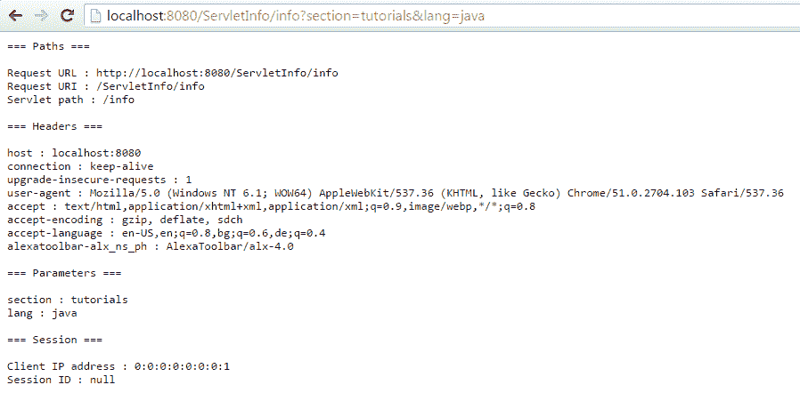

# Servlet 请求信息示例

> 原文： [https://javatutorial.net/servlet-request-info-example](https://javatutorial.net/servlet-request-info-example)

在本教程中，我将向您展示如何从 Servlet `Request`对象检索各种数据，例如标头，参数，路径和会话数据

当客户端（浏览器）向 Servlet 发出 GET，POST，PUT 等请求时，`HttpServletRequest`对象将保存有关客户端和请求本身的有价值的信息。 在下面的示例中，我将列出请求对象的一些最有趣的方法以及如何提取信息。

```java
package net.javatutorial.tutorials;

import java.io.IOException;
import java.io.PrintWriter;
import java.util.Enumeration;
import java.util.Map;

import javax.servlet.ServletException;
import javax.servlet.http.Cookie;
import javax.servlet.http.HttpServlet;
import javax.servlet.http.HttpServletRequest;
import javax.servlet.http.HttpServletResponse;

public class ServletInfo extends HttpServlet {

	private static final long serialVersionUID = -2383814320847175129L;

	@Override
	protected void doGet(HttpServletRequest request, HttpServletResponse response) 
			throws ServletException, IOException {
		PrintWriter pr = response.getWriter();

		pr.println("=== Paths ===\n");
		pr.println("Request URL : " + request.getRequestURL());
		pr.println("Request URI : " + request.getRequestURI());
		pr.println("Servlet path : " + request.getServletPath());

		pr.println("\n=== Headers ===\n");
		Enumeration<String> e = request.getHeaderNames();
		while(e.hasMoreElements()){
			String param = (String) e.nextElement();
			pr.println(param + " : " + request.getHeader(param));
		}

		pr.println("\n=== Parameters ===\n");
		Map<String, String[]> paramsMap = request.getParameterMap();
		for (String key : paramsMap.keySet()) {
			pr.println(key + " : " + request.getParameter(key));
		}

		pr.println("\n=== Session ===\n");
		// returns 0:0:0:0:0:0:0:1 if executed from localhost
		pr.println("Client IP address : " + request.getRemoteAddr());
		pr.println("Session ID : " + request.getRequestedSessionId());
		// Cookie objects the client sent with this request
		Cookie[] cookies = request.getCookies();
		if (cookies != null) {
			for (Cookie cookie : cookies) {
				pr.print(cookie.getName() + ";");
			}
		}
	}

}

```

从我的 Google Chrome 版本 51.0.2704.103 请求`http://localhost:8080/ServletInfo/nfo?section=tutorials&lang=java`的`localhost` Tomcat 服务器上的 servlet 显示以下输出：



请求信息输出

## `HttpServletRequest`方法

`getRequestURL()` – 返回客户端用于发出请求的整个 URL，包括协议（http 或 https），服务器名称，端口号和服务器路径，但不包括查询参数

`getRequestURI()` – 仅返回 URL 的服务器路径部分

`getServletPath()` – 返回在 Tomcat 中部署的应用程序路径（在上面的示例中为`/info`）

`getHeaderNames()` – 返回与请求一起传递的所有标头中的名称的枚举

`getHeader(headerName)` – 返回具有给定名称的标头的值

`getParameterMap()` – 返回带有所有参数及其值的`HashMap`

`getParameter(key)` – 返回具有给定键（名称）的参数的值

`getRemoteAddr()` – 返回客户端的 IP 地址。 如果请求是在本地主机上执行的，则返回值为`0:0:0:0:0:0:0:1`或`127.0.0.1`的 IPv6 等效值

`getRequestedSessionId()` – 返回远程会话 ID（如果提供）

`getCookies()` – 返回与此请求一起发送的客户端的`Cookie`对象数组

您可以在 GitHub 中找到整个项目： [https://github.com/JavaTutorialNetwork/Tutorials/tree/master/ServletInfo](https://github.com/JavaTutorialNetwork/Tutorials/tree/master/ServletInfo)