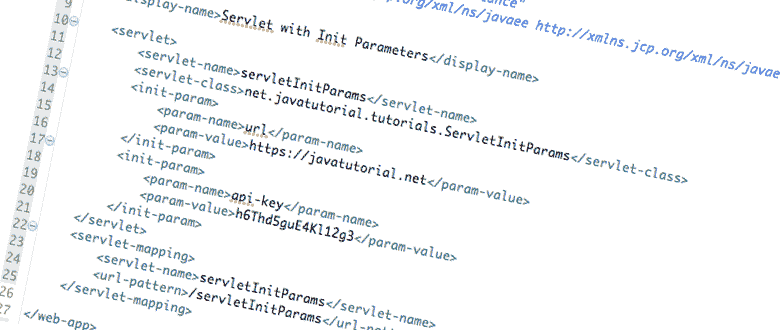

# 使用初始化参数配置 Java Web 应用程序

> 原文： [https://javatutorial.net/java-init-parameters](https://javatutorial.net/java-init-parameters)

本示例演示了使用初始化参数来配置 [Java](https://javatutorial.net/install-java-9-eclipse) Web 应用程序

初始化参数非常适合设置变量，将来可能需要更改。 例如，您可以使用初始化参数来存储数据库连接或存储外部 API 密钥或 URL。 使用初始化参数的好处是，您可以轻松更改配置，而无需重新编译整个应用程序。



使用`init-param`和`context-param`配置 Java Web 应用程序

## 注解与部署描述符

在前面的示例中，我们演示了使用[注解配置 Servlet](https://javatutorial.net/servlet-annotation-example) 的用法。 尽管您可以使用注解来设置初始化参数，但我不建议您这样做。 原因是，如果使用注解来设置初始化参数，则每次需要更改参数时都必须重新编译应用程序。 使用部署描述符来设置初始化参数要好得多。 一旦将初始化参数值放入`web.xml`文件中并需要更改它们，您要做的就是用更改后的值重新启动应用程序。 无需重新编译，无需重新部署！

## `@WebInitParam`注解

下面的示例显示 Servlet 声明中`@WebInitParam`注解的用法

```java
@WebServlet(
		name = "servletParamAnnotation", 
		urlPatterns = {"/servletParamAnnotation"}, 
		initParams = {
				@WebInitParam(name = "server", value = "https://javatutorial.net"), 
				@WebInitParam(name = "api-key", value = "h6Thd5guE4Kl12g3")
		} )
public class InitParamServletAnnotations extends HttpServlet {
	// ...
}
```

如前所述，如果您选择设置初始化参数，则需要重新编译和重新部署应用程序。

## 上下文初始化参数

如果要在整个应用程序中共享参数，那么上下文初始化参数是一个很好的选择。 应用程序中的每个 Servlet 都共享这些初始化参数，并且它们的值在所有 Servlet 中都相同。 您可以使用以下`<context-param>`，`<param-name>`和`<param-value>`标记在`web.xml`文件中设置上下文参数：

```java
<context-param>
	<param-name>url</param-name>
	<param-value>https://javatutorial.net</param-value>
</context-param>
<context-param>
	<param-name>api-key</param-name>
	<param-value>h6Thd5guE4Kl12g3</param-value>
</context-param>
```

稍后，您可以像这样简单地在 servlet 或其他组件中使用此参数：

```java
package net.javatutorial.tutorials;

import java.io.IOException;
import java.io.PrintWriter;

import javax.servlet.ServletContext;
import javax.servlet.ServletException;
import javax.servlet.http.HttpServlet;
import javax.servlet.http.HttpServletRequest;
import javax.servlet.http.HttpServletResponse;

public class ServletContextParams extends HttpServlet {

	private static final long serialVersionUID = -3462096555274971485L;

	@Override
	protected void doGet(HttpServletRequest reqest, HttpServletResponse response) 
			throws ServletException, IOException {

		ServletContext c = this.getServletContext();
		PrintWriter writer = response.getWriter();
		writer.append("URL: ").append(c.getInitParameter("url")).append(", API KEY: ")
				.append(c.getInitParameter("api-key"));
	}

}

```

## Servlet 初始化参数

`web.xml`文件中的`<init-param>`标记创建特定于给定 Servlet 的初始化参数。

```java
<?xml version="1.0" encoding="UTF-8"?>

<web-app xmlns="http://xmlns.jcp.org/xml/ns/javaee" 
	xmlns:xsi="http://www.w3.org/2001/XMLSchema-instance"
	xsi:schemaLocation="http://xmlns.jcp.org/xml/ns/javaee http://xmlns.jcp.org/xml/ns/javaee/web-app_3_1.xsd"
	version="3.1">

	<display-name>Servlet with Init Parameters</display-name>

	<servlet>
		<servlet-name>servletInitParams</servlet-name>
		<servlet-class>net.javatutorial.tutorials.ServletInitParams</servlet-class>
		<init-param>
			<param-name>url</param-name>
			<param-value>https://javatutorial.net</param-value>
		</init-param>
		<init-param>
			<param-name>api-key</param-name>
			<param-value>h6Thd5guE4Kl12g3</param-value>
		</init-param>
	</servlet>
	<servlet-mapping>
		<servlet-name>servletInitParams</servlet-name>
		<url-pattern>/servletInitParams</url-pattern>
	</servlet-mapping>

</web-app>
```

在您的 Servlet 中，您可以像这样调用参数：

```java
package net.javatutorial.tutorials;

import java.io.IOException;
import java.io.PrintWriter;

import javax.servlet.ServletConfig;
import javax.servlet.ServletException;
import javax.servlet.http.HttpServlet;
import javax.servlet.http.HttpServletRequest;
import javax.servlet.http.HttpServletResponse;

public class ServletInitParams extends HttpServlet {

	private static final long serialVersionUID = -1242096555274971485L;

	@Override
	protected void doGet(HttpServletRequest reqest, HttpServletResponse response) 
			throws ServletException, IOException {

		ServletConfig c = this.getServletConfig();
		PrintWriter writer = response.getWriter();
		writer.append("URL: ").append(c.getInitParameter("url")).append(", API KEY: ")
				.append(c.getInitParameter("api-key"));
	}

}

```

注意上下文参数之间的区别，它们的用法如下：

```java
ServletContext c = this.getServletContext();
```

和初始化参数：

```java
ServletConfig c = this.getServletConfig();
```