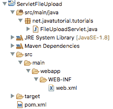
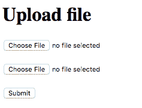

# Java Servlet 文件上传

> 原文： [https://javatutorial.net/java-servlet-file-upload](https://javatutorial.net/java-servlet-file-upload)

本示例演示如何使用 Java Servlet 上传文件

始终可以将文件上传到 Java EE Servlet，但是要完成该工作需要付出很大的努力。 Apache Foundation 甚至构建了一个称为 Commons FileUpload 的库，以使此任务更易于实现。 尽管如此，Servlet 3.0 规范弥补了这一差距，并且自 Java EE 6 起，多部分配置选项已添加到 Servlet 中，从而在`HttpServletRequest`中引入了`getPart`和`getParts`方法。

如果您有兴趣使用 WebServices 将文件上传到服务器，则可以查看本[教程](https://javatutorial.net/java-file-upload-rest-service)。

## Servlet 文件上传示例

Servlet 文件上载示例演示了`MultipartConfig`注解的用法，并使用户能够上载一个或两个文件。

该示例项目的结构非常简单。 它由一个 servlet 文件`FileUploadServlet.java`，`pom.xml`和可选的`web.xml`组成，这些文件用于在构建时处理依赖项。 正如我们在 [Servlet 注释示例](https://javatutorial.net/servlet-annotation-example)中讨论的那样，您可以在注释和部署描述符之间进行选择，以设置 Servlet 配置。 本示例使用注释。

下图显示了项目结构



Servlet 文件上传项目结构

在 Maven 的`pom.xml`文件中，我们需要声明的唯一依赖项是`javax.servlet`

```java
<project xmlns="http://maven.apache.org/POM/4.0.0" xmlns:xsi="http://www.w3.org/2001/XMLSchema-instance"
	xsi:schemaLocation="http://maven.apache.org/POM/4.0.0 http://maven.apache.org/xsd/maven-4.0.0.xsd">
	<modelVersion>4.0.0</modelVersion>

	<groupId>net.javatutorial.tutorials</groupId>
	<artifactId>ServletFileUpload</artifactId>
	<version>1</version>
	<packaging>war</packaging>

	<name>ServletFileUpload</name>
	<url>https://javatutorial.net</url>

	<properties>
		<project.build.sourceEncoding>UTF-8</project.build.sourceEncoding>
	</properties>

	<dependencies>
		<dependency>
			<groupId>javax.servlet</groupId>
			<artifactId>javax.servlet-api</artifactId>
			<version>3.1.0</version>
			<scope>provided</scope>
		</dependency>
	</dependencies>

	<build>
		<finalName>fileuploader</finalName>
        <sourceDirectory>src/main/java</sourceDirectory>

        <plugins>
            <plugin>
                <groupId>org.apache.maven.plugins</groupId>
                <artifactId>maven-war-plugin</artifactId>
                <version>2.3</version>
                <configuration>
                    <warSourceDirectory>src/main/webapp</warSourceDirectory>
                </configuration>
            </plugin>
            <plugin>
                <groupId>org.apache.maven.plugins</groupId>
                <artifactId>maven-compiler-plugin</artifactId>
                <version>3.1</version>
                <configuration>
                    <source>1.8</source>
                    <target>1.8</target>
                </configuration>
            </plugin>
        </plugins>
    </build>
</project>

```

文件上传 servlet 是我们项目的核心。 它只有两种方法 - `goGet`（显示上载表格）和`doPost`（完成整个上载工作）。

```java
package net.javatutorial.tutorials;

import java.io.File;
import java.io.IOException;
import java.io.PrintWriter;

import javax.servlet.ServletException;
import javax.servlet.annotation.MultipartConfig;
import javax.servlet.annotation.WebServlet;
import javax.servlet.http.HttpServlet;
import javax.servlet.http.HttpServletRequest;
import javax.servlet.http.HttpServletResponse;
import javax.servlet.http.Part;

@WebServlet(name = "uploadServlet", urlPatterns = { "/upload" }, loadOnStartup = 1)
@MultipartConfig(fileSizeThreshold = 6291456, // 6 MB
		maxFileSize = 10485760L, // 10 MB
		maxRequestSize = 20971520L // 20 MB
)
public class FileUploadServlet extends HttpServlet {

	private static final long serialVersionUID = 5619951677845873534L;

	private static final String UPLOAD_DIR = "uploads";

	@Override
	protected void doGet(HttpServletRequest request, HttpServletResponse response)
			throws ServletException, IOException {
		response.setContentType("text/html");
		response.setCharacterEncoding("UTF-8");

		PrintWriter writer = response.getWriter();
		writer.append("<!DOCTYPE html>\r\n")
		.append("<html>\r\n")
		.append("    <head>\r\n")
		.append("        <title>File Upload Form</title>\r\n")
		.append("    </head>\r\n")
		.append("    <body>\r\n");

		writer.append("<h1>Upload file</h1>\r\n");
		writer.append("<form method=\"POST\" action=\"upload\" ")
		.append("enctype=\"multipart/form-data\">\r\n");
		writer.append("<input type=\"file\" name=\"fileName1\"/><br/><br/>\r\n");
		writer.append("<input type=\"file\" name=\"fileName2\"/><br/><br/>\r\n");
		writer.append("<input type=\"submit\" value=\"Submit\"/>\r\n");
		writer.append("</form>\r\n");

		writer.append("    </body>\r\n").append("</html>\r\n");
	}

	@Override
	protected void doPost(HttpServletRequest request, HttpServletResponse response)
			throws ServletException, IOException {

		response.setContentType("text/html");
		response.setCharacterEncoding("UTF-8");

		// gets absolute path of the web application
		String applicationPath = request.getServletContext().getRealPath("");
		// constructs path of the directory to save uploaded file
		String uploadFilePath = applicationPath + File.separator + UPLOAD_DIR;

		// creates upload folder if it does not exists
		File uploadFolder = new File(uploadFilePath);
		if (!uploadFolder.exists()) {
			uploadFolder.mkdirs();
		}

		PrintWriter writer = response.getWriter();

		// write all files in upload folder
		for (Part part : request.getParts()) {
			if (part != null && part.getSize() > 0) {
				String fileName = part.getSubmittedFileName();
				String contentType = part.getContentType();

				// allows only JPEG files to be uploaded
				if (!contentType.equalsIgnoreCase("image/jpeg")) {
					continue;
				}

				part.write(uploadFilePath + File.separator + fileName);

				writer.append("File successfully uploaded to " 
						+ uploadFolder.getAbsolutePath() 
						+ File.separator
						+ fileName
						+ "<br>\r\n");
			}
		}

	}

}

```

`@MultipatrtConfig`注解使 Servlet 可以接受文件上传。 有 3 个重要属性：

*   `fileSizeThreshold` – 在将文件写入`temp`目录之前要超出的文件大小。 如果文件小于此阈值，则文件将在请求完成之前驻留在内存中。
*   `maxFileSize` – 这是允许上传的文件的最大大小。 在上面的示例中，不允许用户上传大于 10 MB 的文件
*   `maxRequestSize` – 是我们尝试通过一个请求上传的所有文件的大小的总和。 在上面的示例中，我们将该值设置为 20 MB，这意味着无论文件数量多少，我们总共可以上传 20MB

您可能要指定或不指定第四个属性。 它称为`location`，它指向 Web 容器应存储临时文件的目录。 但是，如果您未指定此属性，则容器将使用默认的`temp`文件夹。

我们重写`doGet`方法以显示具有两个文件选择器字段的简单形式。 您可能需要添加其他输入字段，因为多部分附件允许这样做。



表格上传文件

在`doPost`方法中，我们首先构造要存储上载文件的文件夹的路径。 比我们使用`request.getParts()`遍历用户选择上传的文件，最后将它们存储到所需位置。

构建并部署后，您可以在以下浏览器中访问应用程序：`http://localhost:8080/fileuploader/upload`

您可以在我们的 GitHub 存储库的[中找到该项目](https://github.com/JavaTutorialNetwork/Tutorials/tree/master/ServletFileUpload)。