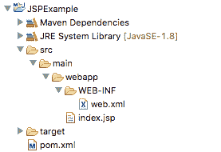
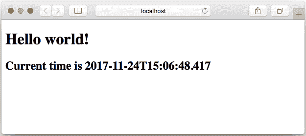

# Java JSP 示例

> 原文： [https://javatutorial.net/java-jsp-example](https://javatutorial.net/java-jsp-example)

本示例演示如何创建一个简单的 JSP 页面

在之前的教程中，我向您展示了如何使用 Servlet 处理[请求](https://javatutorial.net/java-servlet-example)，[响应](https://javatutorial.net/java-servlet-post-example)，[请求参数](https://javatutorial.net/servlet-request-info-example)和[上传文件](https://javatutorial.net/java-servlet-file-upload)。 但是，您可能已经注意到，使用 servlet 呈现 Web 应用程序的 HTML 内容是多么不便。 重复调用`ServletOutputStream`或`PrintWriter`类上的方法以输出内容，并且必须将 HTML 内容放入 Java 字符串中，这需要转义引号，这确实是一个难题。 在此示例中，您将了解 Java Server Pages 以及它们如何使您的生活更加轻松。

## 什么是 JSP？

Java EE 规范的创建者意识到，使用 servlet 生成纯 HTML 内容需要付出的精力比需要的多。 纯 HTML 页面的问题在于它们是静态的。 使用 servlet 时，我们可以生成动态内容并将其呈现为 HTML。 JavaServer Pages（也称为 JSP）是解决此问题的方法。 JSP 本质上是一种混合解决方案，结合了 Java 代码和 HTML 标签。 JSP 除了 Java 代码外，还可以包含任何 HTML 标记。

## JSP 示例

在下面的示例中，我们将显示一个简单的 JSP 页面，其中显示了当前时间。

首先让我们看一下项目结构：



JSP 项目结构

如您所见，结构非常简单。 一个 Maven POM 文件，用于处理依赖关系和构建属性：

```java
<project xmlns="http://maven.apache.org/POM/4.0.0" xmlns:xsi="http://www.w3.org/2001/XMLSchema-instance" 
	xsi:schemaLocation="http://maven.apache.org/POM/4.0.0 http://maven.apache.org/xsd/maven-4.0.0.xsd">
	<modelVersion>4.0.0</modelVersion>

	<groupId>net.javatutorial.tutorials</groupId>
	<artifactId>JSPExample</artifactId>
	<version>1</version>
	<packaging>war</packaging>

 	<name>JSPExample</name>
 	<url>https://javatutorial.net</url>

 	<properties>
		<project.build.sourceEncoding>UTF-8</project.build.sourceEncoding>
	</properties>

	<dependencies>
		<dependency>
			<groupId>javax.servlet</groupId>
			<artifactId>javax.servlet-api</artifactId>
			<version>3.1.0</version>
			<scope>provided</scope>
		</dependency>
		<dependency>
			<groupId>javax.servlet.jsp</groupId>
			<artifactId>javax.servlet.jsp-api</artifactId>
			<version>2.3.1</version>
			<scope>provided</scope>
		</dependency>
	</dependencies>

	<build>
	<finalName>jspexample</finalName>
        <plugins>
            <plugin>
                <groupId>org.apache.maven.plugins</groupId>
                <artifactId>maven-war-plugin</artifactId>
                <version>2.3</version>
                <configuration>
                    <warSourceDirectory>src/main/webapp</warSourceDirectory>
                </configuration>
            </plugin>
            <plugin>
                <groupId>org.apache.maven.plugins</groupId>
                <artifactId>maven-compiler-plugin</artifactId>
                <version>3.1</version>
                <configuration>
                    <source>1.8</source>
                    <target>1.8</target>
                </configuration>
            </plugin>
        </plugins>
    </build>
</project>
```

一个仅包含应用程序显示名称的简单`web.xml`

```java
<?xml version="1.0" encoding="UTF-8"?>
<web-app xmlns:xsi="http://www.w3.org/2001/XMLSchema-instance"
	xmlns="http://xmlns.jcp.org/xml/ns/javaee"
	xsi:schemaLocation="http://xmlns.jcp.org/xml/ns/javaee 
						http://xmlns.jcp.org/xml/ns/javaee/web-app_3_1.xsd"
	version="3.1">

	<display-name>JSP Example</display-name>

</web-app>
```

和实际的 JSP 文件：

```java
<%@ page contentType="text/html;charset=UTF-8" language="java" %>
<%@ page import="java.time.LocalDateTime" %>
<!DOCTYPE html>
<html>
	<head>
		<title>Simple JSP Application</title>
	</head>
	<body>
		<h1>Hello world!</h1>
		<h2>Current time is <%= LocalDateTime.now() %></h2>
	</body>
</html>
```

现在让我们仔细看看`index.jsp`

JSP 中可以使用几种不同类型的标签。 在上面的示例中，我们使用指令类型`<% @page… %>`将页面编码设置为 UTF-8

```java
<%@ page contentType="text/html;charset=UTF-8" %>
```

默认情况下（如果我们的 JSP 文件中不包括此行），字符编码将设置为 ISO-8859-1，如果我们要使用非拉丁字母的特殊字符和字母，这将很不方便。

我们使用另一个指令导入`LocalDateTime`

```java
<%@ page import="java.time.LocalDateTime" %>
```

最后，为了显示当前时间，我们使用了一个名为表达式的特殊标签`<%= … %>`。 表达式包含简单的 Java 代码，这些代码返回可以写到客户端输出的内容，并且表达式将该代码的返回变量输出到客户端：

```java
<h2>Current time is <%= LocalDateTime.now() %></h2>
```

部署应用程序后，转到`http://localhost:8080/jspexample/index.jsp`

您应该会看到与此页面相似的页面



JSP 页面输出

您可以在我们的 [GitHub 存储库](https://github.com/JavaTutorialNetwork/Tutorials/tree/master/JSPExample)中找到此示例的源文件。