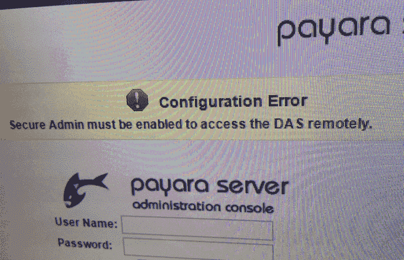
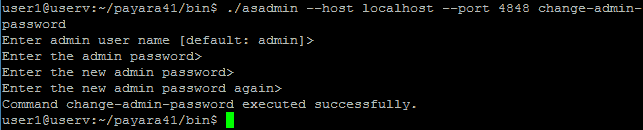
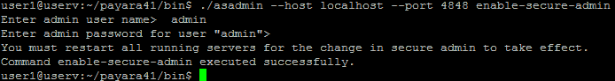

# Glassfish 启用安全管理

> 原文： [https://javatutorial.net/glassfish-enable-secure-admin](https://javatutorial.net/glassfish-enable-secure-admin)

在本教程中，我将向您展示如何启用 Glassfish 或 Payara 的安全管理，以便您可以远程访问它。



当您在远程域（而不是`localhost`）上部署 Glassfish 或 Payara 并希望远程访问 Glassfish Admin 时，需要首先启用它。 默认情况下，Glassfish Admin 在端口 4848 上运行。

如果看到此消息

```java
Configuration Error
Secure Admin must be enabled to access the DAS remotely.
```

比按照此步骤。

## 设置管理员密码

在能够启用 DAS（域管理服务器）之前，系统可能会提示您一条消息，提示您的管理员密码为空并且无法启用安全性。 如果尚未设置管理员密码，请通过以下方式更改（或初始设置）管理员密码来解决该问题：

```java
asadmin --host localhost --port 4848 change-admin-password
```

要求您输入用户名和密码：



Glassfish 更改管理员密码

输入管理员用户名（默认值：admin），如果要保留`admin`，请按`Enter`键或输入另一个

如果尚未设置管理员密码，请输入管理员密码，只需按`Enter`键

输入新的管理员密码，输入新密码

## 启用安全管理员

在运行的服务器上，输入以下命令：

```java
asadmin --host localhost --port 4848 enable-secure-admin
```

系统将提示您输入管理员用户名和密码



Glassfish 启用安全管理员

您将需要重新启动所有正在运行的服务器，以使更改生效。