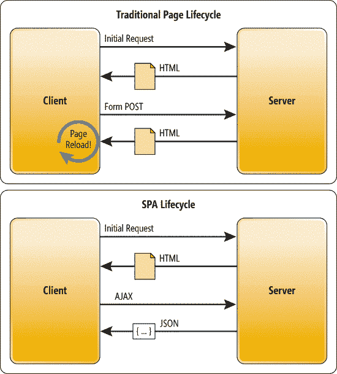
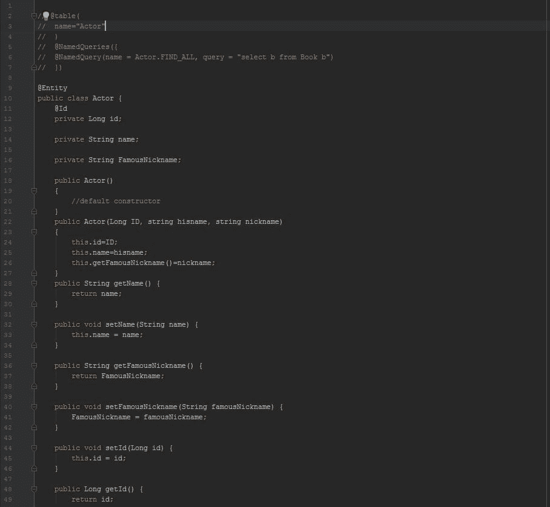
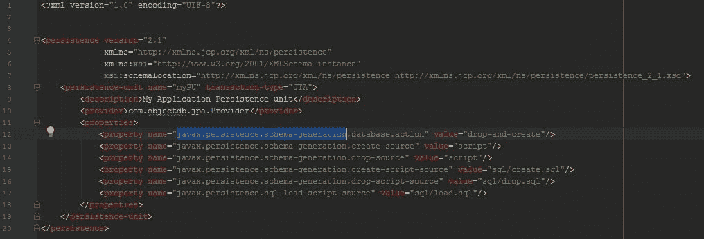
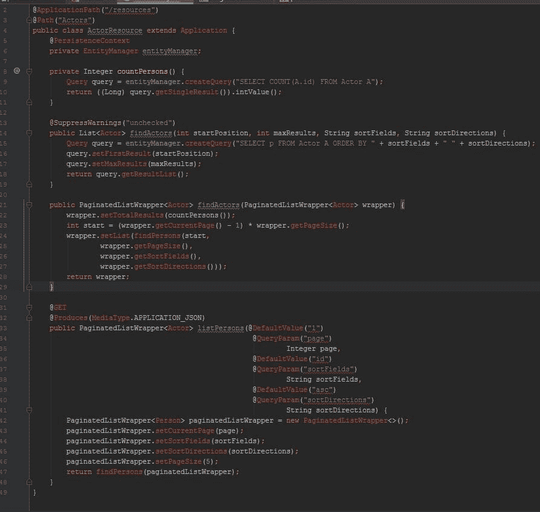
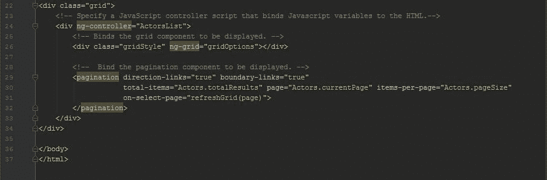
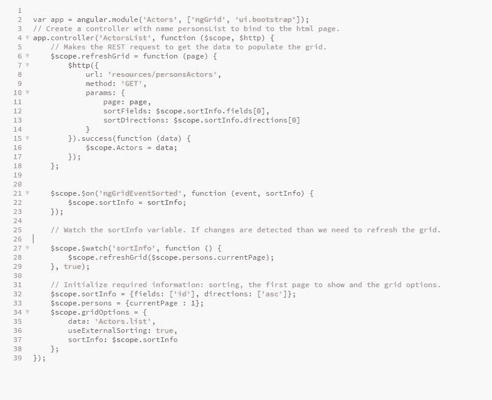

# 如何使用 Java EE 和 Angular 构建单页应用程序

> 原文： [https://javatutorial.net/how-to-build-single-page-application-with-java-ee-and-angular](https://javatutorial.net/how-to-build-single-page-application-with-java-ee-and-angular)

本文介绍如何使用 Angular 和 Java EE 构建自己的单页应用程序

网络世界一直令人眼花乱。 如今，可见网络上有超过 18 亿个页面，其中大多数页面提供了某种想法，业务，原因或互联网上您拥有的任何内容。 每天都有越来越多的人对 Web 感兴趣，而第二者正在创建内容。 然后，您可以了解为什么 Web 开发是目前最繁荣的工作之一。 该技术本身正在迅速发展，以满足用户的需求，并通过更好的沉浸式用户体验超越了它。 这种追求促使 SPA 等技术成为行业领先的技术。 他们的增长惊人，用户似乎对新的升级感到非常满意。 今天，我们将使用 Angular 和 Java EE 构建自己的单页应用程序，为您自己的实现奠定基础。

[图像源](https://koukia.ca/going-single-page-app-or-traditional-web-app-cedb10041b50)

## 什么是 SPA？

单页应用程序是一种设计模式，特别是一种确定程序流程的架构设计模式。 这样做的想法是一次加载所有数据和元素，以防止在用户使用页面时刷新页面。 例如，您可能已经注意到，首次加载 Gmail 后，它甚至可以脱机运行，而且运行速度也很快。 Gmail，Facebook，GitHub 和许多其他应用程序使用 SPA 来提供自然的 UX，以保持不受干扰的用法。 如今，这种想法已逐渐发展为一种设计方向，PWA 则采用了相同的概念，即提供几乎自然的离线体验。

传统页面生命周期与 SPA 生命周期

[图像源](https://msdn.microsoft.com/en-us/magazine/dn463786.aspx)

实际上，SPA 的许多优点使其成为开发人员的青睐选择。

例如，使用 SPA，随着编写服务器渲染代码的需求随着 SPA 的消失，开发过程变得越来越容易。 SPA 应用程序直接呈现到浏览器。 将移动应用程序与您的应用程序集成起来比较容易，因为您可以使用相同的网络后端。 当然，大多数资源（如 HTML，CSS 和脚本）在应用程序的生命周期内仅加载一次，这一事实使应用程序变得更快，因为仅在需要时来回传输数据。 这全都归功于 JavaScript 框架为我们完成了大部分繁重的工作。

使用 SPA 确实有一些弊端，例如 SEO 变得有些难以管理，但是在完成应用程序后，我们将讨论如何解决该问题。 今天要使用的框架是著名的 Angular。

## 为什么要 Angular？

好吧，您可能想知道为什么每个人都对 Angular 狂热。 毕竟，目前的排名表明 Angular 是 JS 框架王国的统治者。 它是迄今为止使用最广泛的框架，并且拥有最大的社区之一和大量文档。 Angular 允许我们使用双向数据绑定来构建动态 Web 应用程序。 在电子商务网站上浏览时，您不想每次签出新产品或同一产品的其他版本时都重新加载页面，而 Angular 允许您这样做。 它也很容易构建和调试，因此使用 Angular 可以使测试变得更加容易，这是 Web 开发的核心步骤。 为此，互联网上有许多 [Angular 教程](https://hackr.io/tutorials/learn-angular)和课程，可以从中找到基本信息。

## 为什么选择 Java EE？

Java 企业版是健壮的技术和 API 的分组集合，用于企业级别，以构建可满足关键业务需求和约束的可伸缩，事务性和分布式应用程序。 它旨在使 Java 开发保持最新状态，以满足当今应用程序的标准。 [Java EE](https://javatutorial.net/category/java-ee) 带有大量的规范，可以满足您的需求。 这就是为什么 Java EE 是理想的开始我们创建第一个 SPA 的旅程的原因。 我们将使用 Java 为 Angular 前端创建 REST 服务以供使用。

因此，让我们开始吧。 我们将设计一个简单的应用程序，在表格中显示演员姓名及其著名的昵称。 请注意，为了避免将本文变成 Java/Angular 课程，并且将重点放在 SPA 开发上，将省略一些代码。

## 后端

Java 持久化 API 将使我们能够管理和操纵应用程序和服务器之间的数据。 通过使用`@Entity`注解，我们可以将对象类建模为数据库内部的数据库实体。 您可能已经猜到`@ID`为此关系设置了主键，这是事实。 我们可以使用`@table`表示法来指定某些表属性，例如唯一性约束（数据成员必须是唯一的，即候选键）和表名。 `@namedqueries`允许我们准备某些查询以用于该关系。 然后，我们继续使用构造函数，setter 和 getter 构建基本类。

演员实体类

我们首先创建 JPA 所需的`persistence.xml`文件，它看起来像这样。 `javax.persistence.schema-generation`不仅使我们能够以自然的方式运行 SQL，而且还可以连接到数据源（如果我们尚未连接到 SQL 源）。 因此，这样做可以省去您的麻烦。

`persistence.xml`文件

这里要做的一件事是创建`Resources`类，以将该数据库公开为资源类。`@Get`表示法定义 HTTP Get 谓词行为，并以一种非常不错的方式格式化 JSON 响应。

网络服务类

## 前端

现在该跳到我们的前端了。 我们将分两个步骤进行操作，首先是 HTML 文件，因为 Angular 扩展了典型的 HTML，并允许我们按照 MVC 设计，使用 Javascript 变量向组件添加自定义数据绑定。

HTML 文件中没有太多代码，这使 Angular 相当有效。 Angular 拥有我们将在此处使用的网格组件，Bootstrap 还提供了外观漂亮的组件集，可供我们使用。

Angular HTML 文件

现在剩下的唯一事情就是制作一个 Javascript 文件，将所有内容整合在一起。

Javascript 文件将定义客户端行为，并使用我们之前创建的 REST 服务发出 HTTP 请求。 这是程序中真正魔术的体现。

Angular 代码

## Angular SEO 优化

SPA 的核心问题之一是 SEO 优化，这对于某些 SPA 的成功至关重要。 Google 在抓取 Javascript 内容时遇到了问题，尽管他们正在努力，但它还不完全兼容 JS。 有多种方法可以解决此问题，可以手动或使用自定义服务。 这个想法是从您的应用程序创建一个 HTML 快照以直接提供给搜寻器，而不是希望它可以正确理解和索引您的 Angular 代码。 如果您无法手动完成任务，也可以减轻压力，则可以使用预渲染平台来完成任务。 您还可以执行一些辅助操作，例如获取有意义的 URL 名称而不是随机生成的 URL 名称。 维护用户友好的 URL 会反过来给您的用户和应用程序增加很多。 您应该使用一些工具来监视 SPA 的性能，并监视所有需要的更改。

## 总结

回顾一下，我们首先通过 Java 持久化 API 构建数据库，然后创建了 Java 资源类以作为 REST 服务访问数据库，尽管这里我们仅演示了 GET 方法。 在完成了后端之后，我们继续进行前端，我们创建了 HTML 组件文件，这要归功于 AngularJS，它非常简单明了。 最后，Javascript 文件将所有内容组合在一起，为应用程序注入了生命。

Angular 是一个非常强大的框架，它允许您仅用几行代码即可创建完全不同的 UX，这非常令人惊讶。 能够通过 Java RESTful 后端扩展 JS 前端可以增加更多的表格，并提高您作为开发人员的技能。 Angular 越来越流行，谁知道它何时会成为开发标准，与此同时，它是 SPA 领域的第一大统治框架。 请记住，传统网页也有其优点，因此您需要事先确定要遵循的模式。 例如，MPA 更安全，因为它们涉及的客户端脚本更少，并且正如我们之前提到的，它们更易于针对 SEO 进行优化。 在开发中总会有这种折衷，您必须选择一个选择。 但是，SPA 将继续是一个非常强大的选择。