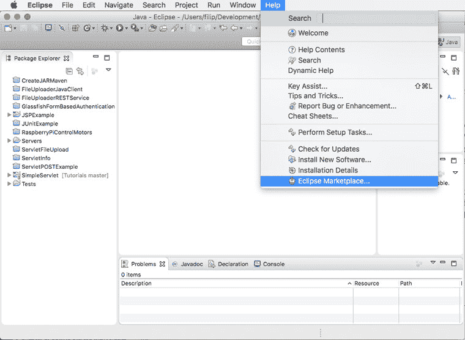
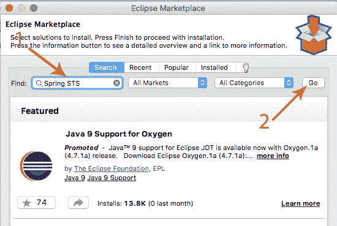
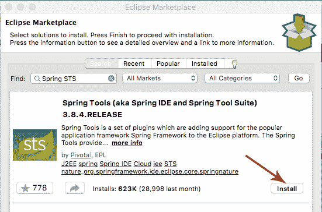
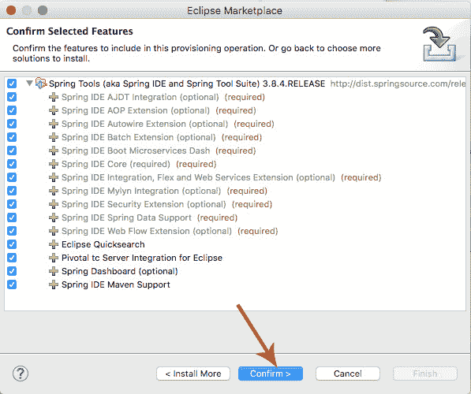

# 在 Eclipse 中安装 Spring STS

> 原文： [https://javatutorial.net/install-spring-sts-in-eclipse](https://javatutorial.net/install-spring-sts-in-eclipse)

本指南向您展示如何在 Eclipse 中安装 Spring Tool Suite

[STS](https://spring.io/tools/sts) 代表 **Spring Tool Suite**。 它提供了使用 Eclipse [IDE](https://javatutorial.net/choose-your-java-ide-eclipse-netbeans-and-intellij-idea) 来实现，运行，调试和部署 Spring 应用程序的现成环境。 它是一个强大的环境，它将帮助您使 Spring 开发更快，更轻松。

## 如何在 Eclipse 中安装 Spring Tool Suite

1\. 打开您的 Eclipse IDE

2\. 转到“帮助”，然后选择“Eclipse Marketplace…”

Eclipse 开放市场

3\. 在 Eclipse Marketplace 窗口的“查找：”字段中键入“Spring STS”，然后单击“执行”按钮。

搜索 Spring STS

4\. 在列表中找到“Spring Tool Suite”，然后单击“安装”按钮。 撰写本指南时的最新版本是`3.8.4.RELEASE`

安装 Spring Tool Suite

5\. 在下一个屏幕上，选择所需的功能，然后按“确定”按钮

STS 功能选择

6\. 接受条款和许可协议

7\. 等待软件安装

8\. 安装完成后，系统将提示您重新启动 Eclipse 以使更改生效

## 确认安装成功

如果安装顺利，并且您在功能列表中选择了“仪表板”（请参阅​​步骤 5），那么您将在 Eclipse 工具栏中看到一个新图标

工具栏中的 Spring 仪表板图标

您可能还需要创建一个简单的应用程序，以测试所有配置是否正常。 阅读我们的下一个教程，以了解如何使用 Spring 和 STS 创建一个[简单应用](https://javatutorial.net/spring-web-app-sts)