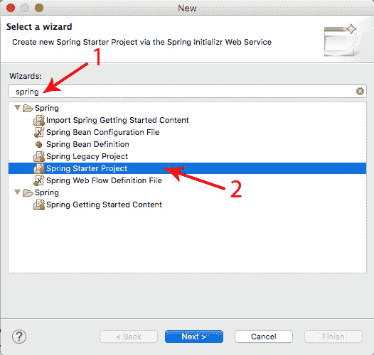
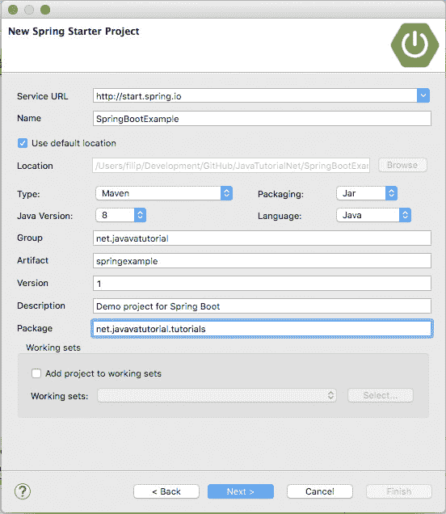
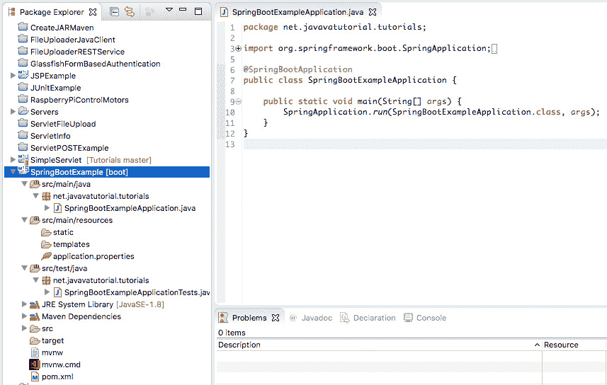
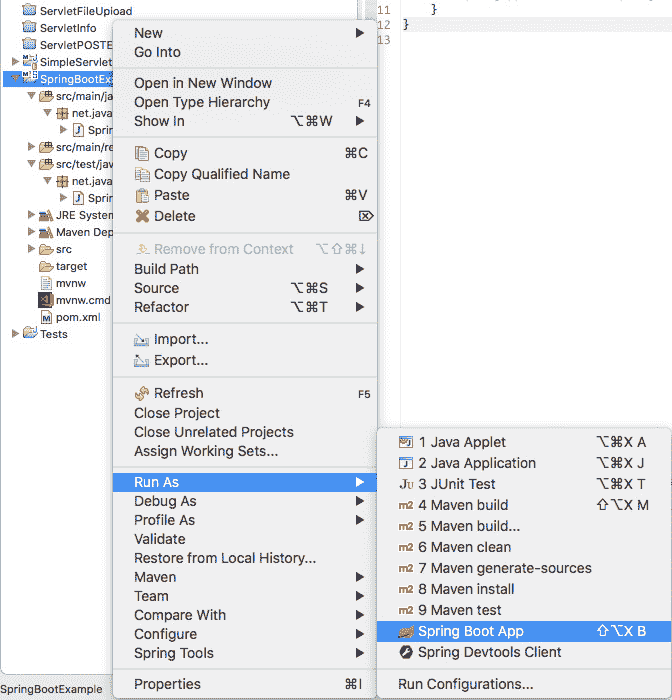
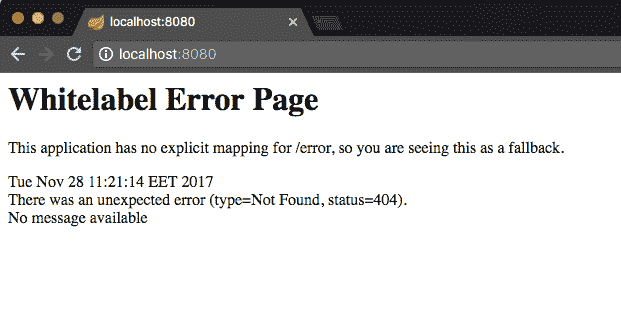
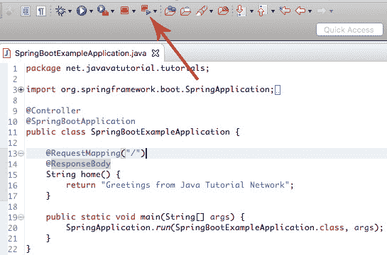
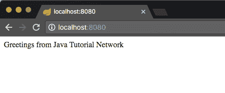

# 使用 STS 创建简单的 Spring Web App

> 原文： [https://javatutorial.net/spring-web-app-sts](https://javatutorial.net/spring-web-app-sts)

本教程将向您展示如何使用 Spring Framework 和 STS（Spring 工具套件）构建一个简单的 Web 应用程序。 这是一个入门指南，如果您是 Spring 或 STS 的新手，它将为您提供帮助。

**注意**：本教程要求使用 Eclipse [IDE](https://javatutorial.net/choose-your-java-ide-eclipse-netbeans-and-intellij-idea) 安装和配置 **Spring STS**。 如果尚未完成此步骤，请先阅读[在 Eclipse](https://javatutorial.net/install-spring-sts-in-eclipse) 中安装 Spring STS。

## 什么是 Spring Boot

本教程使用 Spring Boot 创建一个简单的 Web 应用程序，并在嵌入式 Tomcat 服务器上运行。

Spring Boot 是 Spring 的解决方案，用于创建易于构建和运行的独立应用程序。 它使用预配置的 Spring 平台和第三方库，因此您可以在数分钟内开始使用。 大多数 Spring Boot 应用程序只需要很少的 Spring 配置。 此特定示例完全不需要任何配置。

Spring Boot 的功能：

*   创建独立的 Spring 应用程序
*   直接嵌入 Tomcat 或 Jetty（无需部署 WAR 文件）
*   提供 POM 文件以简化您的 Maven 配置
*   尽可能自动配置 Spring
*   提供生产就绪的功能，例如指标，运行状况检查和外部配置
*   完全没有代码生成，也不需要 XML 配置

## 创建新的 Spring Starter 项目

**1\. 启动 Eclipse 并转到“文件 -&gt; 新建 -&gt; 其他…”或按键盘上的`Ctrl + N`

在搜索字段中输入`spring`。 这将列出几个 Spring 选项。 我们需要本教程的一个是“Spring Starter Project”。 选择它并单击“下一步”确认



创建新的 Spring 入门项目

2\. **使用下面的屏幕快照中所示的设置**。

为您的项目选择一个名称。 选择 [Maven](https://javatutorial.net/how-to-install-maven-on-windows-linux-and-mac) 作为构建工具，JAR 打包以及您的 Java 版本。

在“包”下，键入包名称。“Artifact”是您要构建的 JAR 文件的名称。 例如，如果您将`springexample`用作工件，则最终的 JAR 文件将称为`springexample.jar`



Spring Starter 项目设置

3\. **在“New Spring Starter 项目依赖项”窗口中，选择“Web”**。

如果您在列表中找不到它，请使用搜索字段并在其中键入`web`


创建 Spring Web 项目

单击“完成”按钮确认。 STS 将为您创建项目并下载所有需要的依赖项。

**4\. 创建项目后，您将看到一个名为`SpringBootExampleApplication.java`的主要 Java 类**，一个用于测试的 Java 类，空属性文件，一个 Maven POM 文件以及两个文件，可从命令行执行该应用程序 。 在下面的屏幕截图中，您将在左侧看到项目结构，在右侧看到主类的内容。



Spring Boot Web 项目结构

## 运行您的 Spring Boot 应用程序

右键单击您的项目，转到“运行方式”，然后选择“Spring Boot App”



作为 Spring Boot 应用程序运行项目

这将引导嵌入式 Tomcat 服务器，部署您的应用程序并映射 URL。 在 Eclipse 控制台中，您将看到类似于以下内容的输出：

```java
  .   ____          _            __ _ _
 /\\ / ___'_ __ _ _(_)_ __  __ _ \ \ \ \
( ( )\___ | '_ | '_| | '_ \/ _` | \ \ \ \
 \\/  ___)| |_)| | | | | || (_| |  ) ) ) )
  '  |____| .__|_| |_|_| |_\__, | / / / /
 =========|_|==============|___/=/_/_/_/
 :: Spring Boot ::        (v1.5.8.RELEASE)

2017-11-28 11:15:29.068  INFO 3428 --- [           main] n.j.t.SpringBootExampleApplication       : Starting SpringBootExampleApplication on Filips-MacBook-Air.local with PID 3428 (/Users/filip/Development/GitHub/JavaTutorialNet/SpringBootExample/target/classes started by filip in /Users/filip/Development/GitHub/JavaTutorialNet/SpringBootExample)
2017-11-28 11:15:29.081  INFO 3428 --- [           main] n.j.t.SpringBootExampleApplication       : No active profile set, falling back to default profiles: default
2017-11-28 11:15:29.163  INFO 3428 --- [           main] ationConfigEmbeddedWebApplicationContext : Refreshing org.springframework.boot.context.embedded.AnnotationConfigEmbeddedWebApplicationContext@4461c7e3: startup date [Tue Nov 28 11:15:29 EET 2017]; root of context hierarchy
2017-11-28 11:15:30.753  INFO 3428 --- [           main] s.b.c.e.t.TomcatEmbeddedServletContainer : Tomcat initialized with port(s): 8080 (http)
2017-11-28 11:15:30.773  INFO 3428 --- [           main] o.apache.catalina.core.StandardService   : Starting service [Tomcat]
2017-11-28 11:15:30.775  INFO 3428 --- [           main] org.apache.catalina.core.StandardEngine  : Starting Servlet Engine: Apache Tomcat/8.5.23
2017-11-28 11:15:30.949  INFO 3428 --- [ost-startStop-1] o.a.c.c.C.[Tomcat].[localhost].[/]       : Initializing Spring embedded WebApplicationContext
2017-11-28 11:15:30.949  INFO 3428 --- [ost-startStop-1] o.s.web.context.ContextLoader            : Root WebApplicationContext: initialization completed in 1791 ms
2017-11-28 11:15:31.201  INFO 3428 --- [ost-startStop-1] o.s.b.w.servlet.ServletRegistrationBean  : Mapping servlet: 'dispatcherServlet' to [/]
2017-11-28 11:15:31.206  INFO 3428 --- [ost-startStop-1] o.s.b.w.servlet.FilterRegistrationBean   : Mapping filter: 'characterEncodingFilter' to: [/*]
2017-11-28 11:15:31.207  INFO 3428 --- [ost-startStop-1] o.s.b.w.servlet.FilterRegistrationBean   : Mapping filter: 'hiddenHttpMethodFilter' to: [/*]
2017-11-28 11:15:31.208  INFO 3428 --- [ost-startStop-1] o.s.b.w.servlet.FilterRegistrationBean   : Mapping filter: 'httpPutFormContentFilter' to: [/*]
2017-11-28 11:15:31.208  INFO 3428 --- [ost-startStop-1] o.s.b.w.servlet.FilterRegistrationBean   : Mapping filter: 'requestContextFilter' to: [/*]
2017-11-28 11:15:31.684  INFO 3428 --- [           main] s.w.s.m.m.a.RequestMappingHandlerAdapter : Looking for @ControllerAdvice: org.springframework.boot.context.embedded.AnnotationConfigEmbeddedWebApplicationContext@4461c7e3: startup date [Tue Nov 28 11:15:29 EET 2017]; root of context hierarchy
2017-11-28 11:15:31.777  INFO 3428 --- [           main] s.w.s.m.m.a.RequestMappingHandlerMapping : Mapped "{[/error]}" onto public org.springframework.http.ResponseEntity<java.util.Map<java.lang.String, java.lang.Object>> org.springframework.boot.autoconfigure.web.BasicErrorController.error(javax.servlet.http.HttpServletRequest)
2017-11-28 11:15:31.779  INFO 3428 --- [           main] s.w.s.m.m.a.RequestMappingHandlerMapping : Mapped "{[/error],produces=[text/html]}" onto public org.springframework.web.servlet.ModelAndView org.springframework.boot.autoconfigure.web.BasicErrorController.errorHtml(javax.servlet.http.HttpServletRequest,javax.servlet.http.HttpServletResponse)
2017-11-28 11:15:31.820  INFO 3428 --- [           main] o.s.w.s.handler.SimpleUrlHandlerMapping  : Mapped URL path [/webjars/**] onto handler of type [class org.springframework.web.servlet.resource.ResourceHttpRequestHandler]
2017-11-28 11:15:31.820  INFO 3428 --- [           main] o.s.w.s.handler.SimpleUrlHandlerMapping  : Mapped URL path [/**] onto handler of type [class org.springframework.web.servlet.resource.ResourceHttpRequestHandler]
2017-11-28 11:15:31.871  INFO 3428 --- [           main] o.s.w.s.handler.SimpleUrlHandlerMapping  : Mapped URL path [/**/favicon.ico] onto handler of type [class org.springframework.web.servlet.resource.ResourceHttpRequestHandler]
2017-11-28 11:15:32.144  INFO 3428 --- [           main] o.s.j.e.a.AnnotationMBeanExporter        : Registering beans for JMX exposure on startup
2017-11-28 11:15:32.254  INFO 3428 --- [           main] s.b.c.e.t.TomcatEmbeddedServletContainer : Tomcat started on port(s): 8080 (http)
2017-11-28 11:15:32.271  INFO 3428 --- [           main] n.j.t.SpringBootExampleApplication       : Started SpringBootExampleApplication in 13.607 seconds (JVM running for 19.742)

```

启动应用程序后，打开浏览器并转到`http://localhost:8080`

您将看到一个标签为“Whitelabel Error Page”的页面。 很好 不用担心 它指示服务器已启动，但是 URL `/`没有可用的映射。 我们将在下一步中解决此问题。



Spring WhiteLabel 错误页面

## 创建请求映射

现在，为了能够在`http://localhost:8080`下看到一些“有意义的”内容，我们需要更改出价`SpringBootExampleApplication.java`的代码。 首先使用`@Controller`注解对类进行注解。 其次，创建一个映射到 URL `/`的请求 - 这会将`home()`方法映射到该 URL。 换句话说，当浏览器向`http://localhost:8080`发出 GET 请求时，将通过此方法提供服务。 最后，为了能够将响应返回给浏览器，您需要使用`@ResponseBody`注释`home()`方法。 您将在下面找到所有更改：

```java
package net.javavatutorial.tutorials;

import org.springframework.boot.SpringApplication;
import org.springframework.boot.autoconfigure.SpringBootApplication;
import org.springframework.stereotype.Controller;
import org.springframework.web.bind.annotation.RequestMapping;
import org.springframework.web.bind.annotation.ResponseBody;

@Controller
@SpringBootApplication
public class SpringBootExampleApplication {

	@RequestMapping("/")
	@ResponseBody
	String home() {
		return "Greetings from Java Tutorial Network";
	}

	public static void main(String[] args) {
		SpringApplication.run(SpringBootExampleApplication.class, args);
	}
}

```

## 重新启动 Spring Boot App

在看到上一步中所做的更改之前，您需要重新部署已更改的应用程序。 为此，请使用以下屏幕截图中显示的“Spring 重新启动按钮”



Spring 重新启动按钮

现在转到浏览器并刷新页面。 您应该在屏幕上看到我们的`home()`方法返回的字符串



程序输出

该项目的完整源代码可以在我们的 GitHub 存储库中找到： [https://github.com/JavaTutorialNetwork/Tutorials/tree/master/SpringBootExample](https://github.com/JavaTutorialNetwork/Tutorials/tree/master/SpringBootExample)