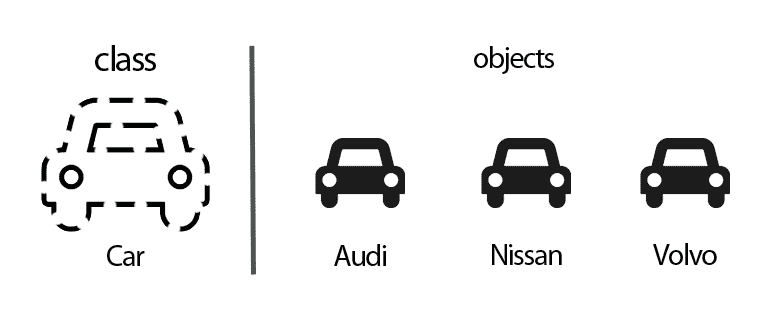

# 什么是面向对象编程（OOP）

> 原文： [https://javatutorial.net/java-oop](https://javatutorial.net/java-oop)

遵循本教程可了解面向对象编程的原理，并编写可重用和简洁的代码

本文旨在解释有关 OOP 的原理和概念，以及在讨论 OOP 时您需要了解的 4 个主要术语：封装，继承，抽象和多态。 尽管这些原则对于每种面向对象的编程语言（例如 Java，Python，C++，Ruby 等）都具有完全的威力，但我将提供 Java 中的示例。 为什么？ 因为首先是 Java 教程网站，其次 Java 是面向对象的，所以 Java 中的所有东西都是对象。 等待！ 您可能不会说诸如`int`，`double`，`long`等原始类型。 是的，是的，但是即使基本类型也具有 Java 中的 Object 表示形式。 `int`是`Integer`，`double`是`Double`，依此类推。

也准备在下次 Java 求职面试中遇到面向对象的问题。 它们是如此普遍，以至于几乎有 100% 的机会会询问您有关一项或多项 OOP 原则的信息。

## 什么是面向对象

[Wikipedia 将 OOP](https://en.wikipedia.org/wiki/Object-oriented_programming) 定义为：基于对象的概念的编程示例，其中可能包含字段形式的字段，通常称为属性；和程序形式的代码，通常称为方法。

面向对象编程（OOP）是一种编程语言模型，它使用[对象](https://javatutorial.net/java-objects-and-classes-tutorial)和数据作为核心组件。 如果您想了解更多细节并更好地理解类和对象，请参阅本主题的详细教程。 单击此处的[首先阅读它](https://javatutorial.net/java-objects-and-classes-tutorial)。

OOP 背后的主要思想是用对象而不是动作或函数来表示数据和逻辑。 可以将对象视为现实生活中的对象，例如汽车，建筑物，动物，苹果等。还有诸如`HttpConnection`或`UserDataParser`之类的抽象对象（我们看不到或不能吃的东西）。 所有这些都具有可操纵和访问存储在其中的数据的属性和方法。 最终，我们可以将所有内容“转换”为对象。

那么，总体上拥有所有这些对象和 OOP 有什么大不了的呢？ 嗯，没有人能阻止您在一个具有数百个函数的大文件中编写 Java 程序（当然，除了团队负责人或老板），但是一旦遵循了面向对象编程的原理，您将产生可重用，可维护，可扩展和可重用的代码。 干净的代码。

这是 **4 个主要的 Java OOP 原则**：

## 封装形式

封装的目的是将变量和方法包装在一个单元中，其唯一目的是从外部类中隐藏数据。 阅读完整的 [Java 封装示例](https://javatutorial.net/java-encapsulation-example)，了解更多详细信息。

## 继承

继承是一种 OOP 特性，它允许 Java 类从其他类派生。 阅读完整的 [Java 继承示例](https://javatutorial.net/java-inheritance-example)了解更多详细信息。

## 抽象

抽象是向用户隐藏实现细节的过程。只有函数将提供给用户。 阅读完整的 [Java 抽象示例](https://javatutorial.net/java-abstraction-example)了解更多详细信息。

## 多态

Java 中的多态允许类的子类定义其自己的独特行为，而又共享父类的某些相同函数。 阅读完整的 [Java 多态示例](https://javatutorial.net/java-polymorphism-example)，了解更多详细信息。