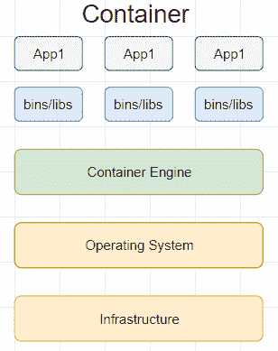
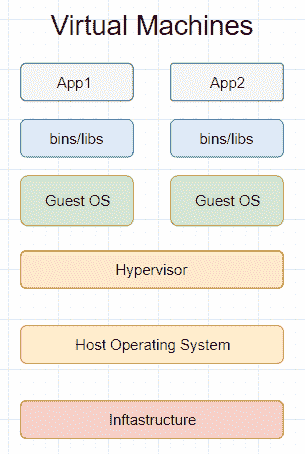

# Java Docker 和 Docker 容器简介

> 原文： [https://javatutorial.net/introduction-to-docker-and-docker-containers-in-java](https://javatutorial.net/introduction-to-docker-and-docker-containers-in-java)

简而言之，Docker 是一个工具，通过使用所谓的容器，您可以轻松地构建，部署和运行应用程序。 这些容器使我们可以打包所有必不可少的要素，例如库和依赖项。


另外，这些容器在主机操作系统上运行。

当我们使用 Docker 时会带来很多好处。 它

*   增强了应用程序的可移植性，并且可以非常轻松地创建测试应用程序，而不必依赖于环境
*   优化基础设施
*   将应用程序及其依赖项打包到标准化单元中

## 容器

不，我不是在谈论现实世界中的容器。 但是，既然您正在考虑它，我不妨作个比喻。 现实生活中的容器的目的是存储需要运输到另一个地方的货物或物品。 现在，这些商品具有不同的存储要求，例如，可能存在牛奶的有效期比例如西红柿短的牛奶。 这就是为什么在现实生活中容器是非常有用的原因–容器保留了内部环境，例如敏感商品和/或物品的温度。 话虽如此，运输业不必担心这些物品，而将重点放在将它们从 A 运送到 B 上。

现在，如果您已经注意了以上段落，那么 Doc​​ker 中的容器就是一回事。 多亏了 Docker 的**容器**，我们可以轻松地将**容器化应用程序**组件从一种环境迁移到另一种环境，希望不会出现任何问题。

就像现实生活中的容器一样，Docker 中的**容器**为我们提供了一个隔离的安全的应用程序组件环境。 与现实生活中的容器相比，应用组件是商品。

## Docker 容器与虚拟机





根据映像，VM 方法的问题在于它附带了很多东西 - 二进制和库（必不可少的），但最主要的是 - 整个来宾操作系统的总容量为几个 GB。

另一方面，Docker 容器包含应用程序的所有依赖关系，与其他容器共享内核。 此外，Docker 容器可以在任何计算机，基础架构和云上运行。 现在，您可以再次阅读真实容器的类比并看到相似之处。

## 安装 Docker

如果使用 Windows 或 Mac，[请单击此处](https://www.docker.com/products/docker-desktop)。

安装 Docker 之后，您将拥有以下内容：

1.  用于运行`docker-machine`命令的 Docker Machine
2.  用于运行 docker 命令的容器引擎
3.  Docker Compose 用于运行`docker-compose`命令
4.  Kitematic，Docker GUI
5.  为 Docker 命令行环境预先配置的 Shell
6.  甲骨文 VirtualBox

要检查您是否已成功安装 docker，请输入以下内容：

```java
docker --version
```

要查看更多信息，例如容器，正在运行，已暂停或已停止的容器数，图像等，可以键入：

```java
docker info
```

就是这样！ 您的机器上有 Docker。 要编写一个简单的“hello world”程序，可以键入以下内容：

```java
docker run hello-world
```

响应：

```java
This message shows that your installation appears to be working correctly.

To generate this message, Docker took the following steps:
 1\. The Docker client contacted the Docker daemon.
 2\. The Docker daemon pulled the "hello-world" image from the Docker Hub.
    (amd64)
 3\. The Docker daemon created a new container from that image which runs the
    executable that produces the output you are currently reading.
 4\. The Docker daemon streamed that output to the Docker client, which sent it
    to your terminal.
```