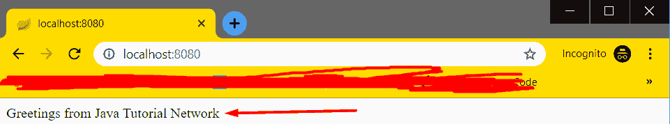

# 在 Spring 中实现控制器

> 原文： [https://javatutorial.net/implementing-controllers-in-spring](https://javatutorial.net/implementing-controllers-in-spring)

控制器在 Spring 中的主要目的是拦截传入的 http 请求，将数据发送到模型进行处理，最后从模型中获取处理后的数据，然后将完全相同的数据传递给要呈现它的视图。


上面所写内容的顶级概述：


Spring 工作流程

现在，让我们构建一个简单的应用程序，作为在 Spring 中实现控制器的示例。

当您要“声明”一个类作为控制器时，就像使用`@Controller`对其进行注释一样简单。 在类级别使用时，控制器现在可以处理 REST API 请求。

### `GetMapping`注解

当使用`@Controller`注解时，可以通过使用该方法的`RequestMapping`注解来提供请求映射。 还有`@RequestMapping`，`@PostMapping`，`@PutMapping`可以简化常见 HTTP 方法类型的映射。

```java
package com.example.demo;

import org.springframework.boot.SpringApplication;
import org.springframework.boot.autoconfigure.SpringBootApplication;
import org.springframework.stereotype.Controller;
import org.springframework.web.bind.annotation.RequestMapping;
import org.springframework.web.bind.annotation.ResponseBody;

@RestController
@SpringBootApplication
public class DemoApplication {

	@GetMapping("/")
	String home() {
		return "Greetings from Java Tutorial Network";
	}

	public static void main(String[] args) {
		SpringApplication.run(DemoApplication.class, args);
	}

}

```

上面的代码段，我们创建了一个`DemoApplication`，其注释为`@Controller`和`@SpringBootApplication`。 请注意`@GetRequest("/")`的使用。 这就是说`home()`方法将显示注释中放置的内容，在本例中为`"/"`，即`http://localhost:8080/`。

在示例中，我使用的是`@RestConroller`，它基本上是控制器的专用版本，其中包括`@Controller`和`@ResponseBody`注解。 它只是简化了控制器的实现。

当我们运行上面的代码时，我们得到以下结果：



输出量

如果我们想实现一个简单的登录功能，我们将执行以下操作：

```java
package com.example.demo;

import org.springframework.stereotype.Controller;
import org.springframework.web.bind.annotation.RequestMapping;

@Controller
@RequestMapping("/account/*")
public class AccountController {
	@RequestMapping
	public String login() {
		return "login";
	}
}

```

我们在这里所做的是，我们对类`AccountController`和方法`login()`都进行了注释。 当访问`http://localhost:8080/account/`时，我们将被带到登录页面。 请注意网址末尾的`"/"`。 如果不存在，例如`http://localhost:8080/account`，将导致错误。

我在`account/`之后加上`*`的原因是，如果我们想向其添加更多内容（例如注册），则该 URL 将能够处理具有不同路径的所有请求。

但就目前而言，我们将仅坚持登录。 接下来，我们需要为登录创建一个类，并将其注释为`@Controller`：

```java
package com.example.demo;

import org.springframework.stereotype.Controller;
import org.springframework.web.bind.annotation.RequestMapping;
import org.springframework.web.bind.annotation.RequestMethod;

@Controller
@RequestMapping("/account/login")
public class Login {
	@GetMapping
	public String login() {
		return "login";
	}
}

```

现在，当我们访问`http://localhost:8080/account/login`时，它将返回`login.jsp`文件中的内容。