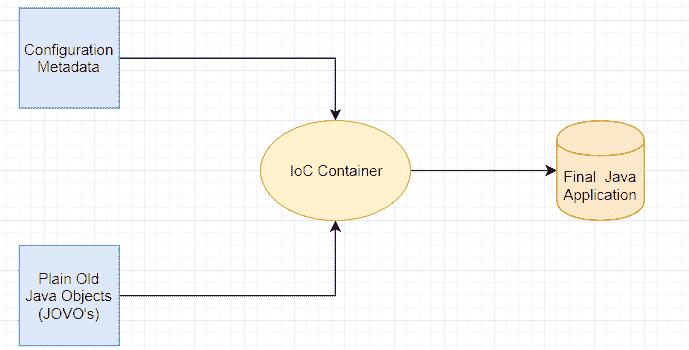

# Java Spring IoC 容器示例

> 原文： [https://javatutorial.net/java-spring-ioc-container-example](https://javatutorial.net/java-spring-ioc-container-example)

简而言之，IoC 容器负责实例化/创建和配置对象以及组装对象之间的依赖关系。


您可能想知道.. IoC 容器如何接收执行上述操作的数据？ 答案来自 3 个地方中的 1 个：XML 文件，Java 代码或 Java 注解。

IoC 容器是 Spring 中的一个框架，用于管理 POJO（普通的旧 Java 对象）的生命周期，并在需要时将其插入 Java 程序中。

通常，Java 对象通过两种方式声明其依赖项：

1.  通过将它们作为参数传递给构造函数
2.  通过将它们作为参数传递给对象的 setter 方法

Spring IoC 容器的基础有两个软件包：`org.springframework.beans`和`org.springframework.context`。

[`BeanFactory`](https://docs.spring.io/spring/docs/1.2.x/reference/beans.html) 接口管理许多 Bean，同时，这些 Bean 之间也具有依赖关系。 它提供了基本功能，更重要的是，它提供了`ApplicationContext`，它是`BeanFactory`的子接口。 在应用程序运行时，它是只读的；如果实现允许并管理 Bean 的生命周期，则可以重新加载它。

此时，依赖关系不是由 Java 对象管理，而是由框架管理。 **倒置** （如果您知道我的意思）。

**配置元数据**是赋予与我在本教程开始时提到的任务相关的指令的术语 - 对象的实例化，配置和组装。



从上图可以看到，本质上发生的是配置元数据（对象的实例化，配置和组装），并且 JOVO 正在传递到 IOC 容器（很可能是`ApplicationContext`的实例）。

### 如何实例化`ApplicationContext`

```java
ApplicationContext context = new ClassPathXmlApplicationContext("services.xml");
```

将`ApplicationContext`也视为简单的配置。 它从 XML 文件或注释中加载“配置”。 需要在应用程序的开头创建`ApplicationContext`，以便它读取应用程序读取所需的所有内容。

以防万一，您可以在应用程序中包含许多`ApplicationContext`。 您甚至可以使它们从同一配置文件读取。 这是个好习惯吗？ 取决于您要实现的目标。 大多数人会建议将所有 bean 配置在一个位置（通过 XML 或另一个位置）并由单个应用程序上下文加载。

以下示例取自[原始 Spring 文档](https://docs.spring.io/spring/docs/3.2.x/spring-framework-reference/html/beans.html)，请随时查看以获取有关 Spring 的深入了解。

`services.xml`

```java
<?xml version="1.0" encoding="UTF-8"?>
<beans xmlns="http://www.springframework.org/schema/beans"
       xmlns:xsi="http://www.w3.org/2001/XMLSchema-instance"
       xsi:schemaLocation="http://www.springframework.org/schema/beans
           http://www.springframework.org/schema/beans/spring-beans.xsd">

  <!-- services -->

  <bean id="petStore"
        class="org.springframework.samples.jpetstore.services.PetStoreServiceImpl">
    <property name="accountDao" ref="accountDao"/>
    <property name="itemDao" ref="itemDao"/>
    <!-- additional collaborators and configuration for this bean go here -->
  </bean>

  <!-- more bean definitions for services go here -->

</beans>
```

同样，您可以将`services.xml`视为配置文件，然后将`ApplicationContext`加载/读取。

## 结论

当您只用简单的 DI（依赖注入）而无法使用时，为什么还要使用 IoC 容器？

好吧，这里有几个原因：

1.  优雅
2.  易于在生产和测试模式之间进行切换
    1.  只需更改配置

但是有一个缺点，那就是有时正确地实现 IoC 容器有些棘手。