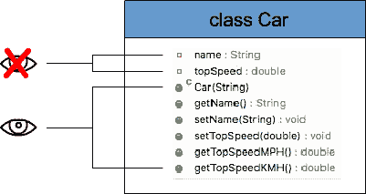

# Java 封装示例

> 原文： [https://javatutorial.net/java-encapsulation-example](https://javatutorial.net/java-encapsulation-example)

此示例演示了 Java 编程语言中封装的用法

## 什么是封装

封装就是将变量和方法包装在一个单元中。 封装也称为数据隐藏。 为什么？ 因为，当您设计类时，您可以（并且应该）使变量对其他类隐藏，而提供处理数据的方法。 您的班级应设计成黑匣子。 您可以从外部（类）访问多个方法，并且可以访问每个方法的返回类型。 您需要了解的有关此类的所有信息是方法的名称和返回类型。 换句话说，您为类提供了一些数据并获得了新数据作为响应，而无需关心用于数据处理的内部机制。

封装是[面向对象编程（OOP）](https://javatutorial.net/java-oop)背后的四个主要概念之一。 OOP 问题在求职面试中很常见，因此您可能会在下次 Java 求职面试中遇到有关封装的问题。

要实现 Java 封装：

*   将一个类的变量声明为私有。
*   提供公共的 setter 和 getter 方法来修改和查看变量值。

## Java 封装示例



Java 封装示例

下面的示例演示 Java 中的封装。 `Car`类具有两个字段 - `name`和`topSpeed`。 两者都声明为私有，这意味着它们不能在类外部直接访问。 吸气和设置方法：`getName`，`setName`和`setTopSpeed`等已声明为公开。 这些方法对“外部人员”开放，可用于更改和从`Car`对象检索数据。 请注意，我们有一种方法可以设置车辆的最高速度，而有两种吸气方法可以以 MPH 或 KMH 检索最大速度值。 这就是封装的作用–它隐藏了实现并为我们提供了所需的值

```java
package net.javatutorial;

public class Car {

	private String name;
	private double topSpeed;

	public Car() {}

	public String getName() {
		return name;
	}

	public void setName(String name) {
		this.name = name;
	}

	public void setTopSpeed(double speedMPH) {
		topSpeed = speedMPH;
	}

	public double getTopSpeedMPH() {
		return topSpeed;
	}

	public double getTopSpeedKMH() {
		return topSpeed * 1.609344;
	}

}

```

主程序使用给定名称创建`Car`对象，并使用 setter 方法存储此实例的最高速度。 现在，我们可以轻松获得 MPH 或 KMH 中的速度，而无需关心`Car`类中的速度转换方式。

```java
package net.javatutorial;

public class EncapsulationExample {

	public static void main(String[] args) {
		Car car = new Car();
		car.setName("Porsche Cayenne 4.8-litre V8");
		car.setTopSpeed(173.0d);

		System.out.println(car.getName() + " top speed in MPH is " + car.getTopSpeedMPH());
		System.out.println(car.getName() + " top speed in KMH is " + car.getTopSpeedKMH());
	}

}

```

这是示例的输出

```java
Porsche Cayenne 4.8-litre V8 top speed in MPH is 173.0
Porsche Cayenne 4.8-litre V8 top speed in KMH is 278.416512
```

让我们总结一下封装的好处：

*   可以将类的字段设置为只读或只写。
*   一个类可以完全控制其字段中存储的内容。
*   类的用户不知道该类如何存储其数据。 类可以更改字段的数据类型，并且该类的用户不需要更改任何代码。