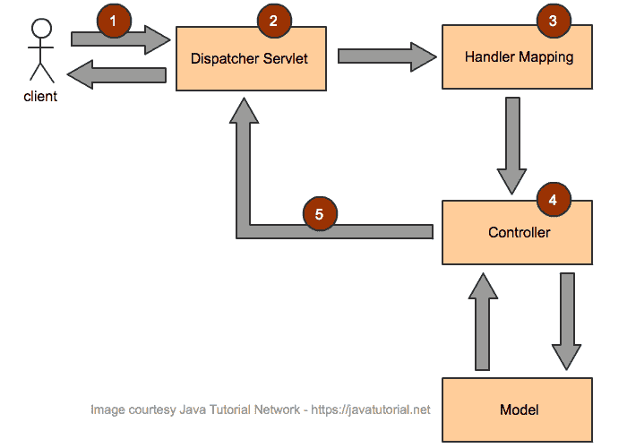
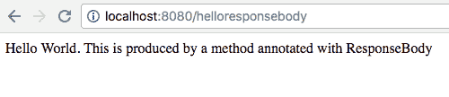
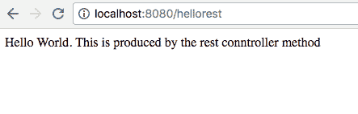

# 实现 Spring MVC 控制器

> 原文： [https://javatutorial.net/implementing-spring-mvc-controllers](https://javatutorial.net/implementing-spring-mvc-controllers)

本教程描述了实现 Spring MVC 控制器的不同方法，并提供了示例。

在我以前的教程，[使用 STS 创建简单的 Spring Web App](https://javatutorial.net/spring-web-app-sts) 中，我向您展示了如何构建引入控制器的 Spring Boot App。 本教程是对上一个教程的扩展。

在开始实现之前，让我们快速概述一下控制器如何参与 MVC 工作流程。



Spring MVC 架构工作流程

1.  来自客户端的传入请求由调度器 Servlet 解释
2.  调度器 Servlet 通过解析请求属性并使对象对处理程序可用来进行初始处理。
3.  确定并调用适当的处理程序以进一步处理请求。 确定适当控制器上的适当方法
4.  控制器处理请求并返回`ModelAndView`的实例
5.  调度器 Servlet 进一步处理`ModelAndView`的实例，以将响应发送给客户端

## 在 Spring Boot 应用程序中启用 JSP

如果要启用 JSP，则必须执行以下操作：

在`pom.xml`文件中添加以下依赖项：

```java
<dependency>
	<groupId>org.apache.tomcat.embed</groupId>
	<artifactId>tomcat-embed-jasper</artifactId>
</dependency>

<dependency>
	<groupId>javax.servlet</groupId>
	<artifactId>jstl</artifactId>
</dependency>
```

在`src/main/resources/application.properties`中添加这两行

```java
spring.mvc.view.prefix=/WEB-INF/jsp/
spring.mvc.view.suffix=.jsp
```

创建文件夹`src/main/resources/META-INF/resources/WEB-INF/jsp/`并将 JSP 文件放入其中

## 实现 Spring 控制器返回 JSP 页面

以下示例演示如何在 Spring `Controller`方法中返回 JSP 页面。 请注意`@Controller`注释和`@RequestMapping`注释的用法。 如果我们想返回一个 JSP 页面，我们将不使用`@ResponseBody`注释（如第二个示例所示）。

```java
package net.javatutorial.tutorials;

import org.springframework.boot.SpringApplication;
import org.springframework.boot.autoconfigure.SpringBootApplication;
import org.springframework.stereotype.Controller;
import org.springframework.web.bind.annotation.RequestMapping;

@Controller
@SpringBootApplication
public class ControllerExampleJSP {

	@RequestMapping("/hellojsp")
	String helloJSP() {
		return("index");
	}

	public static void main(String[] args) {
		SpringApplication.run(ControllerExampleJSP.class, args);
	}
}
```

`@RequestMapping`注释将网址`http://localhost:8080/hellojsp`插入到控制器的方法`helloJSP()`中。 此方法返回`index.jsp`的解析内容


使用 Spring 控制器渲染 JSP 页面

## 用`ResponseBody`实现控制器

与前面的示例不同，此示例将返回由方法而不是 JSP 页面生成的`String`。 我们唯一需要更改的就是将`@ResponseBody`注解添加到我们的控制器方法中

```java
package net.javatutorial.tutorials;

import org.springframework.boot.SpringApplication;
import org.springframework.boot.autoconfigure.SpringBootApplication;
import org.springframework.stereotype.Controller;
import org.springframework.web.bind.annotation.RequestMapping;
import org.springframework.web.bind.annotation.ResponseBody;

@Controller
@SpringBootApplication
public class ControllerResponseBodyExample {

	@RequestMapping("/helloresponsebody")
	@ResponseBody
	String helloResponseBody() {
		return("Hello World. This is produced by a method annotated with ResponseBody");
	}

	public static void main(String[] args) {
		SpringApplication.run(ControllerResponseBodyExample.class, args);
	}

}
```

在浏览器中调用`http://localhost:8080/helloresponsebody`将产生以下输出：



使用 Spring `Controller`和`ResponseBody`进行输出

## 实现 Spring `RestController`

`@RestController`注释用作方便注释，以表示诸如`@Controller`和`@ResponseBody`之类的注释。 在类级别使用时，控制器可以处理 REST API 请求。

```java
package net.javatutorial.tutorials;

import org.springframework.boot.SpringApplication;
import org.springframework.boot.autoconfigure.SpringBootApplication;
import org.springframework.web.bind.annotation.RequestMapping;
import org.springframework.web.bind.annotation.RestController;

@RestController
@SpringBootApplication
public class RestControllerExample {

	@RequestMapping("/hellorest")
	String helloRest() {
		return("Hello World. This is produced by the rest conntroller method");
	}

	public static void main(String[] args) {
		SpringApplication.run(RestControllerExample.class, args);
	}

}

```

在浏览器中调用`http://localhost:8080/hellorest`将产生以下输出：



使用 Spring `RestController`输出

## 在方法和类级别使用`@RequestMapping`注释

Spring 4.3 引入了诸如`@GetMapping`，`@PostMapping`和`@PutMapping`等注解，以指定常见 HTTP 方法类型（如 GET，POST 和 PUT）的映射。 这些注释增强了代码的可读性。

以下示例演示了如何在方法和类级别上使用映射注释。

```java
package net.javatutorial.tutorials;

import org.springframework.boot.SpringApplication;
import org.springframework.boot.autoconfigure.SpringBootApplication;
import org.springframework.web.bind.annotation.GetMapping;
import org.springframework.web.bind.annotation.RequestMapping;
import org.springframework.web.bind.annotation.RestController;

@RestController
@RequestMapping("/user/*")
@SpringBootApplication
public class MethodAndClassLevelAnnotations {

	@RequestMapping
	String login() {
		return("Login method called");
	}

	@GetMapping("/logout")
	String logout() {
		return("Logout method called");
	}

	public static void main(String[] args) {
		SpringApplication.run(MethodAndClassLevelAnnotations.class, args);
	}

}

```

向以下网址`http://localhost:8080/user/`发出请求，将调用`login()`方法。 注意，注释`login()`方法的`@RequestMapping`没有参数。

在类级别使用的`@RequestMapping("/user/*")`注释用作兜底方法，以使用`/*`表示的不同路径来处理所有请求。

请求`http://localhost:8080/user/logout`将调用`logout()`方法。 `@GetMapping`注释是一个组合的注释，用作`@RequestMapping(method = RequestMethod.GET)`

您可以在[我们的 GitHub 存储库](https://github.com/JavaTutorialNetwork/Tutorials/tree/master/SpringImplementingControllers)中找到本教程中的代码示例。