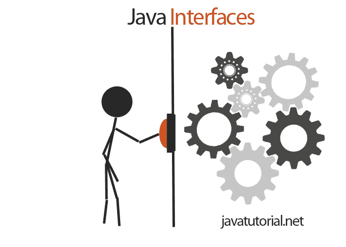

# Java 接口示例

> 原文： [https://javatutorial.net/java-interface-example](https://javatutorial.net/java-interface-example)

在本教程中，我将向您展示如何创建和使用 **Java 接口**。 与往常一样，我将演示 Java 接口的实际示例。



## 什么是 Java 接口？

与许多其他 Java 概念一样，接口是从真实场景中派生而来的，其主要目的是按照严格的规则使用对象。 例如，如果您想打开洗衣机来洗衣服，则需要按开始按钮。 此按钮是您与洗衣机内部电子设备之间的接口。 Java 接口具有相同的行为：它们对如何与对象进行交互设置了严格的规则。 要查找有关 [Java 对象的更多信息，请阅读本教程](https://javatutorial.net/java-objects-and-classes-tutorial)。

Java 接口表示一组带有空主体的方法。 嗯，在接口中包含完整的方法列表不是强制性的 - 它们可以为 0 或更多…但是，无论方法的数量如何，它们都应该为空。

## 创建一个接口

以洗衣机为例，使用一种方法`startButtonPressed()`创建一个名为`WashingMachine`的接口

```java
public interface WashingMachine {	
	public void startButtonPressed();
}
```

定义接口就这些了。 注意关键字`interface`的用法。 方法`startButtonPressed()`没有正文。 它以结尾; 当然，您也可以使用具有返回类型和参数的方法，例如：`public int changeSpeed(int speed);`

## 如何实现接口

现在，我们将创建一个**实现我们的接口**的类。 继续该示例，我们将创建具有“开始”按钮的特定品牌的洗衣机。

```java
public class SamsungWashingMachine implements WashingMachine {

	@Override
	public void startButtonPressed() {
		System.out.println("The Samsung washing machine is now running.");
	}

}
```

我们在类声明中使用`implements`关键字。 我们需要实现`startButtonPressed`方法（为它提供一些功能），否则我们的类将无法编译。

请注意，您可以在一类中实现多个接口。 您只需要在类声明中用逗号分隔接口名称，如下所示：

```java
public class SamsungWashingMachine implements WashinMachine, Serializable, Comparable<WashinMachine> { ... }
```

## 测试你的接口

现在让我们创建一个小程序来测试我们的接口和实现

```java
public class Test {
	public static void main(String[] args) {
		WashinMachine samsungWashinMachine = new SamsungWashingMachine();
		samsungWashinMachine.startButtonPressed();
	}
}
```

该程序的输出将是：

```java
The Samsung washing machine is now running.
```

## 使用接口声明特定的对象特征

Java 接口还有另一种常见用法 - 告诉对象具有特定用途或特征。

让我们再举一个真实的例子。 你是在树林里生存。 您会发现其他物体，并将它们放在背包中以备后用。 休息时，您会浏览找到的物体并食用一次可食用的物体。

首先，让我们定义一个根本没有方法的名为`FoundObject`的接口。 这些都是我们在树林里发现的物体：

```java
public interface FoundObject {

}
```

现在我们定义第二个接口`Eatable`。 我们将仅使用它来表示对象是否可食用

```java
public interface Eatable {
	public void eat(); 
}
```

通过以下三个类，我们将定义我们在树林中找到的对象–苹果，树莓和石头

```java
public class Apple implements FoundObject, Eatable {

	private String name;

	public Apple(String name) {
		this.name = name;
	}

	@Override
	public void eat() {
		System.out.println("Yummy! you eat some " + this.name);
	}

}
```

```java
public class Raspberry implements FoundObject, Eatable {

	private String name;

	public Raspberry(String name) {
		this.name = name;
	}

	@Override
	public void eat() {
		System.out.println("Yummy! you eat some " + this.name);
	}

}
```

```java
public class Stone implements FoundObject {

	private String name;

	public Stone(String name) {
		this.name = name;
	}

}
```

现在让我们编写生存程序。 我们将在背包（数组）中收集找到的物品，并尝试吃掉它们

```java
public class WoodsSurvival {

	public static void main(String[] args) {
		// create an array of type FoundObject
		FoundObject backpack [] = new FoundObject[3];

		// create the objects we found in the woods
		FoundObject apple = new Apple("apple");
		FoundObject stone = new Stone("stone");
		FoundObject raspberry = new Raspberry("raspberry");

		// add the found objects to the backpack
		backpack[0] = apple;
		backpack[1] = stone;
		backpack[2] = raspberry;

		// iterate over the found objects
		for (int i=0; i<backpack.length; i++) {
			FoundObject currentObject = backpack[i];
			// check if object is eatable
			if (currentObject instanceof Eatable) {
				// cast the object to eatable and execute eat method
				((Eatable) currentObject).eat();
			}
		}

	}

}
```

该程序的输出为：

```java
Yummy! you eat some apple
Yummy! you eat some raspberry
```

**代码说明了**

首先，我们创建接口`FoundObject`的唯一目的是表示特定类型的对象，因此我们可以将它们放在同一数组中。 我们创建`Eatable`接口以标记可以食用的对象。

当我们创建三个对象（苹果，树莓和石头）时，我们将所有对象的类都声明为`implements FoundObject`，而我们可以食用的对象也实现了`Eatable`接口。

在`WoodsSurvival`类中，我们首先创建一个`FoundObject`类型的数组。 我们稍后创建的三个对象的类型也都是`FoundObject`，因此我们可以将它们放在同一数组中。 关注本文，以了解有关 [Java 数组](https://javatutorial.net/java-array)的更多信息。

迭代数组时，我们检查当前对象是否为`Eatable`类型。 我们在`instanceof keyford`的帮助下进行此操作。 如果两个对象属于同一类型，则`instanceof`返回`true`。 在我们的案例中，使用`instanceof Eatable`进行检查时，苹果和树莓将返回 true，因为两者均实现了`Eatable`接口。 为了能够执行`eat()`方法，我们需要首先将对象显式类型转换为`Eatable`。 我们使用以下代码行实现此目的：

```java
((Eatable) currentObject).eat();
```

我们无法执行石头对象的`eat`方法，因为它不是`Eatable`类型。

## 结论

可以使用[抽象类](https://javatutorial.net/java-abstraction-example)，[集合](https://javatutorial.net/java-collection-tutorial)和[继承](https://javatutorial.net/java-inheritance-example)以更时髦的方式编写上面的代码示例。 其中一些是更高级的主题，将在下一个教程中进行说明。 这是一个初学者教程，旨在仅说明 Java 接口。