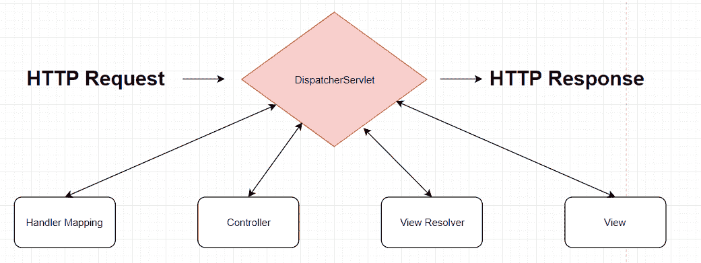

# Spring MVC 框架介绍

> 原文： [https://javatutorial.net/introduction-to-mvc-framework-in-spring](https://javatutorial.net/introduction-to-mvc-framework-in-spring)

MVC 代表模型-视图-控制器，Spring 支持它。 MVC 模式的优点在于，它将应用程序的不同方面分开，例如输入，业务逻辑和用户界面。 这种模式使用非常广泛，甚至还带有[歌曲](https://www.youtube.com/watch?v=YYvOGPMLVDo)。


MVC 模式中的三个组件是**模型，视图，控制器** ，因此是首字母缩写。

## 角色

#### 模型

简而言之，模型将存储 UI 呈现给用户的数据。

#### 视图

简而言之，可视化数据。

#### 控制器

简而言之，控制器管理状态机的行为，也就是响应事件，命令执行和更新模型。 例如，当用户单击按钮时会发生什么。

## 分派器

Spring 中的整个 MVC 模式都是围绕`DispatcherServlet`设计的，该`DispatcherServlet`处理所有 HTTP 请求和响应。



## MVC 的好处

*   可重用性
*   灵活性
*   强大

让我们看看如何实现上述目标。

可重用性 – 通过使用已经存在的对象来形成其他对象，而不是复制它们。

灵活性 – 可以利用参数注释（如`@RequestParam`，`@RequestHeader`等）。

强大 – MVC 架构支持异步技术，这意味着使用此模式构建的应用程序加载速度明显加快。

## 如何定义一个控制器？

`@Controller`注释用于使类的行为类似于控制器。 我们还可以在`@Controller`旁边使用`@RequestMapping`注解，以指定类或方法的 URL 路由。 在我们的例子中，我们将为整个`Controller`类指定 URL。

```java
@Controller
@RequestMapping("/")
public class ControllerDemo {
	@RequestMapping(method = RequestMethod.GET)
	public String helloWorld(ModelMap model) {
		model.addAttribute("message", "Hello World");
		return "helloWorld";
	}
}
```

由于`@RequestMapping("/")`，**该类中存在的所有方法都将相对于`"/"`路径。 我们还指定我们的`helloWorld`方法处理 GET 请求。

当然，如果需要，您可以添加更多表示 POST 的方法。 为了简单起见，我仅包含 GET。

## 如何创建视图？

上面，我提到了灵活性是该架构的优势之一。 好吧，Spring MVC 支持多种视图技术 – HTML，PDF，Excel，XML 等。 因此，您的技术将得到支持。 这给您灵活性（无双关语），可以选择您最喜欢使用的任何技术。

就我们而言，我们将使用 HTML 创建视图。

```java
<html>
	<head> 
		<title>Hello World</title>
	</head>

	<body>
		<h1> Message coming from helloWorld() method that resides in ControllerDemo class: ${ message } </h1>
	</body>
</html>
```

我们将这个 html 文件（我们的视图）存储在`/WEB-INF/helloWorld/`中，并为其命名为`helloWorld.jsp`。

您能猜出`${message}`给我们带来什么吗？ 它将返回我们添加为模型属性的任何消息。 让我们看看示例的情况：

```java
model.addAttribute("message", "Hello World");
```

因此，`${message}`的输出为`"Hello World"`。