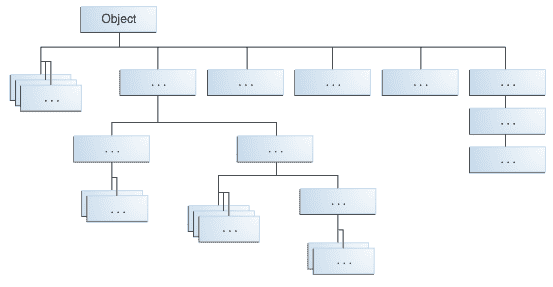

# Java 继承示例

> 原文： [https://javatutorial.net/java-inheritance-example](https://javatutorial.net/java-inheritance-example)

此示例演示了 Java 编程语言中继承的用法

## 什么是继承

继承是一种 OOP 功能，它允许 Java 类从其他类派生。 父类称为超类，而派生类称为子类。 子类从其超类继承字段和方法。

继承是[面向对象编程（OOP）](https://javatutorial.net/java-oop)背后的四个主要概念之一。 OOP 问题在工作面试中很常见，因此您可能会在下一次 Java 工作面试中遇到有关继承的问题。

Java 中的“所有类的母亲”是`Object`类。 Java 中的每个类都继承自`Object`。 在层次结构的顶部，`Object`是所有类中最通用的。 层次结构底部附近的类提供了更特殊的行为。



Java 平台中的所有类都是对象的后代（图像来自 [Oracle](https://oracle.com) ）

Java 具有单个继承模型，这意味着每个类都只有一个并且只有一个直接超类。

子类继承其父级的所有公共和受保护的成员，无论该子类位于哪个包中。如果该子类与其父级位于同一包中，则它也继承父成员的私有成员。 您可以按原样使用继承的成员，替换它们，隐藏它们，或用新成员补充它们：

*   继承的字段可以像其他任何字段一样直接使用。
*   您可以在子类中声明一个与超类中的名字相同的字段，因此隐藏了（不推荐）。
*   您可以在子类中声明不在超类中的新字段。
*   继承的方法可以直接使用。
*   您可以在子类中编写一个新的实例方法，该方法具有与超类中的签名相同的签名，因此将覆盖。
*   您可以在子类中编写一种新的静态方法，该方法具有与超类中的签名相同的签名，因此隐藏了。
*   您可以在子类中声明不在超类中的新方法。
*   您可以编写一个隐式或使用关键字`super`来调用超类的构造函数的子类构造函数。

继承是一种强大的技术，可让您编写干净且可维护的代码。 例如，假设您有一个具有多个后继类的超类。 更改超类中的几行代码，并更改每个继承者的功能，而不是在每个子类的每一端这样做，要容易得多。

## Java 继承示例

在下面的示例中，我们创建 3 个类。 超类`Point`表示二维空间中具有`x`和`y`坐标的点。

```java
package net.javatutorial;

public class Point {
	// fields marking X and Y position of the point
	public int x;
	public int y;

	// one constructor
	public Point(int x, int y) {
		super();
		this.x = x;
		this.y = y;
	}

	// getter and setter methods
	public int getX() {
		return x;
	}

	public void setX(int x) {
		this.x = x;
	}

	public int getY() {
		return y;
	}

	public void setY(int y) {
		this.y = y;
	}
}

```

`ColoredPoint`是一个子类，它扩展了`Point`的所有属性和方法，并添加了一个附加字段 –  `colorName`。 注意这是如何完成的–我们使用关键字`extends`来告诉我们要从哪个类派生

```java
package net.javatutorial;

public class ColoredPoint extends Point {

	// new field added to store the color name
	public String colorName;

	public ColoredPoint(int x, int y, String colorName) {
		super(x, y);
		this.colorName = colorName;
	}

	public String getColorName() {
		return colorName;
	}

	public void setColorName(String colorName) {
		this.colorName = colorName;
	}

}

```

最后是一个测试继承的程序。 首先，我们创建一个类型为`ColoredPoint`的新`Point`。 请注意关键字`instanceof`的用法。 这样，我们可以检查对象是否为某种类型。 一旦确定点的类型为`ColoredPoint`，就可以使用以下方法显式地进行类型转换：

```java
ColoredPoint coloredPoint = (ColoredPoint)point;
```

现在我们可以访问新属性`colorName`

```java
package net.javatutorial;

public class InheritanceExample {

	public static void main(String[] args) {
		Point point = new ColoredPoint(2, 4, "red");

		if (point instanceof ColoredPoint) {
			ColoredPoint coloredPoint = (ColoredPoint)point;
			System.out.println("the color of the point is: " + coloredPoint.getColorName());
			System.out.println("with coordinates x=" + coloredPoint.getX() + 
					" y=" + coloredPoint.getY());
		}
	}

}

```

运行上面的示例将产生以下输出

```java
the color of the point is: red
with coordinates x=2 y=4
```

### 参考文献

官方 Oracle [继承教程](https://docs.oracle.com/javase/tutorial/java/IandI/subclasses.html)