# 安装和配置 Android Studio

> 原文： [https://javatutorial.net/install-configure-android-studio](https://javatutorial.net/install-configure-android-studio)

本教程说明并指导您如何在 Windows 中安装和配置 Android Studio。

## Android Studio

众所周知，Android 世界正日趋增长。 数十亿个 Android 应用已在 Google Play 商店中发布。 因此，需要时间来学习 Android 开发的一些基础知识。 Android Studio 是用于 Android 应用程序开发的 IDE（集成开发环境）。

## **Android Studio** 的功能

以下是 Android Studio 的一些有趣功能：

*   它提供了一个基于 Gradle 的灵活构建系统。
*   它还支持 C++ 和 NDK
*   在不构建新 APK 的情况下运行您的应用。
*   提供虚拟设备来运行和测试您的应用

## 安装

请按照以下步骤完整安装和配置 Android Studio。

## 步骤 1）下载 Android Studio

您可以从[链接](https://developer.android.com/studio/index.html)下载 Android Studio，或转到 [developer.android.com](https://developer.android.com) 主页并搜索下载内容。 选择适用于 Windows，Mac 或 Linux 的适当平台。 以下是 Windows 操作系统的先决条件。

**前提条件**

*   Microsoft Windows 7/8/10（32 或 64 位）
*   最低 3GB RAM（建议 8GB）
*   2GB 磁盘空间
*   最小 1280 x 800 屏幕分辨率
*   英特尔加速仿真器处理器
*   Android SDK

**注意**：如果您没有 Android SDK，则可以通过 Android Studio 下载。 转到下载页面的末尾，找到[`android-studio-bundle-162.4069837-windows.exe`](https://dl.google.com/dl/android/studio/install/2.3.3.0/android-studio-bundle-162.4069837-windows.exe)，其中还包含 SDK。

## 步骤 2）运行`.exe`文件

现在，下一步是启动您刚刚下载的`.exe`文件。 出现以下屏幕

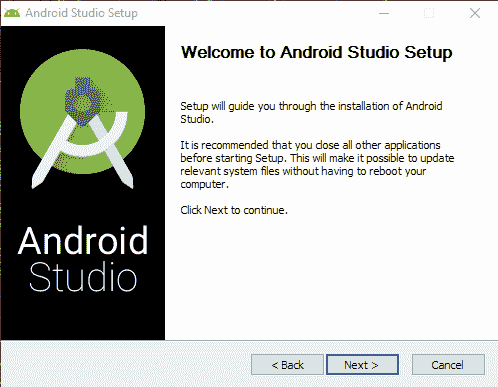

步骤 1：运行`.exe`文件

单击“下一步”，然后选择已选中的 Android SDK（如果尚未安装）。 更好的是保留默认设置。

确保还检查了 Android 虚拟设备。

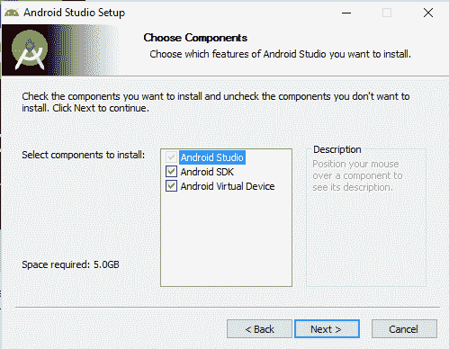

步骤 2：选择组件

下一步是接受许可和协议。 点击“我同意”

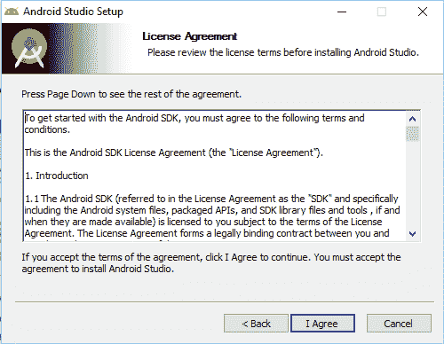

步骤 3：接受许可

下一步是设置安装位置。 在单击“下一步”之前，请确保磁盘具有最小的所需空间。 对于 Android Studio，安装位置必须至少有 500MB 可用空间。 要安装 Android SDK，所选位置必须至少具有 3.25GB 的可用空间。

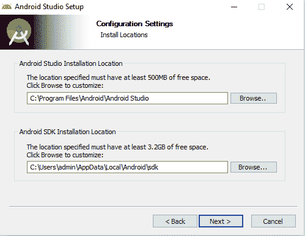

步骤 4：安装位置

下一步是选择要在其中创建快捷方式的开始菜单文件夹。 如果您不想创建快捷方式，只需标记，**不要创建快捷方式**。

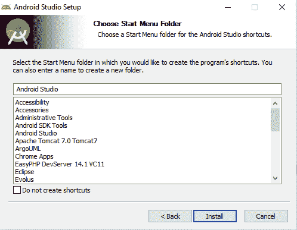

步骤 5：选择开始菜单文件夹

然后点击“安装”按钮。

它将开始安装。 完成后，将出现以下窗口。

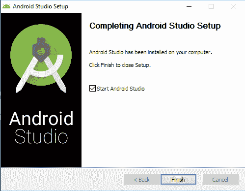

步骤 6：完成

这将通知您安装已完成。 单击“完成”。 确保已选中“启动 Android Studio”。 将出现以下 Android Studio 的初始屏幕。

步骤 7：Android Studio 启动画面

## 步骤 3）配置 Android Studio

首次运行时，系统会要求您提供 Android Studio 设置。

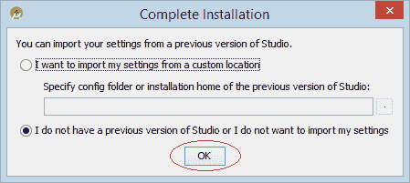

步骤 8：导入设置

如果您之前没有任何设置，请点击第二个选项（我没有 Studio 的早期版本，或者我不想导入设置）。

选择一个主题，然后单击下一步。

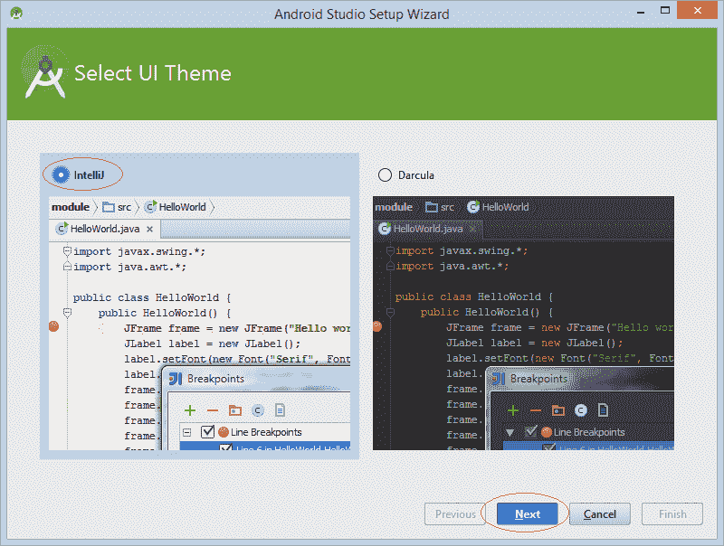

步骤 9：选择主题

在第一次运行时，它需要下载一些必要的组件，直到完成。

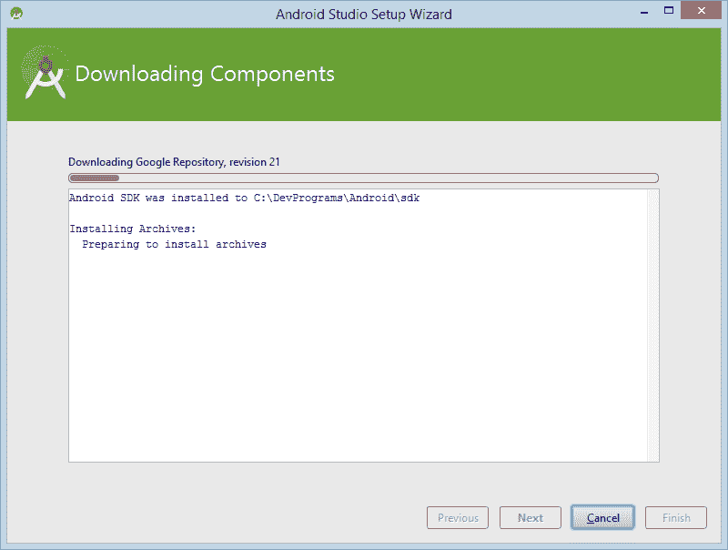

步骤 10：下载组件

一切都完成了。

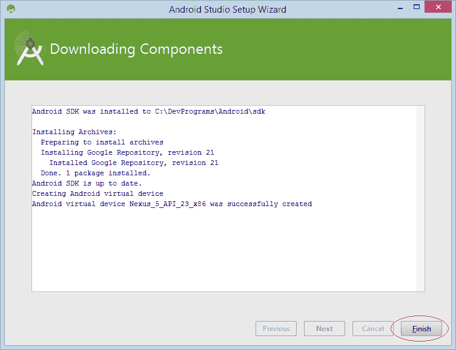

步骤 11：完成

点击“完成”并开始构建您的 Android 应用。

## **Android Studio** 用户界面简介

Android Studio 是一个集成开发环境（IDE）。 您已经在本教程中看到了下载和安装。 让我们学习一些 Android Studio 的基础知识。 这是一个正在运行的 Android Studio 的屏幕截图。

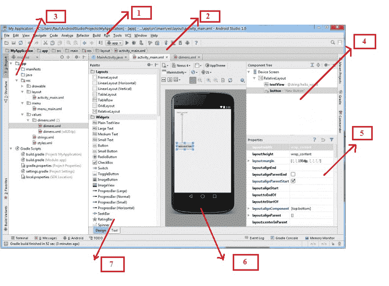

Android Studio 屏幕

红色标记显示

**1：工具栏** - 它是许多工具的集合，如剪切，复制，粘贴，运行调试等。

**2：导航栏** - 它可以帮助您浏览项目的最近打开的文件。

**3：项目层次结构** - 这是项目文件夹的层次结构。

**4：组件树** - 它以树结构的形式显示活动中使用的组件。

**5：属性窗口** - 它在屏幕上显示所选项目的属性。

**6：布局编辑器** - 它显示图形布局，以及您的应用程序外观。

**7：“调色板”窗口** - “调色板”窗口显示了 Android Studio 中可用的组件，布局和小部件。