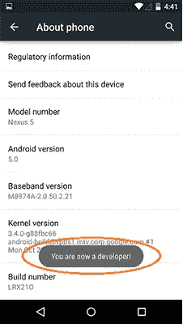
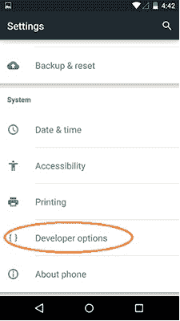
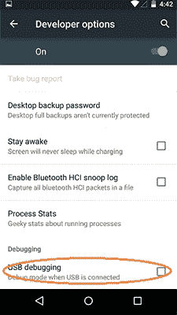
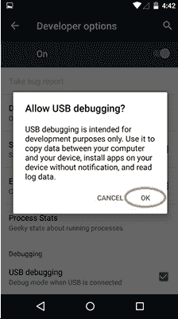
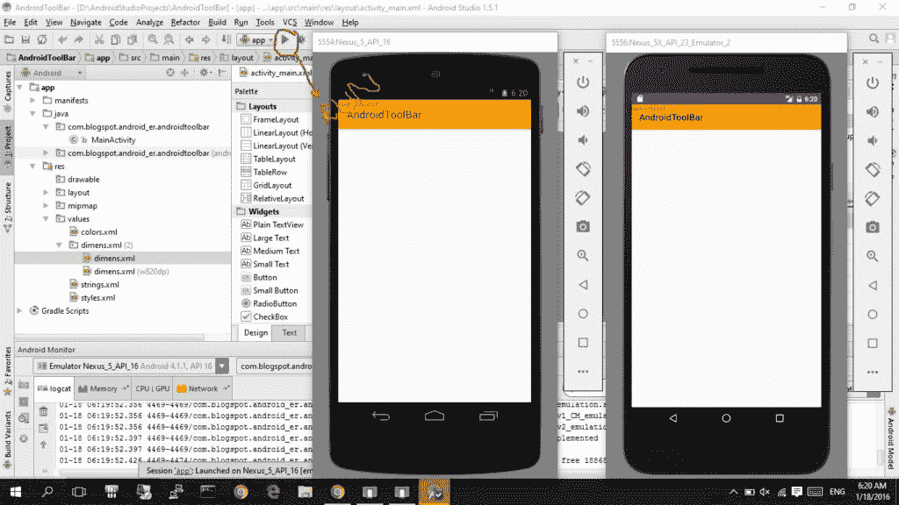
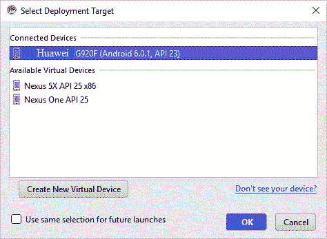

# 将 Android 设备连接到 Android Studio

> 原文： [https://javatutorial.net/connect-android-device-android-studio](https://javatutorial.net/connect-android-device-android-studio)

本教程将按照分步说明说明如何将您的 Android 设备连接到 Android Studio。

## 解释

在 Android Studio 中创建应用非常容易。 那么运行和测试呢？ Android Studio 为我们提供了一种方法，可以非常轻松，快速地在手机 Android 设备上运行应用程序。 如果您没有 Android 设备，请放心，Android Studio 会为您提供一个模拟器，它会创建虚拟 Android 设备，因此您无需真正拥有 Android 智能手机就可以运行和发送应用程序文本。 这次，我将向您展示如何将 Android 设备连接到 Android Studio。 因为没有替代品可以在硬件设备上运行您的应用程序。

## 前提条件

以下是一些先决条件：

*   Android Studio（如果没有它，[请参阅先前的教程](https://javatutorial.net/install-configure-android-studio)，以安装 Android Studio）。
*   USB 电缆
*   Android 设备

## 步骤 1）启用 USB 调试

第一步是在 Android 设备上启用 USB 调试。 为此，请按照下列步骤操作

*   在手机（或平板电脑）上，转到“设置 =&gt; 关于手机”
*   轻按“内部版本号” 7 次，第 7 次之后将显示“您现在是开发人员”。

步骤 1：USB 调试

*   您会注意到“开发人员的选项”现在可用。

步骤 2：USB 调试

*   转到“开发人员选项”并启用“USB 调试”

步骤 3：USB 调试

单击“确定”。

步骤 4：USB 调试

## 步骤 2：安装 USB 驱动程序

下一步是为您的 Android 设备安装 USB 驱动程序。 为此，请遵循设备制造商的说明。 例如，我正在使用华为的 Android 智能手机，因此我只是从他们的官方网站下载了华为 USB 驱动程序。 如果您的设备使用 Google USB 驱动程序，则可以从此链接 [http://developer.android.com/sdk/win-usb.html](http://developer.android.com/sdk/win-usb.html) 下载。 安装后，您需要对其进行更新。 确保您的设备通过 USB 电缆连接。 转到“控制面板 =&gt; 设备管理器”，然后找到并右键单击您的 Android 设备，然后单击“更新驱动程序软件”。

**注意**：确保通过 USB 电缆连接时，Android 设备未处于睡眠状态。

## 步骤 3：运行您的应用

您可以运行您的 Android 应用。 右键单击该应用程序，然后单击“运行”。 或者只需从下面显示的工具栏菜单中选择运行选项。

Android Studio 屏幕

将出现一个窗口“Select Deployment Target”，并出现可用设备的列表。 选择您的设备，然后单击“OK”。 Android Studio 将在您的 Android 设备上运行您的应用程序。

部署目标

如果您想保存此设置供以后的应用程序，请单击“将相同的选择用于以后的启动”。

## 参考文献

[官方 Android OEM 驱动程序安装指南](https://developer.android.com/studio/run/oem-usb.html)

[适用于 Windows 的 Samsung Android USB 驱动程序](http://developer.samsung.com/galaxy/others/android-usb-driver-for-windows)

[LG Android USB 驱动程序](http://www.lg.com/us/support/software-firmware-drivers)