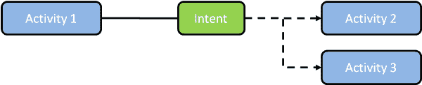
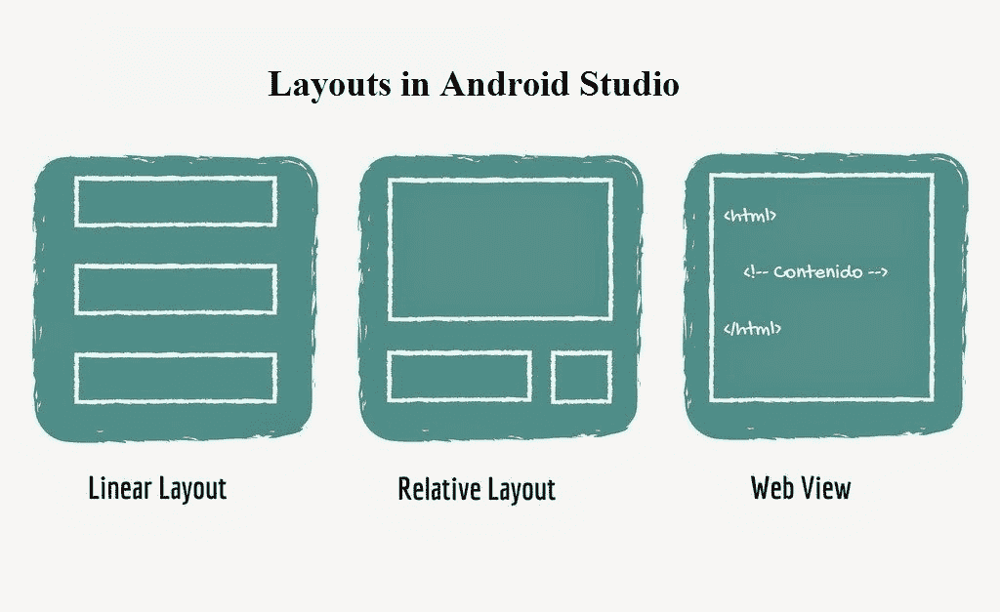

# Android 简介，活动，意图，服务，布局

> 原文： [https://javatutorial.net/introduction-android-activities-intents-services-layouts](https://javatutorial.net/introduction-android-activities-intents-services-layouts)

本教程将教您一些 Android 基础知识，因此您可以轻松制作自己的第一个 Android 应用。

## Android 简介

Android 是适用于多种不同设备的操作系统，例如平板电脑和智能手机。 它基于 Google 维护的 Linux。 统计数据显示，目前全球每月有 20 亿台活跃的 Android 设备。 Android 是功能强大的操作系统，具有许多不同的功能。

**消息传递**：它允许 SMS 和 MMS。

**浏览**： Android 的网络浏览器基于 WebKit 布局引擎。 它允许浏览。

**用户界面**：Android 提供了醒目的且易于使用的用户界面。

**触摸屏输入**：Android 支持简单和多点触摸系统。

**3G 通信协议**：它提供​​3G，4G 和 5G 通信协议以通过网络进行通信。

让我们谈谈内部工作，如何创建应用屏幕。

## Android 活动

活动类是 Android 的重要组成部分。 活动就像带有用户界面的单个屏幕一样，就像 Java 的框架一样。 我们知道任何用 Java 或 C++ 编写的可执行程序都具有`main()`方法，并且程序是通过`main()`方法启动的。 代替主要方法，[Android 具有不同的活动概念](https://javatutorial.net/swing-jframe-basics-create-jframe)。

大多数应用程序包含多个屏幕，这意味着它们具有多个活动。 活动已在应用的清单文件中注册。 每个活动都有其自己的生命周期，您必须正确管理。

这是一个活动示例。 有关 Android 活动的更多详细信息和全面说明，请阅读我们的 [Android 活动示例](https://javatutorial.net/android-activity-example)

```java
package com.example.admin.app;
import android.support.v7.app.AppCompatActivity;
import android.os.Bundle;
public class MainActivity extends AppCompatActivity {

    @Override
    protected void onCreate(Bundle savedInstanceState) {
        super.onCreate(savedInstanceState);
        setContentView(R.layout.activity_main);
    }
}

```

## Android 意图

目的使我们能够在组件之间进行通信。 意图就像一条消息，用于从另一个组件请求操作。 它用于不同应用程序中的代码之间的运行时绑定。



Android 意图

意图有两个基本组成部分

**数据**：要传送的数据。

**操作**：要执行的操作。

有两种主要类型的意图，显式意图和隐式意图。

```java
<intent-filter>
                 <action android:name="android.intent.action.INSERT" />
                 <category android:name="android.intent.category.DEFAULT" />
                 <data android:mimeType="vnd.android.cursor.dir/vnd.google.note" />
             </intent-filter>

```

转到我们的 [Android `Intent`示例](https://javatutorial.net/android-intent-example)，以了解有关 Android `Intent`的更多信息

## Android 服务

服务是没有用户界面的组件，可以执行长时间运行的操作。 Android 中有两种服务。

**服务**：由于它是 Android 后台服务的基类，因此它在主线程中运行。

**意图服务**：它在单独的线程中运行，并且已自毁。

查看我们的 [Android 服务示例](https://javatutorial.net/android-service-example)，以了解有关 Android 服务的更多信息

## Android 布局

布局是视觉组件在框架中的排列。 Android 支持许多不同的布局，例如线性布局，相对布局和 Web 视图是最常用的布局。 您还可以混合布局以将所需的设计应用于 Android 应用程序。



Android 布局

**线性布局**：将组件组织成单个水平或垂直行。 [完整示例可在这里找到](https://javatutorial.net/android-linear-layout-example)

**相对布局**：它指定组件相对于彼此的位置。 [完整示例可在这里找到](https://javatutorial.net/android-relative-layout-example)

**Web 视图**：用于网页。 [完整示例可在这里找到](https://javatutorial.net/android-web-view-layout-example)