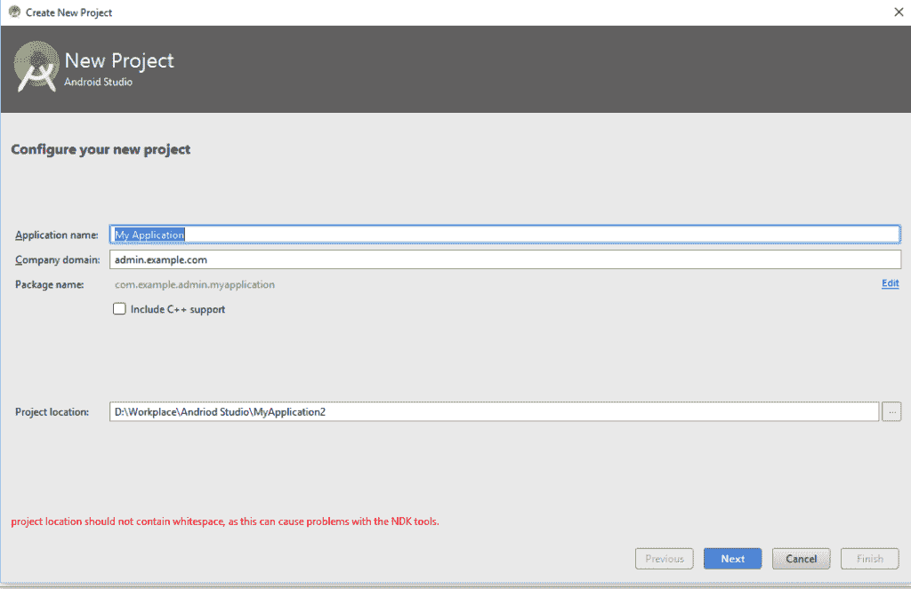
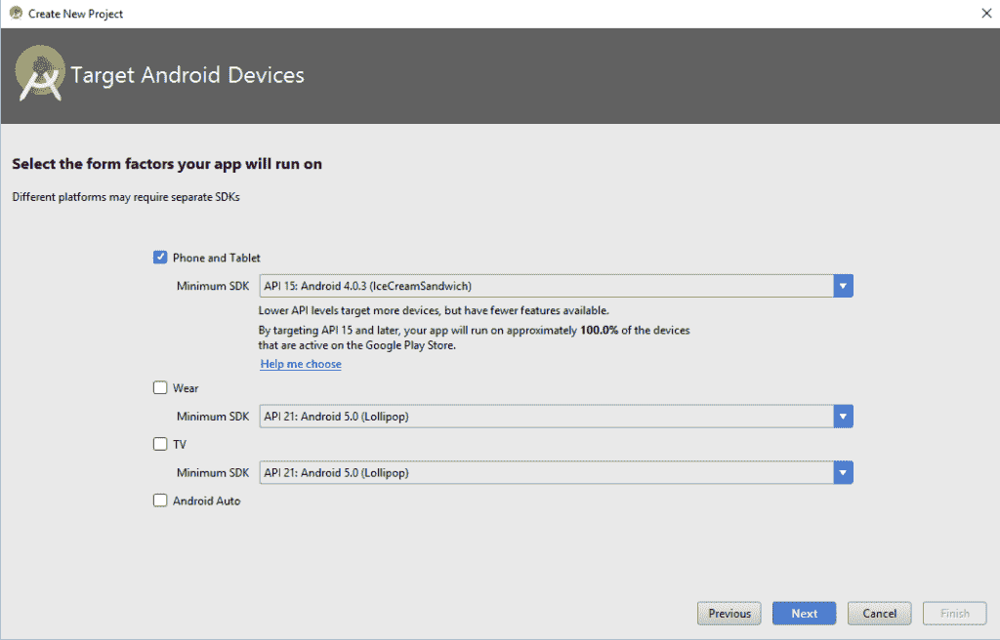
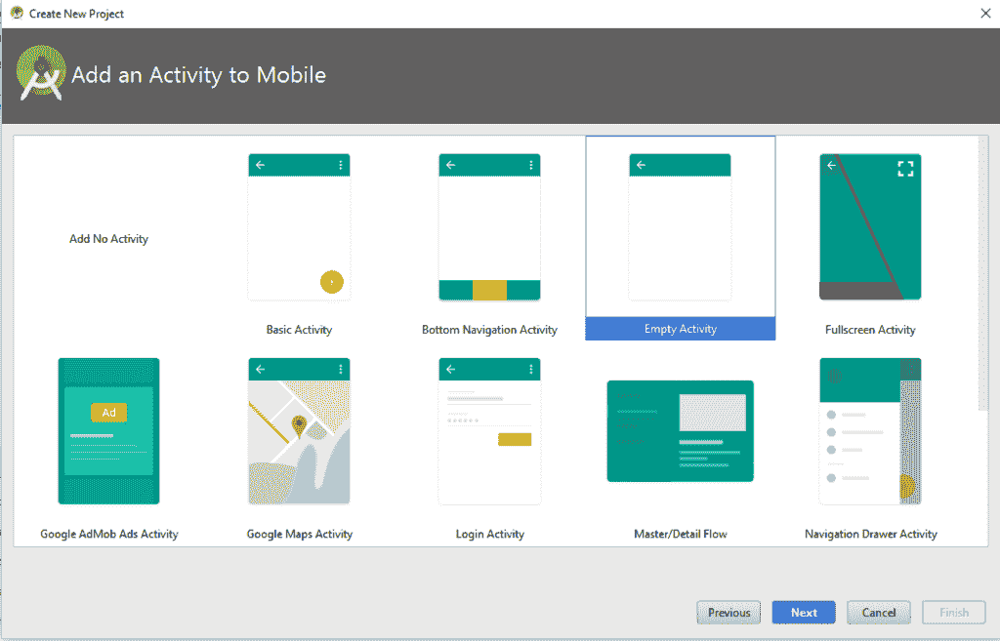
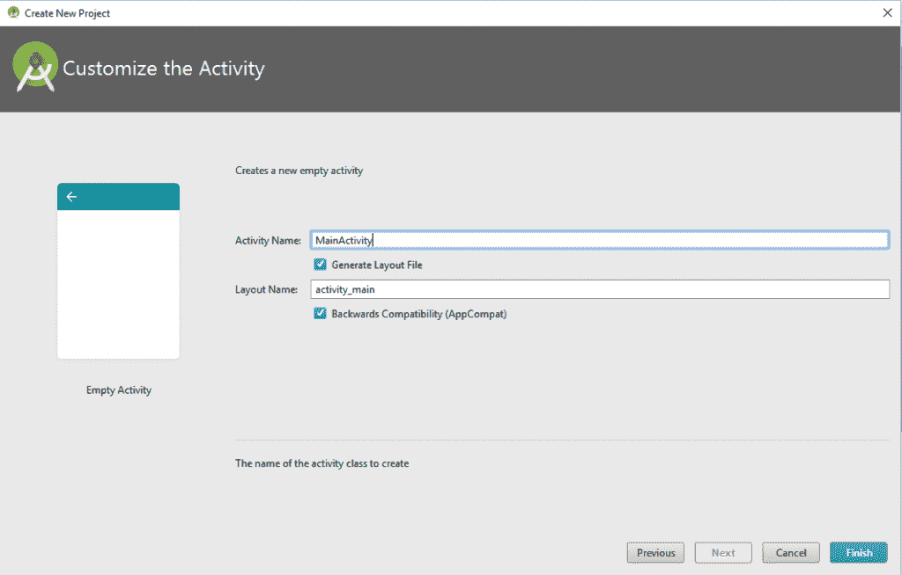
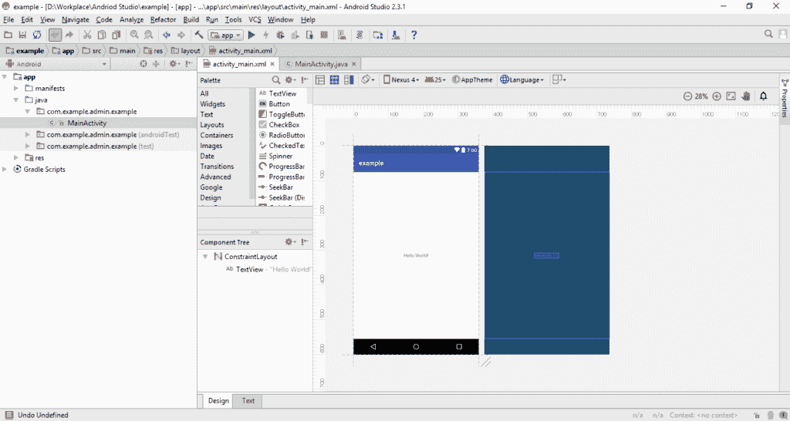
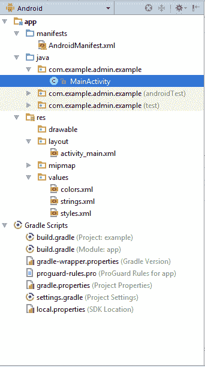
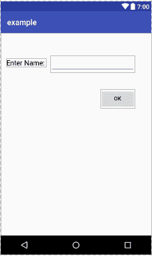
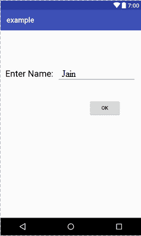
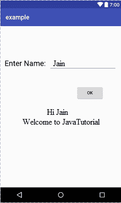

# 创建一个简单的 Android 应用

> 原文： [https://javatutorial.net/creating-simple-android-app](https://javatutorial.net/creating-simple-android-app)

本教程介绍了如何在 Android Studio 中创建简单的 Android 应用。

在 Android Studio 中创建应用非常容易。 在开始实际编程之前，请确保已正确设置环境和 Android SDK 路径。 [您可以按照本教程中的步骤进行操作](https://javatutorial.net/install-configure-android-studio)。 让我们从头开始。

## 创建 Android 项目

创建一个新项目。

*   转到“文件菜单 =&gt; 新建”，然后选择“新建项目”。
*   输入应用程序名称，然后选择项目的位置。单击，然后单击。（应用程序名称将在您的应用程序中显示为顶部横幅）。



步骤 1：新应用

*   为您的项目选择“目标设备”，然后单击“Next”。



第 2 步：定位 Android 设备

*   然后为您的项目选择一个活动。 因为这是基本教程，所以我选择一个空的活动。



步骤 3：添加活动

*   下一步是命名活动和活动的布局。 （活动是 java 类，您将在其中进行所有编码，而布局是 xml 格式的设计）。



步骤 4：自订活动

*   单击“完成”。
*   这是一个空的活动的样子



项目画面

## 项目的层次结构

首先，探索您应用的层次结构



项目层次结构

*   `xml`：它定义应用程序的属性。
*   `layout`：布局文件夹包含所有布局文件，用于设计应用程序的形状和外观。
*   `values`：此文件夹包含其他 xml 文件，例如`strings.xml`，`styles.xml`和`colors.xml`。 这些资源文件对于项目的代码和样式很有用。
*   `Java`：此文件夹包含所有 Java 类。
*   `gradle`：它包含`SDKversion`，`applicationId`和`BuilToolVersion`。

现在开始编码。

## 创建界面

打开布局文件，然后单击“设计”视图。

从**面板**窗口中将**文本视图**拖到屏幕上。 单击`Textview`，然后可以在属性窗口中更改其属性，如字体大小，字体颜色。

同样，也拖动文本字段和按钮并将其排列。 设置其属性，使屏幕如下所示。



设计画面

在单击按钮后出现另一个`textview`。 它应该为空（无文本）。

如果您不喜欢这种拖放选项，则可以随时进行编码。 转到您的布局文件夹，然后打开此活动的布局文件。 它在 xml 中。 使用拖放界面时，它将自动更新。 这是现在的样子。

```java
<?xml version="1.0" encoding="utf-8"?>

<LinearLayout android:layout_width="368dp"
    android:layout_height="495dp"
    xmlns:tools="http://schemas.android.com/tools"
    android:orientation="horizontal"
    tools:layout_editor_absoluteX="8dp"
    tools:layout_editor_absoluteY="8dp"
    android:weightSum="1"
    xmlns:android="http://schemas.android.com/apk/res/android">

    <RelativeLayout
        android:layout_width="390dp"
        android:layout_height="509dp">

        <TextView
            android:id="@+id/textView4"
            android:layout_width="wrap_content"
            android:layout_height="wrap_content"
            android:layout_alignParentLeft="true"
            android:layout_alignParentStart="true"
            android:layout_alignParentTop="true"
            android:layout_marginLeft="13dp"
            android:layout_marginStart="13dp"
            android:layout_marginTop="104dp"
            android:text="Enter Name:"
            android:textColor="@android:color/black"
            android:textSize="24sp" />

        <EditText
            android:id="@+id/editText4"
            android:layout_width="wrap_content"
            android:layout_height="wrap_content"
            android:layout_marginLeft="11dp"
            android:ems="10"
            android:inputType="textPersonName"
            android:text="Name"
            android:layout_alignBaseline="@+id/textView4"
            android:layout_alignBottom="@+id/textView4"
            android:layout_toRightOf="@+id/textView4"
            android:layout_toEndOf="@+id/textView4"
            android:layout_marginStart="11dp" />

        <Button
            android:id="@+id/button3"
            android:layout_width="wrap_content"
            android:layout_height="wrap_content"
            android:layout_alignEnd="@+id/editText4"
            android:layout_alignRight="@+id/editText4"
            android:layout_below="@+id/editText4"
            android:layout_marginEnd="41dp"
            android:layout_marginRight="41dp"
            android:layout_marginTop="46dp"
            android:onClick="ShowMessage()"
            android:text="OK" />

        <TextView
            android:id="@+id/textView5"
            android:layout_width="wrap_content"
            android:layout_height="wrap_content"
            android:layout_alignLeft="@+id/editText4"
            android:layout_alignStart="@+id/editText4"
            android:layout_below="@+id/button3"
            android:layout_marginTop="56dp"
            android:textColor="@android:color/black"
            android:textSize="24sp" />
    </RelativeLayout>
</LinearLayout>

```

## **用 Java 类**编写代码

现在打开`MainActivity.java`并将操作监听器添加到您的按钮。

这是添加动作监听器的方法。

```java
package com.example.admin.example;

import android.support.v7.app.AppCompatActivity;
import android.os.Bundle;
import android.view.View;
import android.widget.Button;
import android.widget.EditText;
import android.widget.TextView;

public class MainActivity extends AppCompatActivity {

    Button  button = null;
    TextView textView = null;
    EditText editText = null;
    @Override
    protected void onCreate(Bundle savedInstanceState) {
        super.onCreate(savedInstanceState);
        setContentView(R.layout.activity_main);

        button = (Button)findViewById(R.id.button3);
        textView = (TextView) findViewById(R.id.textView5);
        editText = (EditText) findViewById(R.id.editText4);
        final String name = editText.getText().toString();
        button.setOnClickListener(new View.OnClickListener() {
            public void onClick(View v) {
            textView.setText("Hello "+name+"\nWelcome to JavaTutorial");
            }
        });
    }
}

```

以下是屏幕快照的工作原理。



应用画面

当用户单击“确定”按钮时，将执行动作监听器，并说“欢迎”。



应用画面

阅读本教程，立即开始制作您的第一个应用程序。 您可以从[链接](https://github.com/JavaTutorialNetwork/Tutorials/blob/master/SimpleAndroidApp.rar)下载完整的项目。