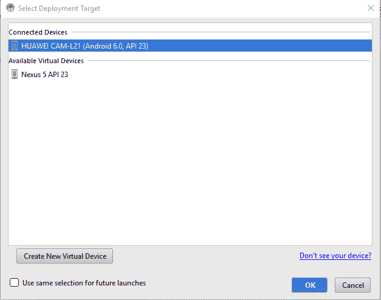
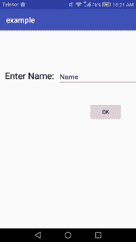
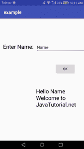
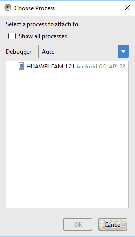
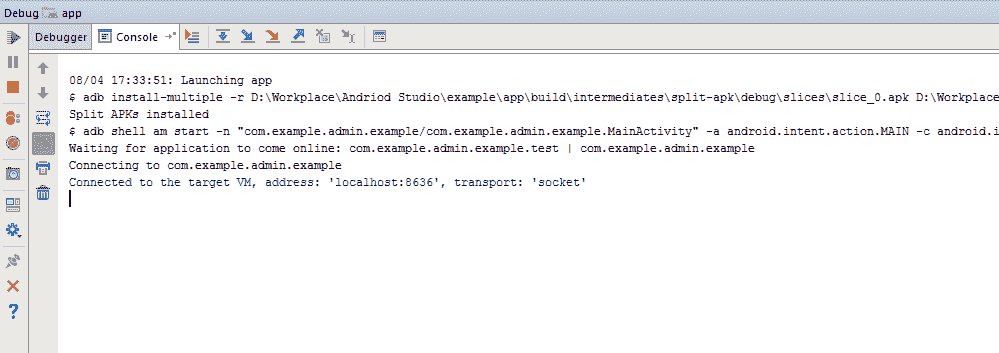
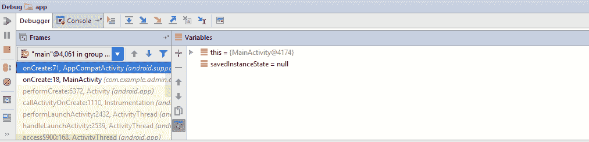

# 运行和调试 Android 应用程序

> 原文： [https://javatutorial.net/running-debugging-android-applications](https://javatutorial.net/running-debugging-android-applications)

在上一教程中，您学习了[如何创建一个简单的 Android 应用](https://javatutorial.net/creating-simple-android-app)。 本教程将说明如何在 Android Studio 中运行和调试 Android 应用程序。

## 解释

Android Studio 具有自己的默认运行/调试配置，足以满足我们的需求。 但是，如果要创建自己的配置或修改默认配置，也可以使用它。 当您在硬件设备上运行应用程序时，Android Studio 会为您的应用程序创建一个 APK 文件，然后在您的设备上安装并运行。 它为您处理大部分细节。 在 Android Studio 中运行和调试应用非常容易。 开始吧。

## 运行 Android 应用程序

请按照以下步骤运行您的应用程序。

*   在 Android Studio 中打开您的应用。
*   在运行/调试配置页面上，输入配置名称并选择模块（如果您不想使用默认的运行/调试配置，则此步骤是可选的）。
*   设置您的 Android 设备，确保已安装适当的 USB 驱动程序，启用 USB 调试并选择部署目标（有关更多详细信息，请参见前面的教程[如何配置 Android 设备](https://javatutorial.net/connect-android-device-android-studio)）。
*   单击菜单栏上的“运行”图标，或通过右键单击根文件夹来运行您的应用，然后选择“运行”。
*   我运行了本教程的上一个示例（一个简单的 Android 应用）。 这是结果
*   我的设备显示在部署目标窗口中。 选择它并运行。

选择部署目标

它将开始在您的设备中安装您的应用程序。 在这里安装后，它会创建快捷方式。

应用程式捷径

在 Android 设备上运行的应用

在 Android 设备上运行的应用

## 调试 Android 应用程序

调试是发现错误的过程。AndroidStudio 还提供了一种机制，可以调试在虚拟 Android 设备或硬件 Android 设备上运行的应用。 Android 调试器提供以下功能。

*   选择设备来调试您的应用
*   在代码中设置断点
*   在运行时检查表达式流。
*   允许捕获屏幕截图和视频

在开始调试之前，请确保该构建变量将`debuggable`属性设置为`true`。

为此，转到“构建 => 选择构建变量”。 要开始调试，请单击菜单栏上的“调试”图标。 在 Android 设备上构建并安装后，它将打开调试窗口。

*   选择屏幕菜单上的调试图标。
*   在“部署目标”窗口中选择您的设备。
*   然后选择要附加到调试器的进程。

选择进程

*   单击“确定”。
*   您将看到调试窗口，控制台将显示已连接到设备。

控制台消息

下图显示了调试器窗口，其中显示了当前线程。

调试器窗口

单击“终止”以终止调试会话。