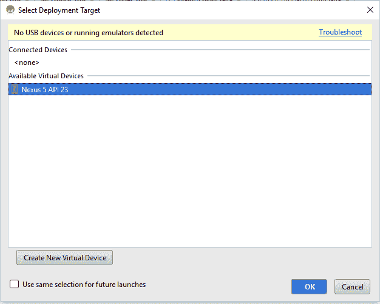
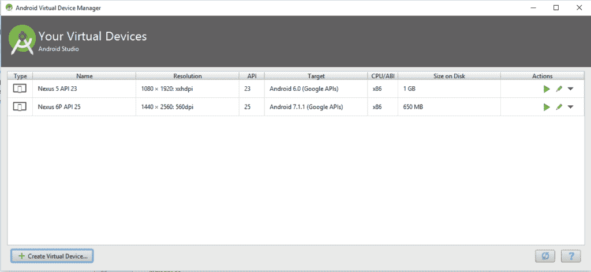
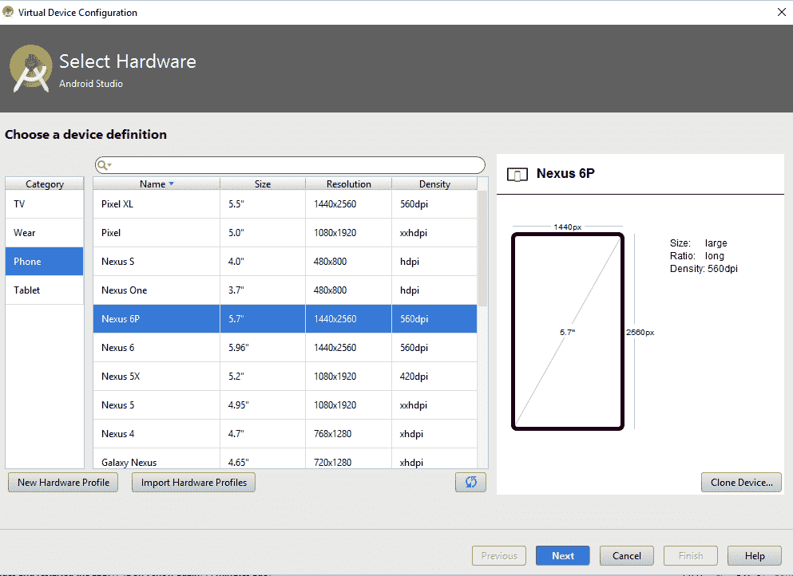
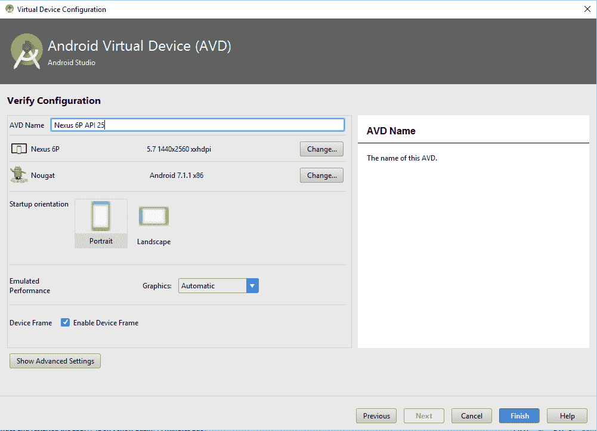
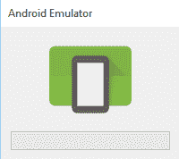
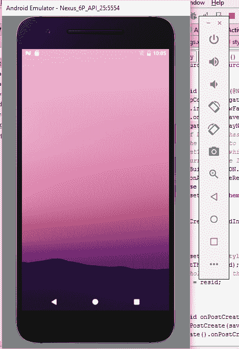
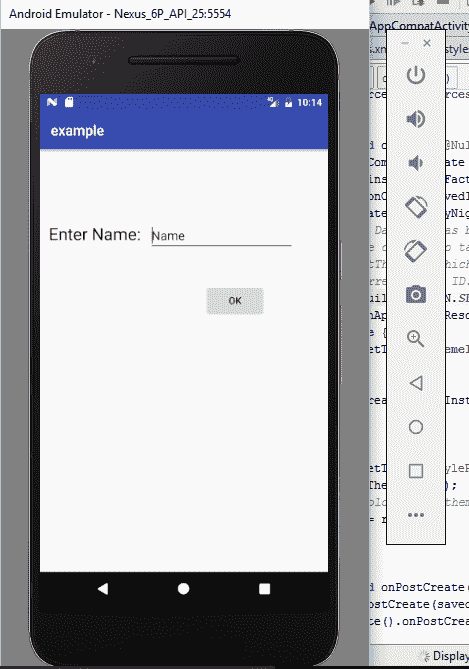

# 在虚拟设备上运行 Android 应用程序

> 原文： [https://javatutorial.net/run-android-application-virtual-device](https://javatutorial.net/run-android-application-virtual-device)

本教程介绍了如何配置虚拟设备以及如何在 Android 虚拟设备上运行应用程序。

## 背景

在上一教程中，您已经了解了如何[在硬件 Android 设备上运行和调试 Android 应用](https://javatutorial.net/running-debugging-android-applications)。 如果您没有 Android 硬件设备，则无需购买。 Android Studio 为我们提供了对虚拟 Android 设备的支持。 本教程全部关于 Android 虚拟设备。

## Android 虚拟设备

Android SDK 包含 Android 虚拟设备（AVD）或称为移动设备模拟器。 它使您无需使用 Android 硬件设备即可在计算机上开发，测试和运行 Android 应用程序。 多核处理器使其快速，强大且功能丰富。

## 在 Android 虚拟设备上运行的应用

您可以使用 Android Studio 在 Android 虚拟设备上运行应用程序，或者如果您有应用程序的 APK 文件，则可以直接在模拟器上拖动该文件以运行它。 如果要通过 Android Studio 运行，请执行以下步骤。

*   在 Android Studio 中打开您的项目（[如果没有该项目，则可以按照本教程的进行创建](https://javatutorial.net/creating-simple-android-app)）
*   单击菜单栏中的“运行”图标，或右键单击项目的根目录，然后单击“运行”。
*   将出现一个新窗口，用于选择部署目标（如果您是第一次使用，可能会遇到一个错误，提示某些必需的文件丢失了，您可以通过单击“下载”按钮进行下载）。

选择部署目标

*   它显示了可用虚拟设备的列表。 您可以选择任何人。
*   如果要使用此部署目标，请始终仅单击“对以后的启动使用相同的选择”。
*   点击“确定”
*   如果看不到任何必需的虚拟设备，则可以为您创建一个。
*   在菜单栏中选择“AVD 管理器”。

创建虚拟设备

*   单击“创建虚拟设备”
*   **从列表中选择硬件**，然后单击“下一步”

选择硬件

*   选择“系统映像”（选择推荐的一个），然后单击“下一步”

系统映像

*   **验证配置**，然后单击“完成”

验证配置

*   现在，单击“运行”，然后选择新创建的虚拟设备作为目标设备。
*   仿真器将以以下方式启动

加载模拟器

*   APK 文件将被安装。

仿真器

*   它将以

在模拟器上的应用

Android Studio 还允许我们自定义您的模拟器。 您可以在仿真器右侧看到一个垂直菜单栏。 这用于自定义您的应用，例如更改方向，音量设置，拍照等。 因此，您可以使用 Android 虚拟设备轻松，快速地运行，调试应用。