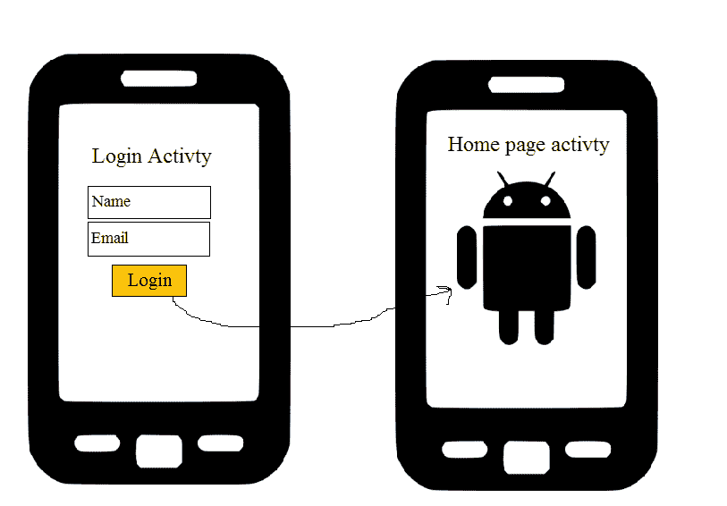
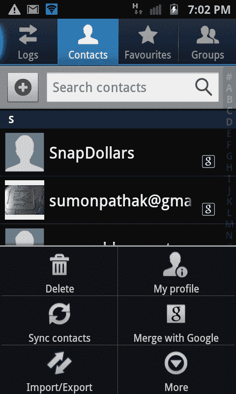
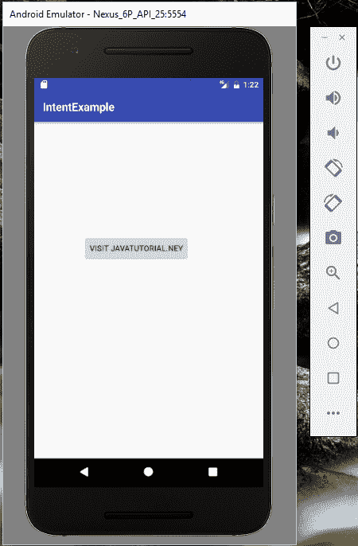
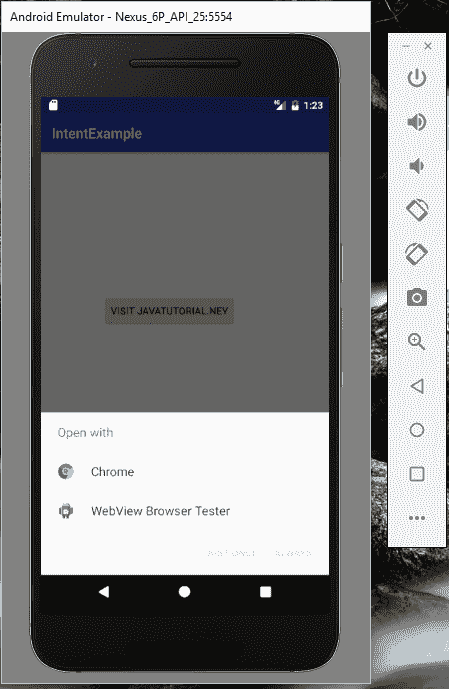
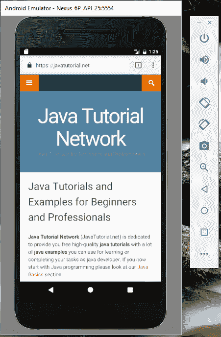

# Android 意图示例

> 原文： [https://javatutorial.net/android-intent-example](https://javatutorial.net/android-intent-example)

本教程通过示例说明了 Android 的意图，类型和方法。

## Android 意图

意图是用于向另一个组件请求操作的对象。 目的是一种数据结构，其中包含要执行的操作的抽象描述。 它用于从其他 Android 组件请求功能。 简而言之，意图是做某事的意图。 通过使用意图，我们可以做很多事情，例如从一个活动转到另一个活动，通过相机应用程序拍照，网络搜索，在地图上搜索位置等等。 这使开发人员可以轻松地重新混合不同的应用程序。

## 意图类型

有两种类型的意图，显式和隐式意图。

**显式意图**

在显式意图中，目标组件名称在创建意图时直接传递到意图中。 当一个活动调用另一个活动时，通常使用显式意图。 例如，我们有两个活动 - 登录活动和主页活动，登录应用程序将用户带到主页后，请参见下图。



显式意图

这是在登录活动中应如何调用的代码。

```java
Intent intent = new intent(this, homepageActivity);
startActivity(intent);

```

**隐式意图**

在显式意图中，目标组件名称在创建时不会在意图中传递。 Android 自行决定应在哪个应用程序的哪个组件中接收此意图。 显式意图用于激活其他应用程序中的组件。

例如，如果您的应用程序需要打开手机中的联系人（此意图需要另一个应用程序即手机中的联系人），那么代码将如下所示

```java
Intent intent = new Intent();
Intent.setAction(android.content.intent.ACTION_VIEW);
Intent.setDeta(ContactsContract.Contacts.intent.CONTENT_URI);
startActivity(intent);

```

因此，它将如下所示打开 Android 联系人



Android 联系人

## 目标方法

有用于向活动，服务和广播接收者传达意图的单独机制。 这是几种方法的解释

`Context.startActivity()`：此方法用于启动新活动，目的是作为参数传递的。

`Context.startService()`：此方法用于启动新服务，目的对象作为参数传递。

`Context.sendBroadcast()`：此方法用于将消息发送到任何广播接收器。 意图对象作为参数传递。

意图对象有两个主要组成部分。

**动作**：显示要执行的动作。 它是意图对象的必修部分。 要执行的动作可以是`ACTION_VIEW`，`ACTION_EDIT`等。

**数据**：它显示要操作的数据。 它可以是简单的数据类型或 URI。

## **意图**的示例

这是一个显示意图的示例。 转到您的 Android Studio 并创建一个新项目。 本示例将在您的 Android 中打开`javatutorial.net`。

这是`activity_main.xml`

```java
<?xml version="1.0" encoding="utf-8"?>

<RelativeLayout android:layout_width="368dp"
    android:layout_height="495dp"
    xmlns:tools="http://schemas.android.com/tools"
    tools:layout_editor_absoluteX="8dp"
    tools:layout_editor_absoluteY="8dp"
    xmlns:android="http://schemas.android.com/apk/res/android">

        <Button
            android:id="@+id/button"
            android:layout_width="wrap_content"
            android:layout_height="wrap_content"
            android:layout_alignParentTop="true"
            android:layout_centerHorizontal="true"
            android:layout_marginTop="202dp"
            android:text="Visit JavaTutorial.net" />
    </RelativeLayout>

```

这是`ActivtyMain.java`

```java
package com.example.admin.intentexample;

import android.content.Intent;
import android.net.Uri;
import android.support.v7.app.AppCompatActivity;
import android.os.Bundle;
import android.view.View;
import android.widget.Button;

public class MainActivity extends AppCompatActivity {

    Button button;
    @Override
    protected void onCreate(Bundle savedInstanceState) {
        super.onCreate(savedInstanceState);
        setContentView(R.layout.activity_main);
        button = (Button)findViewById(R.id.button);

        button.setOnClickListener(new View.OnClickListener() {

            @Override
            public void onClick(View v) {
                Intent i = new Intent(android.content.Intent.ACTION_VIEW,
                Uri.parse("http://www.javatutorial.net"));
                startActivity(i);
            }
        });
    }
}

```

这是它的样子



意图示例



选择浏览器



Java 教程

您可以从[链接](https://github.com/JavaTutorialNetwork/Tutorials/blob/master/IntentExample.rar)下载此代码。