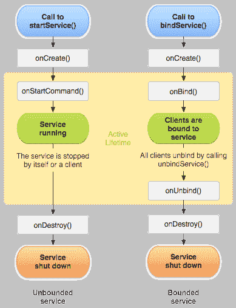
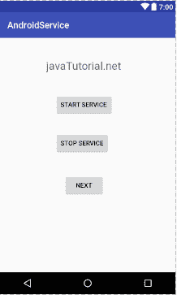
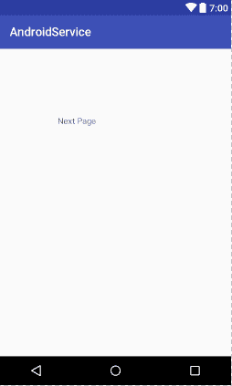

# Android 服务示例

> 原文： [https://javatutorial.net/android-service-example](https://javatutorial.net/android-service-example)

本教程介绍了 Android 中的服务及其生命周期，并提供了有关如何创建服务的示例。

Android 服务与 [Android 活动](https://javatutorial.net/android-activity-example)有很大不同。 这是 Android 应用程序开发的概念。 让我们讨论一下。

## Android 服务

服务用于实现或执行在我们的应用中运行的后台操作。 它是一个应用程序组件，用于执行长时间运行的重要后台任务，例如播放音乐，下载文件或执行网络事务。 由于服务在后台运行，因此与活动不同，它没有任何用户界面。 它使我们能够在应用程序中启用多任务处理。 尽管应用程序已关闭或服务已完成工作或已明确停止，但服务仍在后台继续运行。 因此，它比不活动的应用程序具有更高的优先级。 您还可以将其设置为与正在运行的前台任务相同的优先级。 让我们讨论一下服务类型。

## Android 服务的类型

Android 中提供三种不同类型的服务。

**调度**：在诸如`jobScheduler`之类的 API 中计划了一项服务，然后将其称为计划服务。 系统检查`jobScheduler`并在适当的时间执行服务。

**启动**：如果服务可以由应用程序组件启动，则将其称为已启动服务。 活动调用`startService(0`方法，然后在后台运行。 通常，此服务执行单个操作。

**绑定**：如果应用程序组件将服务绑定到`bindService()`，则称为绑定。 它具有一个客户端服务器接口，该接口允许组件与服务进行交互。

## Android 服务的生命周期

Android 服务生命周期与 Android 活动完全不同。 如果使用`startService()`创建服务或使用`bindService()`创建服务，则其生命周期可能会有所不同。 下图显示了两个生命周期。



服务生命周期

让我们讨论服务生命周期的回调方法。 当使用`startService()`创建服务时，将调用`OnStartCommand()`方法。 执行此方法后，服务星将在后台运行。 如果使用此方法创建了服务，请通过调用`stopSelf()`或`stopService()`方法将其停止。 如果服务是有界的，则使用`OnBound()`方法。 其他组件使用此方法将自己与服务绑定。`OnCreate()`方法用于创建服务。`OnDestroy()`方法用于销毁服务。

## Android 中的服务示例

这是 Android Studio 中的服务示例。 打开您的 IDE 并创建一个新项目。 创建活动并将其命名为`actvity_main`，这是`activty_main.xml`的代码

```java
<?xml version="1.0" encoding="utf-8"?>

<RelativeLayout android:layout_width="368dp"
    android:layout_height="495dp"
    xmlns:tools="http://schemas.android.com/tools"
    tools:layout_editor_absoluteX="8dp"
    tools:layout_editor_absoluteY="8dp"
    xmlns:android="http://schemas.android.com/apk/res/android">

        <Button
            android:id="@+id/buttonStart"
            android:layout_width="wrap_content"
            android:layout_height="wrap_content"
            android:layout_alignParentTop="true"
            android:layout_centerHorizontal="true"
            android:layout_marginTop="122dp"
            android:text="Button"
            tools:text="Start Service" />

        <Button
            android:id="@+id/buttonStop"
            android:layout_width="wrap_content"
            android:layout_height="wrap_content"
            android:layout_alignLeft="@+id/buttonStart"
            android:layout_alignStart="@+id/buttonStart"
            android:layout_below="@+id/buttonStart"
            android:layout_marginTop="36dp"
            android:text="Button"
            tools:text="Stop Service" />

        <Button
            android:id="@+id/buttonNext"
            android:layout_width="wrap_content"
            android:layout_height="wrap_content"
            android:layout_marginTop="44dp"
            android:text="Button"
            tools:text="Next"
            android:layout_below="@+id/buttonStop"
            android:layout_centerHorizontal="true" />

    <TextView
        android:id="@+id/textView"
        android:layout_width="wrap_content"
        android:layout_height="wrap_content"
        android:layout_alignParentTop="true"
        android:layout_centerHorizontal="true"
        android:layout_marginTop="47dp"
        android:text="TextView"
        android:textColorLink="@android:color/black"
        android:textSize="24sp"
        tools:text="javaTutorial.net" />
</RelativeLayout>

```

这是`MainActivity.java`的代码

```java
package com.example.admin.androidservice;

import android.app.Activity;
import android.content.Intent;
import android.support.v7.app.AppCompatActivity;
import android.os.Bundle;
import android.view.View;
import android.widget.Button;

public class MainActivity extends Activity implements View.OnClickListener {

    Button buttonStart, buttonStop,buttonNext;
    @Override
    public void onCreate(Bundle savedInstanceState) {
        super.onCreate(savedInstanceState);
        setContentView(R.layout.activity_main);

        buttonStart = (Button) findViewById(R.id.buttonStart);
        buttonStop = (Button) findViewById(R.id.buttonStop);
        buttonNext = (Button) findViewById(R.id.buttonNext);

        buttonStart.setOnClickListener(this);
        buttonStop.setOnClickListener(this);
        buttonNext.setOnClickListener(this);
    }
    public void onClick(View src) {
        switch (src.getId()) {
            case R.id.buttonStart:
                startService(new Intent(this, SecondActivity.class));
                break;
            case R.id.buttonStop:
                stopService(new Intent(this, SecondActivity.class));
                break;
            case R.id.buttonNext:
                Intent intent=new Intent(this,SecondActivity.class);
                startActivity(intent);
                break;
        }
    }
}

```

为另一个屏幕创建另一个活动，然后为其命名。 打开`activity_second.xml`并粘贴以下代码

```java
<?xml version="1.0" encoding="utf-8"?>

<RelativeLayout android:layout_width="368dp"
    android:layout_height="495dp"
    xmlns:tools="http://schemas.android.com/tools"
    tools:layout_editor_absoluteX="8dp"
    tools:layout_editor_absoluteY="8dp"
    xmlns:android="http://schemas.android.com/apk/res/android">

    <TextView
        android:id="@+id/textView1"
        android:layout_width="wrap_content"
        android:layout_height="wrap_content"
        android:layout_alignParentLeft="true"
        android:layout_alignParentTop="true"
        android:layout_marginLeft="96dp"
        android:layout_marginTop="112dp"
        android:text="Next Page" />

</RelativeLayout>

```

这是`secondActivity.java`的代码

```java
package com.example.admin.androidservice;

import android.support.v7.app.AppCompatActivity;
import android.os.Bundle;

public class SecondActivity extends AppCompatActivity {

        @Override
        public void onCreate(Bundle savedInstanceState) {
            super.onCreate(savedInstanceState);
            setContentView(R.layout.activity_second);
        }

}

```

运行并测试它，这是此代码的输出



android 服务



服务

您可以从此[链接](https://github.com/JavaTutorialNetwork/Tutorials/blob/master/AndroidService.rar)下载代码。