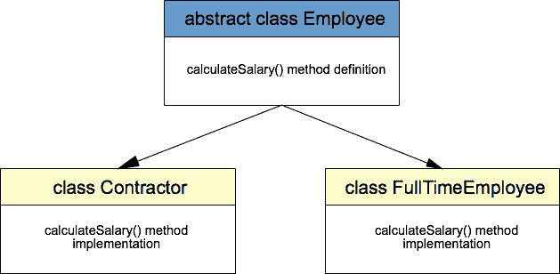

# Java 抽象示例

> 原文： [https://javatutorial.net/java-abstraction-example](https://javatutorial.net/java-abstraction-example)

此示例演示了 Java 编程语言中抽象的用法

## 什么是抽象

抽象是向用户隐藏实现细节的过程。 只有功能将提供给用户。 在 Java 中，使用抽象类和接口来实现抽象。 我们对 Java 接口有更详细的说明，如果您需要有关接口的更多信息，请[首先阅读本教程](https://javatutorial.net/java-interface-example)。

抽象是[面向对象编程（OOP）](https://javatutorial.net/java-oop)背后的四个主要概念之一。 OOP 问题在求职面试中很常见，因此您可能会在下次 Java 求职面试中遇到有关抽象的问题。

## Java 抽象示例

举一个抽象的例子，我们将创建一个名为`Employee`的超类和两个子类 - `Contractor`和`FullTimeEmployee`。 这两个子类都有共同的属性可以共享，例如雇员的姓名和每小时将支付给该人的金额。 承包商和全职员工之间的主要区别是 - 他们在公司工作的时间。 全职员工每天持续工作 8 个小时，承包商的工作时间可能会有所不同。



Java 抽象类示例

首先创建超类`Employee`。 注意在类定义中`abstract`关键字的用法。 这将类标记为抽象，这意味着它不能直接实例化。 我们将称为`calculateSalary()`的方法定义为抽象方法。 这样，您可以将此方法的实现留给`Employee`类的继承者。

```java
package net.javatutorial;

public abstract class Employee {

	private String name;
	private int paymentPerHour;

	public Employee(String name, int paymentPerHour) {
		this.name = name;
		this.paymentPerHour = paymentPerHour;
	}

	public abstract int calculateSalary();

	public String getName() {
		return name;
	}

	public void setName(String name) {
		this.name = name;
	}

	public int getPaymentPerHour() {
		return paymentPerHour;
	}

	public void setPaymentPerHour(int paymentPerHour) {
		this.paymentPerHour = paymentPerHour;
	}

}

```

`Contractor`类继承了其父级`Employee`的所有属性，但必须提供其自己的`calculateSalary()`方法的实现。 在这种情况下，我们将每小时的付款额乘以给定的工作时间。

```java
package net.javatutorial;

public class Contractor extends Employee {

	private int workingHours;

	public Contractor(String name, int paymentPerHour, int workingHours) {
		super(name, paymentPerHour);
		this.workingHours = workingHours;
	}

	@Override
	public int calculateSalary() {
		return getPaymentPerHour() * workingHours;
	}

}

```

`FullTimeEmployee`也有自己的`calculateSalary()`方法实现。 在这种情况下，我们只需乘以恒定的 8 小时即可。

```java
package net.javatutorial;

public class FullTimeEmployee extends Employee {

	public FullTimeEmployee(String name, int paymentPerHour) {
		super(name, paymentPerHour);
	}

	@Override
	public int calculateSalary() {
		return getPaymentPerHour() * 8;
	}

}

```