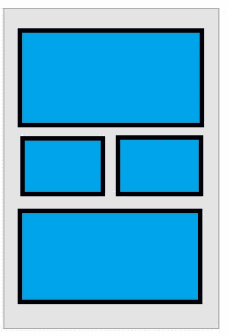
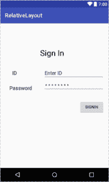

# Android 相对布局示例

> 原文： [https://javatutorial.net/android-relative-layout-example](https://javatutorial.net/android-relative-layout-example)

本教程通过示例说明了 Android 中的相对布局。

Android 中的布局对于基于 GUI 的应用程序非常重要。 在上一教程中，我们学习了[线性布局](https://javatutorial.net/android-linear-layout-example)，本教程介绍了 Android 中的相对布局。

## 相对布局

顾名思义，相对布局显示组件之间的相对位置。 可以相对于连续元素或父组件来指定位置。 相对布局是 Android 提供的最灵活的布局。 它使您可以在屏幕上放置元素。 默认情况下，它将所有组件设置在布局的左上方。 下图显示了相对布局的外观，



相对布局

## 相对布局属性

以下是相对布局的属性。

*   `Id`：定义布局 ID
*   `Gravity`*它指定对象在 x-y 平面中的位置。
*   `IgnoreGravity`：被添加以忽略特定组件上的重力。

## 相对布局构造函数

相对布局具有四个不同的构造函数

*   `RelativeLayout(Contetxt context)`
*   `RelativeLayout(Contetxt context, AttributeSet attribute)`
*   `RelativeLayout(Contetxt context, AttributeSet attribute, int defStyleAttribute)`
*   `RelativeLayout(Contetxt context, AttributeSet attribute, int defStyleAttribute, in defStyleRes)`

## 相对布局的方法

以下是相对布局的几种重要方法

*   `setGravity()`：它将子视图的重力设置为居中，向左或向右。
*   `setHorizo​​ntalGravity()`：用于水平定位元素。
*   `setVerticalGravity()`：用于垂直放置元素。
*   `requestLayout()`：用于请求布局。
*   `setIgnoreGravity()`：用于忽略任何特定元素的重力。
*   `getGravity()`：用于获取元素的位置。
*   `getAccessibilityClassName()`：返回对象的类名称。

## 相对布局的 XML 属性

相对布局具有以下 XML 属性。

`android:layout_above`，它将给定组件的底部边缘定位在给定组件 ID 上方。

`android:layout_alignBaseline`，它将给定组件的基线置于给定组件 ID 的基线之上。

`android:layout_alignBottom`，它在给定组件 ID 的底部对齐。

`android:layout_alignEnd`，它在给定组件 ID 的末尾对齐。

`android:layout_alignLeft`，它将组件定位在给定组件 ID 的左侧。

`android:layout_alignRight`，将该组件定位在给定组件 ID 的右侧。

## 相对布局示例

以下示例显示了 Android 中的相对布局。 创建一个空的活动并将相对布局从调色板拖到屏幕上。 然后拖动所需的 GUI 组件。 这是 xml 文件。

```java
<?xml version="1.0" encoding="utf-8"?>

<RelativeLayout android:layout_width="368dp"
    android:layout_height="495dp"
    xmlns:tools="http://schemas.android.com/tools"
    tools:layout_editor_absoluteX="8dp"
    tools:layout_editor_absoluteY="8dp"
    xmlns:android="http://schemas.android.com/apk/res/android">

        <TextView
            android:id="@+id/textView"
            android:layout_width="wrap_content"
            android:layout_height="wrap_content"
            android:layout_alignParentLeft="true"
            android:layout_alignParentStart="true"
            android:layout_alignParentTop="true"
            android:layout_marginLeft="141dp"
            android:layout_marginStart="141dp"
            android:layout_marginTop="89dp"
            android:text="Sign In"
            android:textColor="@android:color/black"
            android:textColorLink="@android:color/black"
            android:textSize="28sp" />

        <TextView
            android:id="@+id/textView2"
            android:layout_width="wrap_content"
            android:layout_height="wrap_content"
            android:layout_marginTop="43dp"
            android:text="ID"
            android:textColor="@android:color/black"
            android:textSize="18sp"
            android:typeface="normal"
            android:layout_below="@+id/textView"
            android:layout_alignLeft="@+id/textView5"
            android:layout_alignStart="@+id/textView5"
            android:layout_marginLeft="10dp"
            android:layout_marginStart="10dp" />

        <EditText
            android:id="@+id/editText"
            android:layout_width="wrap_content"
            android:layout_height="wrap_content"
            android:ems="10"
            android:inputType="textPersonName"
            android:text="Enter ID"
            android:layout_alignBaseline="@+id/textView2"
            android:layout_alignBottom="@+id/textView2"
            android:layout_alignLeft="@+id/editText2"
            android:layout_alignStart="@+id/editText2" />

    <TextView
        android:id="@+id/textView5"
        android:layout_width="wrap_content"
        android:layout_height="wrap_content"
        android:textSize="18sp"
        android:textColor="@android:color/black"
        android:text="Password"
        android:layout_alignBottom="@+id/editText2"
        android:layout_alignParentLeft="true"
        android:layout_alignParentStart="true"
        android:layout_marginLeft="32dp"
        android:layout_marginStart="32dp" />

    <EditText
        android:id="@+id/editText2"
        android:layout_width="wrap_content"
        android:layout_height="wrap_content"
        android:layout_alignParentEnd="true"
        android:layout_alignParentRight="true"
        android:layout_below="@+id/editText"
        android:ems="10"
        android:text="Password"
        android:inputType="textPassword" />

    <Button
        android:id="@+id/S"
        android:layout_width="wrap_content"
        android:layout_height="wrap_content"
        android:layout_alignParentEnd="true"
        android:layout_alignParentRight="true"
        android:layout_below="@+id/editText2"
        android:layout_marginTop="32dp"
        android:text="SignIn" />
</RelativeLayout>

```

这是输出的样子



相对布局示例

您可以从[链接](https://github.com/JavaTutorialNetwork/Tutorials/blob/master/RelativeLayout.rar)下载源代码。