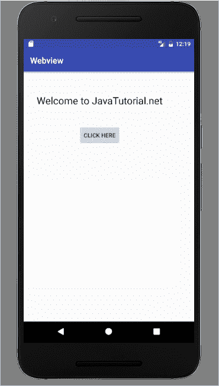
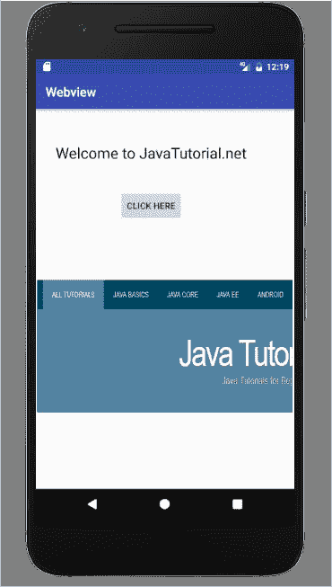

# Android Web 视图示例

> 原文： [https://javatutorial.net/android-web-view-layout-example](https://javatutorial.net/android-web-view-layout-example)

在先前的教程中，我们学习了 Android 中的[线性](https://javatutorial.net/android-linear-layout-example)和[相对布局](https://javatutorial.net/android-relative-layout-example)，本教程以示例说明了 Web 视图。

您要在 Android 应用程序中打开网页吗？ Android 提供了一种称为 Web 视图，可帮助我们在应用程序中打开网页。

## Web 视图

Web 视图用于显示活动中的在线内容。 Web 视图类是 Android 中视图类的扩展。 它不像网络浏览器，因此不提供导航控件和 URL。 Web 工具包呈现引擎显示网页，并允许我们向前和向后导航。 如果要在应用程序中显示一些网页信息，则使用 Web 视图非常普遍。 或者，如果您想提供需要更新的信息（例如用户指南或协议），则可以用作另一种用途。

如果要在应用程序中访问互联网，则必须向清单文件添加`INTERNET`权限，例如

`<uses-permission android: name= "android.permission.INTERNET" />`

## Web 查看方法

以下是 Android 中 Web 视图的方法。

*   `addJavascriptInterface(Object object, String name)`，用于在 Web 视图中注入 JavaScript 代码。
*   `canGoBack()`，用于转到上一个历史记录项目。
*   `canGoBackOrForward(int steps)`，用于按给定步骤前进或后退。
*   `canGoForward()`，用于转到下一个历史记录项目。
*   `canZoonIn()`，用于放大。
*   `canZoomOut()`，用于缩小。
*   `clearHistory()`，用于清除 Web 视图的历史记录。
*   `clearView()`，用于重置 Web 视图和释放资源。
*   `destroy()`，用于破坏 Web 视图的内部状态。
*   `findFocus()`，在以当前具有焦点的此视图为根的层次结构中查找视图。
*   `freeMemory()`，用于释放内存，现在不建议使用此方法。
*   `getSettings()`，获取 Web 视图的设置。
*   `getTitle()`，以字符串形式获取当前页面的标题。
*   `getURL()`，以字符串形式获取当前页面的 URL。
*   `goBack()`，返回 Web 视图的历史记录。
*   `capturePicture()`，用于拍摄 Web 视图的位图快照。

## Android 中的 Web 视图示例

这是一个示例，显示了如何通过在活动中使用 Web 视图在应用程序中显示`javatutorial.net`网站。 首先，您需要创建一个新活动。 打开您的`activity_main.xml`并粘贴此代码。

```java
<?xml version="1.0" encoding="utf-8"?>

<RelativeLayout android:layout_width="368dp"
    android:layout_height="495dp"
    tools:layout_editor_absoluteX="8dp"
    tools:layout_editor_absoluteY="8dp"
    xmlns:tools="http://schemas.android.com/tools"
    xmlns:android="http://schemas.android.com/apk/res/android">

    <TextView
        android:id="@+id/textView"
        android:layout_width="wrap_content"
        android:layout_height="wrap_content"
        android:layout_alignParentTop="true"
        android:layout_centerHorizontal="true"
        android:layout_marginTop="53dp"
        android:text="Welcome to JavaTutorial.net"
        android:textColor="@android:color/black"
        android:textSize="24sp" />

    <Button
        android:layout_width="wrap_content"
        android:layout_height="wrap_content"
        android:layout_below="@+id/textView"
        android:layout_centerHorizontal="true"
        android:layout_marginTop="44dp"
        android:text="Click Here"
        android:id="@+id/button" />

    <WebView
        android:layout_width="match_parent"
        android:layout_height="match_parent"
        android:layout_below="@+id/button"
        android:layout_marginTop="86dp"
        android:id="@+id/webView"/>
</RelativeLayout>

```

现在打开`mainActivity.java`并粘贴此代码

```java
package com.example.admin.webview;

import android.support.v7.app.AppCompatActivity;
import android.os.Bundle;
import android.view.View;
import android.webkit.WebView;
import android.webkit.WebViewClient;
import android.widget.Button;
import android.widget.EditText;

public class MainActivity extends AppCompatActivity {

    Button b1;

    private WebView wv1;
    @Override
    protected void onCreate(Bundle savedInstanceState) {
        super.onCreate(savedInstanceState);
        setContentView(R.layout.activity_main);

        b1=(Button)findViewById(R.id.button);

        wv1=(WebView)findViewById(R.id.webView);
        wv1.setWebViewClient(new MyBrowser());

        b1.setOnClickListener(new View.OnClickListener() {
            @Override
            public void onClick(View v) {
                String url = "https://www.javatutorial.net/";

                wv1.getSettings().setLoadsImagesAutomatically(true);
                wv1.getSettings().setJavaScriptEnabled(true);
                wv1.setScrollBarStyle(View.SCROLLBARS_INSIDE_OVERLAY);
                wv1.loadUrl(url);
            }
        });
    }

    private class MyBrowser extends WebViewClient {
        @Override
        public boolean shouldOverrideUrlLoading(WebView view, String url) {
            view.loadUrl(url);
            return true;
        }
    }
}

```

您的清单文件应该是这样的

```java
<?xml version="1.0" encoding="utf-8"?>
<manifest xmlns:android="http://schemas.android.com/apk/res/android"
    package="com.example.admin.webview">
    <uses-permission android:name="android.permission.INTERNET" />
    <application
        android:allowBackup="true"
        android:icon="@mipmap/ic_launcher"
        android:label="@string/app_name"
        android:roundIcon="@mipmap/ic_launcher_round"
        android:supportsRtl="true"
        android:theme="@style/AppTheme">
        <activity android:name=".MainActivity">
            <intent-filter>
                <action android:name="android.intent.action.MAIN" />

                <category android:name="android.intent.category.LAUNCHER" />
            </intent-filter>
        </activity>
    </application>

</manifest>
```

这是此应用程序的输出



网页视图



Web 视图示例

您可以通过单击[链接](https://github.com/JavaTutorialNetwork/Tutorials/blob/master/Webview.rar)下载此代码。