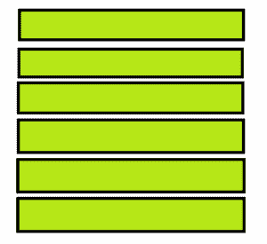
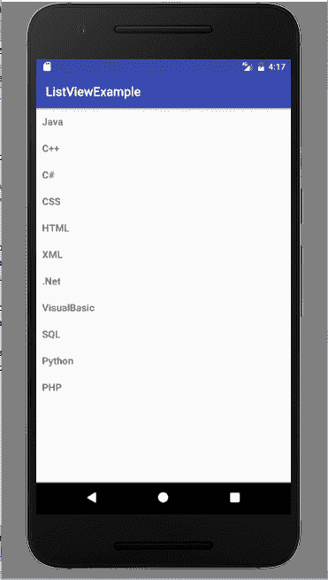

# Android 列表视图示例

> 原文： [https://javatutorial.net/android-list-view-example](https://javatutorial.net/android-list-view-example)

您已经学习了 Android 的许多其他布局，本教程通过示例说明了 android 中的列表视图。

## `ListView`

您要在应用中显示列表吗？ Android 通过提供列表视图布局来解决其问题。 它是一种布局，在垂直可滚动列表中显示项目。 列表中的每个项目都位于列表中上一个项目的下方。 列表项存储在数组中，并由[使用适配器](https://javatutorial.net/android-listview-with-listadapter-example)从列表中拉出项目，然后将其插入列表。 列表视图是`AdapterView`的子类。 自定义列表在移动应用程序中非常常见，列表视图提供了一种创建自定义列表的简便方法。 它是最常用的布局之一，例如，当您要显示一组日期时，没有什么比列表更合适的了。 下图显示了列表视图的外观



列表显示

## 列表视图的属性

这是列表视图的一些重要 XML 属性。

`android: divider`，它用作绘制能力或颜色，用于在列表项之间绘制。

`android: entries`，它用于引用数组资源以填充列表视图。

`android: headerDividersEnabled`，用于在每个标题视图之后绘制分隔线。

`android: footerDividersEanabled`，用于在每个页脚视图之前绘制分隔线。

## 列表视图的方法

列表视图有许多公共方法，下面将对其中的一些方法进行说明。

*   `getAdapter()`：返回列表视图中使用的适配器。
*   `addHeaderView()`：用于在列表顶部添加标题视图。
*   `getAccessibilityClassName()`：返回对象的类名。
*   `getDivider()`：返回列表中每个项目之间的分隔符。
*   `getDividerHeight()`：返回分隔线的高度。
*   `isOpaque()`：显示列表是否不透明。
*   `removeFooterView(View view)`：用于删除列表中先前添加的页脚视图。
*   `removeHeaderView(View view)`：用于删除列表中先前添加的标题视图。

## 列表视图的构造函数

列表视图具有四个不同的公共构造函数，如下所示：

*   `ListView(Context context)`
*   `ListView(Context context, AttributeSet attrs)`
*   `ListView(Context context, AttributeSet attrs, int defStyleAttr)`
*   `ListView(Context context, AttributeSet attrs, AttributeSet attrs, int defStyleRes)`

## 列表视图的示例

这是在 Android 中使用列表视图的示例。 它显示了计算机科学中的语言列表。 首先创建一个活动，打开活动`_main.xml`并粘贴此代码

```java
<?xml version="1.0" encoding="utf-8"?>
<LinearLayout xmlns:android="http://schemas.android.com/apk/res/android"
    xmlns:tools="http://schemas.android.com/tools"
    android:layout_width="match_parent"
    android:layout_height="match_parent"
    android:orientation="vertical"
   >

    <ListView
        android:id="@+id/mobile_list"
        android:layout_width="match_parent"
        android:layout_height="wrap_content" >
    </ListView>

</LinearLayout>
```

创建另一个布局作为`activity_listview.xml`并粘贴此代码

```java
<?xml version="1.0" encoding="utf-8"?>
<!--  Single List Item Design -->

<TextView xmlns:android="http://schemas.android.com/apk/res/android"
    android:id="@+id/label"
    android:layout_width="fill_parent"
    android:layout_height="fill_parent"
    android:padding="10dip"
    android:textSize="16dip"
    android:textStyle="bold" >
</TextView>
```

打开您的 MainActivity.java 并使用此代码

```java
package com.example.admin.listviewexample;

import android.support.v7.app.AppCompatActivity;
import android.os.Bundle;
import android.widget.ArrayAdapter;
import android.widget.ListView;

public class MainActivity extends AppCompatActivity {

    String[] mobileArray = {"Java","C++","C#","CSS",
            "HTML","XML",".Net","VisualBasic", "SQL", "Python", "PHP"};

    @Override
    protected void onCreate(Bundle savedInstanceState) {
        super.onCreate(savedInstanceState);
        setContentView(R.layout.activity_main);

        ArrayAdapter adapter = new ArrayAdapter<String>(this,
                R.layout.activity_listview, mobileArray);

        ListView listView = (ListView) findViewById(R.id.mobile_list);
        listView.setAdapter(adapter);
    }
}

```

这是输出的样子



列表视图示例

您可以通过以下[链接](https://github.com/JavaTutorialNetwork/Tutorials/blob/master/ListViewExample.rar)下载此示例代码。