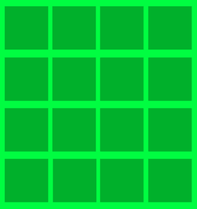
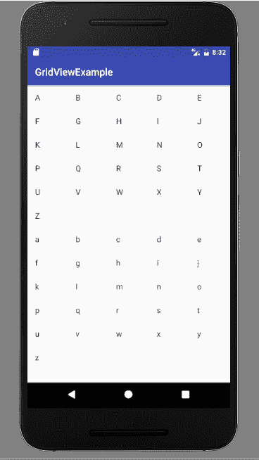

# Android 网格视图示例

> 原文： [https://javatutorial.net/android-grid-view-example](https://javatutorial.net/android-grid-view-example)

Android 网格视图是许多应用程序中最常用的布局之一。 本教程通过示例说明了网格视图的布局。

## `GridView`

网格视图是 android 中的布局，可让您将组件排列在二维可滚动网格中。`GirdView`中的组件不一定是静态的，它可以存储在`ListAdapter`中（适配器就像数据和 UI 组件之间的桥梁）。 下图显示了 android 中`GridView`的示例。



Android `GridView` 

网格视图在计算器，日历等许多应用程序中非常常见。

## 网格视图的属性

以下是 Android 网格视图布局的一些 XML 属性。

*   `android:gravity`，代表每个单元格（如中心，底部，顶部，左侧等）中的重力。
*   `android:columnWidth`，用于指定每个单元格的列宽。
*   `android:horizo​​ntalSpacing`，指定网格列之间的水平空间。
*   `android:verticalSpacing`，用于指定网格行之间的垂直空间。
*   `android:numColumns`，指定要显示的列数。

## 网格视图的方法

网格视图有多种使用方法，其中一些在此处说明

*   `getAccessibilityClassName()`：返回对象的类名称。
*   `getAdapter()`：返回与其关联的适配器。
*   `getColumnWidth()`：返回网格上列的宽度。
*   `getGravity()`：返回网格组件的重力，即它们如何水平对齐。
*   `getHorizo​​ntalSpacing()`：返回网格组件之间的水平间距。
*   `getNumColumns()`：获取网格中的列数。
*   `setAdapter（ListAdapter adapter）`：用于在网格视图后面设置数据。
*   `setColumnWidth（int columnWidth）`：用于设置列宽。
*   `setGravity（in gravity）`：用于设置网格组件的重力。
*   `setHorizo​​ntalSpacing（int horizo​​ntalSpacing）`：用于设置水平间距以将项目放置在网格中。
*   `setVerticalSpacing（int verticalSpacing）`：用于设置垂直间距以将项目放置在网格上。

## 网格视图的构造函数

`GridView`具有四个不同的公共构造函数，如下所示

*   `GridView(Context context)`
*   `GridView(Context context, AttributeSet attribute)`
*   `GridView(Context context, AttributeSet attribute, int defStyleAttr)`
*   `GridView(Context context, AttributeSet attribute, int defStyleAttr, int defStyleRes)`

## 网格视图示例

本示例说明如何在 Android 中使用`GridView`布局。 如前所述，`GridView`可以直接使用，也可以与自定义适配器一起使用。 本示例显示了小写和大写英文字母的网格。

打开 Android Studio 并开始创建一个新项目。 创建一个活动并将以下代码粘贴到`main_Activity.xml`中。

```java
<?xml version="1.0" encoding="utf-8"?>

<GridView xmlns:android="http://schemas.android.com/apk/res/android"
    android:id="@+id/gridView1"
    android:numColumns="auto_fit"
    android:gravity="center"
    android:columnWidth="80dp"
    android:stretchMode="columnWidth"
    android:layout_width="fill_parent"
    android:layout_height="fill_parent" >
</GridView>
```

打开`mainActivity.java`并粘贴此代码

```java
package com.example.admin.gridviewexample;

import android.support.v7.app.AppCompatActivity;
import android.os.Bundle;
import android.view.View;
import android.widget.AdapterView;
import android.widget.ArrayAdapter;
import android.widget.GridView;
import android.widget.TextView;
import android.widget.Toast;

public class MainActivity extends AppCompatActivity {

    GridView gridView;

    static final String[] numbers = new String[] {
            "A", "B", "C", "D", "E",
            "F", "G", "H", "I", "J",
            "K", "L", "M", "N", "O",
            "P", "Q", "R", "S", "T",
            "U", "V", "W", "X", "Y", "Z", "\n","\n","\n","\n",
            "a", "b","c","d","e",
            "f","g","h","i","j",
            "k","l","m","n","o",
            "p","q","r","s","t",
            "u","v","w","x","y",
            "z"};

    @Override
    public void onCreate(Bundle savedInstanceState) {
        super.onCreate(savedInstanceState);

        setContentView(R.layout.activity_main);

        gridView = (GridView) findViewById(R.id.gridView1);

        ArrayAdapter<String> adapter = new ArrayAdapter<String>(this,
                android.R.layout.simple_list_item_1, numbers);

        gridView.setAdapter(adapter);

        gridView.setOnItemClickListener(new AdapterView.OnItemClickListener() {
            public void onItemClick(AdapterView<?> parent, View v,
                                    int position, long id) {
                Toast.makeText(getApplicationContext(),
                        ((TextView) v).getText(), Toast.LENGTH_SHORT).show();
            }
        });

    }

}

```

这是输出的样子



网格视图示例

您可以通过单击[链接](https://github.com/JavaTutorialNetwork/Tutorials/blob/master/GridViewExample.rar)下载此代码。