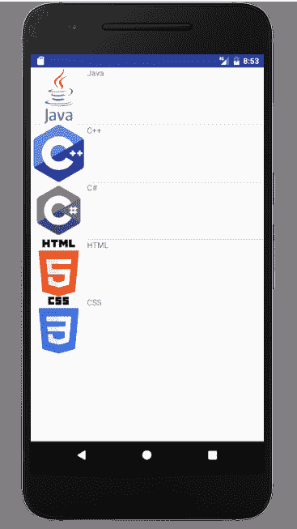

# 带有`ListAdapter`的 Android `ListView`示例

> 原文： [https://javatutorial.net/android-listview-with-listadapter-example](https://javatutorial.net/android-listview-with-listadapter-example)

在上一个教程中，我们通过一个简单的示例了解了[列表视图布局](https://javatutorial.net/android-list-view-example)。 本教程介绍了用于创建自定义列表的列表适配器。

## Android `ListAdapter`

列表视图非常简单，您要自定义列表吗？`ListAdapter`用于自定义列表视图的布局。 它的行为就像是数据源和列表视图之间的桥梁。 它的父类是`BaseAdapter`。 当您要为列表中的各个行指定布局时使用。 不要将其与`ArrayAdapter`混淆，`ListAdapter`是一个接口，而`ArrayAdapter`是可处理数据数组的类。 下图显示了使用`ListAdapter`的自定义列表视图。


列表适配器

## `ListAdapter`构造函数

`ListAdapter`的构造方法采用一个参数，该参数指定每一行的布局资源。 除此之外，它还有两个参数（这两个参数通常是并行数组），使我们能够指定将哪个数据字段与行布局资源中的哪个对象相关联。

## `ListAadapter`的方法

`ListAdapter`具有以下公共方法。

*   `areAllItemsEnabled()`：它通过返回布尔值来告知是否启用列表适配器中的所有项目。 如果返回`true`，则表示所有项目都是可选择和可单击的。 如果返回不同的值（如果值更改），则不能保证它将生效。
*   `isEnabled(int position)`：如果可以单击并选择位于特定位置的项目，则返回`true`。如果给定的位置无效，则无法指定结果。

## `ListAdapter`的示例

让我们开始使用`ListAdapter`进行编码。[在列表视图的先前教程中](https://javatutorial.net/android-list-view-example)，已经讨论了计算机科学语言的简单示例。 这被显示为简单列表。 现在，我们以不同的方式做同样的事情。 不仅显示语言列表，还显示带有语言图标。

首先为每行创建一个布局，该布局具有图像视图和文本视图。 这是`list_single.xml`的代码

```java
<?xml version="1.0" encoding="utf-8"?>
<TableLayout xmlns:android="http://schemas.android.com/apk/res/android"
    android:layout_width="match_parent"
    android:layout_height="match_parent" >
    <TableRow>
        <ImageView
            android:id="@+id/img"
            android:layout_width="100dp"
            android:layout_height="100dp"/>

        <TextView
            android:id="@+id/txt"
            android:layout_width="wrap_content"
            android:layout_height="100dp" />

    </TableRow>
</TableLayout>
```

创建一个 Java 类并将其命名为`CustomList.java`，这是它的代码

```java
package com.example.admin.listadapterexample;

import android.app.Activity;
import android.view.LayoutInflater;
import android.view.View;
import android.view.ViewGroup;
import android.widget.ArrayAdapter;
import android.widget.ImageView;
import android.widget.TextView;

public class CustomList extends ArrayAdapter<String>{

    private final Activity context;
    private final String[] web;
    private final Integer[] imageId;
    public CustomList(Activity context,
                      String[] web, Integer[] imageId) {
        super(context, R.layout.list_single, web);
        this.context = context;
        this.web = web;
        this.imageId = imageId;

    }
    @Override
    public View getView(int position, View view, ViewGroup parent) {
        LayoutInflater inflater = context.getLayoutInflater();
        View rowView= inflater.inflate(R.layout.list_single, null, true);
        TextView txtTitle = (TextView) rowView.findViewById(R.id.txt);

        ImageView imageView = (ImageView) rowView.findViewById(R.id.img);
        txtTitle.setText(web[position]);

        imageView.setImageResource(imageId[position]);
        return rowView;
    }
}

```

现在创建一个主要活动，`mainActivty.java`的代码是

```java
package com.example.admin.listadapterexample;

import android.support.v7.app.AppCompatActivity;
import android.os.Bundle;

import android.os.Bundle;
import android.view.View;
import android.widget.AdapterView;
import android.widget.ListView;
import android.widget.Toast;
import android.app.Activity;

public class MainActivity extends Activity {
    ListView list;
    String[] web = {
            "Java",
            "C++",
            "C#",
            "HTML",
            "CSS"

    } ;
    Integer[] imageId = {
            R.drawable.java,
            R.drawable.cplus,
            R.drawable.csharp,
            R.drawable.html,
            R.drawable.download

    };

    @Override
    protected void onCreate(Bundle savedInstanceState) {
        super.onCreate(savedInstanceState);
        setContentView(R.layout.activity_main);

        CustomList listAdapter = new
                CustomList(MainActivity.this, web, imageId);
        list=(ListView)findViewById(R.id.list);
        list.setAdapter(listAdapter);
        list.setOnItemClickListener(new AdapterView.OnItemClickListener() {

            @Override
            public void onItemClick(AdapterView<?> parent, View view,
                                    int position, long id) {
                Toast.makeText(MainActivity.this, "You Clicked at " +web[+ position], Toast.LENGTH_SHORT).show();

            }
        });

    }

}

```

这是`activty_main.xml`布局的样子

```java
<RelativeLayout xmlns:android="http://schemas.android.com/apk/res/android"
    xmlns:tools="http://schemas.android.com/tools"
    android:layout_width="match_parent"
    android:layout_height="match_parent"
    tools:context=".MainActivity" >

    <ListView
        android:id="@+id/list"
        android:layout_width="wrap_content"
        android:layout_height="wrap_content" >

    </ListView>

</RelativeLayout>
```

运行您的应用程序，这里是输出



列表适配器示例

您可以通过单击[链接](https://github.com/JavaTutorialNetwork/Tutorials/blob/master/ListAdapterExample.rar)下载此代码。