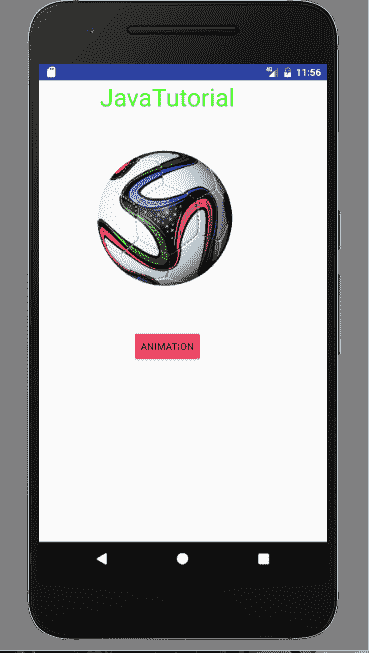
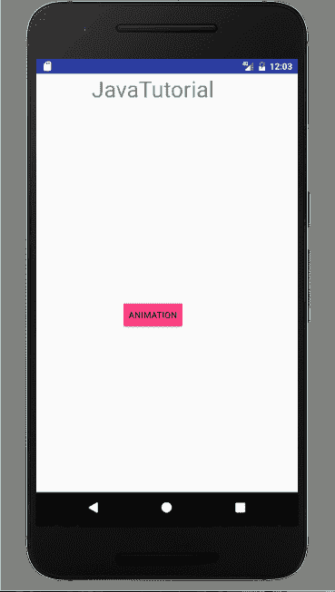

# Android 动画教程

> 原文： [https://javatutorial.net/animations-with-android-tutorial](https://javatutorial.net/animations-with-android-tutorial)

本教程借助一个示例来说明什么是动画以及如何在 Android 应用程序中使用动画。

## 动画

你知道什么是动画吗？ 动画实际上是对运动的幻想。 在这项技术中，相差很小的连续图像会产生运动效果。 动画在移动应用程序中非常有用。 教育中的动画用于解释理论和概念。 应用程序中的动画用来显示一些准则或过程。 向 Android 应用程序添加动画会增加用户的可加性。 它增加了乐趣，并平滑了用户体验。 在本教程中，您将学习如何通过在 Android 应用中添加动画来增加用户体验。

## Android 中的动画

Android 提供了一个名为`Animations`的类。 此类提供了许多不同的方法。 以下是其中一些：

*   `loadAnimation(Context, Layout)`：此方法用于加载动画。 它有两个参数。
*   `start()`：用于启动动画。
*   `setDuration(long duration)`：此方法设置 Android 中动画的持续时间。
*   `getDuration()`：用于获取 Android 动画的持续时间。
*   `end()`：用于结束动画。
*   `cancel()`：用于取消动画。

## Android 中的动画示例

让我们开始为 Android 中的动画创建示例。 我将讨论四种类型的动画：眨眼，淡入淡出，顺时针和滑动。 打开您的 Android Studio 并创建一个新活动。 在主要活动中，有一个图像视图和一个按钮。 我用足球的形象。 这是`activity_main.xml`的代码

```java
<?xml version="1.0" encoding="utf-8"?>
<RelativeLayout android:layout_width="368dp"
    android:layout_height="495dp"
    tools:layout_editor_absoluteX="8dp"
    tools:layout_editor_absoluteY="8dp"
    xmlns:tools="http://schemas.android.com/tools"
    xmlns:android="http://schemas.android.com/apk/res/android">

    <TextView
            android:layout_width="wrap_content"
            android:layout_height="wrap_content"
            android:text="JavaTutorial"
            android:id="@+id/textView2"
            android:textColor="#ff3eff0f"
            android:textSize="35dp"
            android:layout_centerHorizontal="true" />

        <ImageView
            android:layout_width="200dp"
            android:layout_height="200dp"
            android:id="@+id/imageView"
            android:src="@drawable/football"
            android:layout_below="@+id/textView2"
            android:layout_alignRight="@+id/textView2"
            android:layout_alignEnd="@+id/textView2"
            android:layout_marginTop="50dp" />

    <Button
        android:id="@+id/button2"
        android:layout_width="wrap_content"
        android:layout_height="wrap_content"
        android:layout_below="@+id/imageView"
        android:layout_centerHorizontal="true"
        android:layout_marginTop="59dp"
        android:backgroundTint="@color/colorAccent"
        android:onClick="Animation"
        android:text="Animation" />

    </RelativeLayout>

```

现在为眨眼动画，淡入淡出动画，顺时针动画和幻灯片动画创建四个布局文件。 这是`blink_animation.xml`的代码

```java
<?xml version="1.0" encoding="utf-8"?>

    <set xmlns:android="http://schemas.android.com/apk/res/android">
        <alpha android:fromAlpha="0.0"
            android:toAlpha="1.0"
            android:interpolator="@android:anim/accelerate_interpolator"
            android:duration="600"
            android:repeatMode="reverse"
            android:repeatCount="infinite"/>
    </set>

```

这是`fade_animation.xml`的代码

```java
<?xml version="1.0" encoding="utf-8"?>

    <set xmlns:android="http://schemas.android.com/apk/res/android"
        android:interpolator="@android:anim/accelerate_interpolator" >

        <alpha
            android:fromAlpha="0"
            android:toAlpha="1"
            android:duration="2000" >
        </alpha>

        <alpha
            android:startOffset="2000"
            android:fromAlpha="1"
            android:toAlpha="0"
            android:duration="2000" >
        </alpha>

    </set>

```

这是`clockwise_animation.xml`的代码

```java
<?xml version="1.0" encoding="utf-8"?>

       <set xmlns:android="http://schemas.android.com/apk/res/android">

        <rotate xmlns:android="http://schemas.android.com/apk/res/android"
            android:fromDegrees="0"
            android:toDegrees="360"
            android:pivotX="50%"
            android:pivotY="50%"
            android:duration="5000" >
        </rotate>

        <rotate xmlns:android="http://schemas.android.com/apk/res/android"
            android:startOffset="5000"
            android:fromDegrees="360"
            android:toDegrees="0"
            android:pivotX="50%"
            android:pivotY="50%"
            android:duration="5000" >
        </rotate>

    </set>

```

这是`slide_animation.xml`的代码

```java
<?xml version="1.0" encoding="utf-8"?>

    <set xmlns:android="http://schemas.android.com/apk/res/android"
        android:fillAfter="true" >

        <scale
            android:duration="500"
            android:fromXScale="1.0"
            android:fromYScale="1.0"
            android:interpolator="@android:anim/linear_interpolator"
            android:toXScale="1.0"
            android:toYScale="0.0" />
    </set>

```

现在创建一个 Java 类`MainActivity.java`并粘贴以下代码

```java
package com.example.admin.androidanimations;

import android.app.Activity;
import android.os.Bundle;
import android.view.View;
import android.view.animation.Animation;
import android.view.animation.AnimationUtils;
import android.widget.ImageView;
import android.widget.Toast;

public class MainActivity extends Activity {
    int count=0;
    @Override
    protected void onCreate(Bundle savedInstanceState) {
        super.onCreate(savedInstanceState);
        setContentView(R.layout.activity_main);
    }

    public void Animation(View view){
        if(count==0){
            ImageView image = (ImageView)findViewById(R.id.imageView);
            Animation animation = AnimationUtils.loadAnimation(getApplicationContext(),
            R.anim.clockwise_animation);
            image.startAnimation(animation);
        }
        if(count==1){
            ImageView image = (ImageView)findViewById(R.id.imageView);
            Animation animation1 = AnimationUtils.loadAnimation(getApplicationContext(),
            R.anim.fade_animation);
            image.startAnimation(animation1);
        }
        if(count==2){
            ImageView image = (ImageView)findViewById(R.id.imageView);
            Animation animation1 =
                    AnimationUtils.loadAnimation(getApplicationContext(),
                      R.anim.blink_animation);
            image.startAnimation(animation1);
        }
        if(count==3){
            ImageView image = (ImageView)findViewById(R.id.imageView);
            Animation animation1 =
                    AnimationUtils.loadAnimation(getApplicationContext(),
                            R.anim.slide_animation);
            image.startAnimation(animation1);
            count=0;
        }
        count++;

    }

}
```

当用户首次单击`count = 0`的动画按钮时，图像将顺时针旋转。 当用户第二次单击`count = 1`时，图像将消失。 当用户第三次单击`count = 2`时，图像将开始闪烁。 第四次`count = 3`，则图像将显示幻灯片动画。 现在运行它，这是输出



动画示例

这是它闪烁时的输出



闪烁动画

您可以通过单击[链接](https://github.com/JavaTutorialNetwork/Tutorials/blob/master/AndroidAnimations.rar)下载本教程。

## 资源

[官方 Android 动画指南](https://developer.android.com/training/animation/index.html)