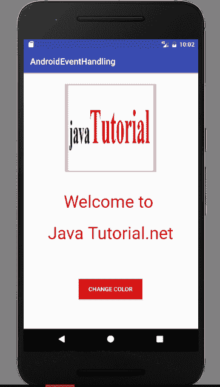
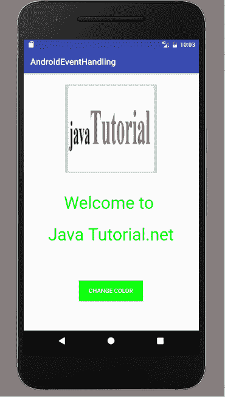
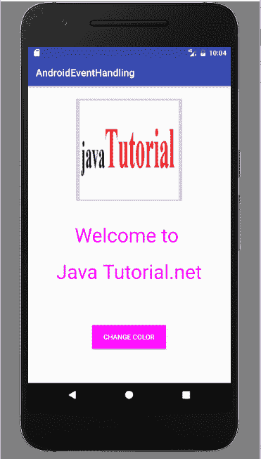
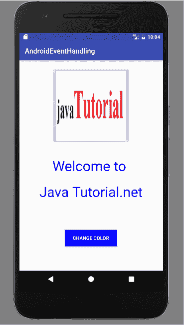

# Android 中的事件处理

> 原文： [https://javatutorial.net/event-handing-android](https://javatutorial.net/event-handing-android)

在先前的教程中，您了解了[活动](https://javatutorial.net/android-activity-example)，[意向](https://javatutorial.net/android-intent-example)和其他内容。 本教程借助示例介绍了 Android 中的事件处理。

## 事件处理

事件是一个动作。 当用户与移动应用程序交互时，会发生这种情况。 Android 中的事件采用多种不同形式，例如按键，触摸输入和许多其他形式。 触摸屏交互属于触摸事件的类别。 Android 框架将所有事件维护在先进先出（FIFO）队列中。 顾名思义，事件处理程序用于处理 Android 中的事件。 事件处理程序和事件监听器是相关概念。

## 事件监听器

它是一个包含回调方法的接口。 当用户触发视图元素时，它将调用这些方法。 以下是一些重要的回调方法：

*   `OnClickListener()`：当用户单击任何 UI 元素（如按钮，文本或图像）时，将调用此事件监听器。`OnClick()`事件处理程序用于处理此监听器。
*   `OnLongClickListener()`：当用户长时间单击任何 UI 元素或按住 UI 元素几秒钟时，将调用此方法。`OnLongClick()`事件处理程序用于处理此监听器。
*   `OnFocusChangeListener()`：当 UI 元素或小部件失去焦点时，将调用此方法。 只需用户向前导航。`OnFocusChange()`事件处理程序用于处理此监听器。
*   `OnKeyListener()`：当用户按下键盘上的键时，将调用此方法。`OnKey()`事件处理程序用于处理此事件。
*   `OnTouchListener()`：当用户触摸屏幕上的任何 UI 元素（例如按下或释放按钮）时，将调用此方法。`OnTouch()`事件处理程序用于处理此监听器。
*   `OnMenuItemClickListener()`：当用户单击或选择菜单项时使用此方法。`OnMenuItemClick()`事件处理程序用于处理此监听器。
*   `OnCreateContextMenuListener()`：`OnCreateContextMenu()`事件处理程序用于处理此监听器。

## 事件处理示例

让我们开始创建一个示例，说明如何在 Android 应用中使用事件处理程序和事件监听器。 打开 Android Studio 并创建一个新项目。 打开您的`activtity_main.xml`并添加测试视图，图像视图和按钮。 这是代码

```java
<?xml version="1.0" encoding="utf-8"?>
<RelativeLayout xmlns:android="http://schemas.android.com/apk/res/android"
    xmlns:tools="http://schemas.android.com/tools"
    android:layout_width="match_parent"
    android:layout_height="match_parent"
    tools:context="MainActivity">

    <TextView
        android:id="@+id/tv_welcome"
        android:layout_width="wrap_content"
        android:layout_height="wrap_content"
        android:text="Welcome to "
        android:textColor="@android:color/holo_red_dark"
        android:textSize="40dp"
        android:layout_centerVertical="true"
        android:layout_centerHorizontal="true" />

    <ImageButton
        android:layout_width="wrap_content"
        android:layout_height="wrap_content"
        android:id="@+id/imageButton"
        android:src="@drawable/message"
        android:layout_alignParentTop="true"
        android:layout_centerHorizontal="true"
        android:layout_marginTop="20dp" />

    <Button
        android:id="@+id/button"
        android:layout_width="150dp"
        android:layout_height="wrap_content"
        android:background="@android:color/holo_red_dark"
        android:text="Change Color"
        android:textColor="@android:color/background_light"
        android:layout_alignParentBottom="true"
        android:layout_centerHorizontal="true"
        android:layout_marginBottom="70dp" />

    <TextView
        android:id="@+id/tv_java"
        android:layout_width="wrap_content"
        android:layout_height="wrap_content"
        android:textColor="@android:color/holo_red_dark"
        android:textSize="40dp"
        android:layout_marginTop="21dp"
        android:text="Java Tutorial.net"
        android:layout_below="@+id/tv_welcome"
        android:layout_centerHorizontal="true" />

</RelativeLayout>
```

现在在`mainActivity.java`中编写代码，当用户单击按钮时，文本的颜色将改变，在此实现`onClickListener()`。 最初，文本颜色为红色，第一次单击时颜色将变为黑色，第二次单击时颜色将变为绿色，依此类推。 这是代码

```java
package com.example.admin.androideventhandling;

import android.graphics.Color;
import android.support.v7.app.AppCompatActivity;
import android.os.Bundle;
import android.view.View;
import android.widget.Button;
import android.widget.TextView;

public class MainActivity extends AppCompatActivity {

    TextView welcome;
    TextView java;
    Button button;
    int i=0;
    @Override
    protected void onCreate(Bundle savedInstanceState) {
        super.onCreate(savedInstanceState);
        setContentView(R.layout.activity_main);
        welcome = (TextView)findViewById(R.id.tv_welcome);
        java = (TextView)findViewById(R.id.tv_java);
        button = (Button) findViewById(R.id.button);

        button.setOnClickListener(new View.OnClickListener() {
            @Override
            public void onClick(View v) {
                if(i==0) {
                    welcome.setTextColor(Color.BLACK);
                    java.setTextColor(Color.BLACK);
                    button.setBackgroundColor(Color.BLACK);
                }
                if(i==1) {
                    welcome.setTextColor(Color.GREEN);
                    java.setTextColor(Color.GREEN);
                    button.setBackgroundColor(Color.GREEN);
                }
                if(i==2) {
                    welcome.setTextColor(Color.BLUE);
                    java.setTextColor(Color.BLUE);
                    button.setBackgroundColor(Color.BLUE);
                }
                if(i==3) {
                    welcome.setTextColor(Color.MAGENTA);
                    java.setTextColor(Color.MAGENTA);
                    button.setBackgroundColor(Color.MAGENTA);
                    i=0;
                }
                i++;
            }
        });
    }

}

```

在这里运行您的应用程序，输出结果看起来像



事件处理

单击按钮后，文本颜色将更改


事件处理颜色变化



事件处理示例



事件处理：洋红色



事件处理：蓝色

您可以通过单击[链接](https://github.com/JavaTutorialNetwork/Tutorials/blob/master/AndroidEventHandling.rar)下载此代码。