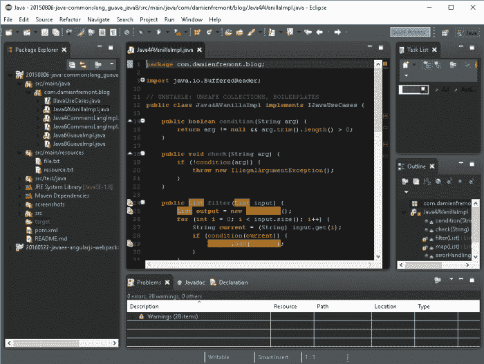
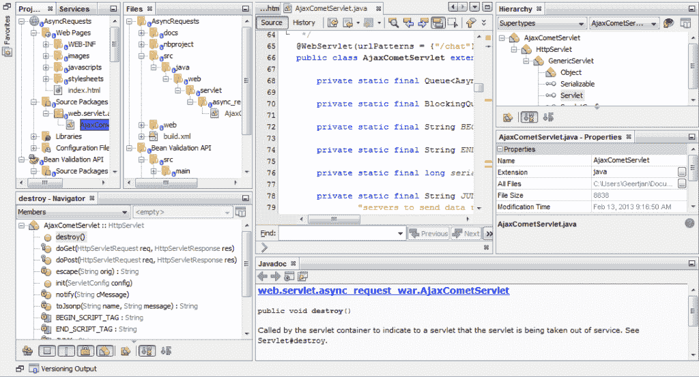
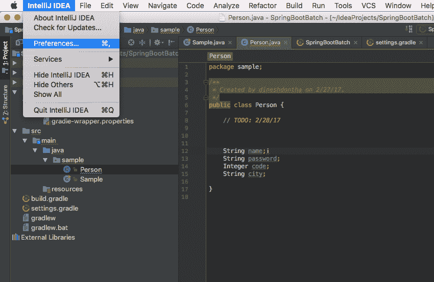

# 选择您的 JAVA IDE：Eclipse，NetBeans 和 IntelliJ IDEA

> 原文： [https://javatutorial.net/choose-your-java-ide-eclipse-netbeans-and-intellij-idea](https://javatutorial.net/choose-your-java-ide-eclipse-netbeans-and-intellij-idea)

在 Java 世界中，有许多集成开发环境或 IDE，它们被视为开发成功的移动应用程序的关键方面。 对于开发人员来说，IDE 是否适合他们的兴趣也很重要。

需要 IDE 或编程编辑器才能使用 Java 类库和框架。 决定哪种 IDE 适合您取决于几件事情，包括正在开发的项目的需求以及团队开发过程。 Eclipse，NetBeans 和 IntelliJ IDEA 是三种最常选择的服务器端 Java 开发。

**在这里，我们对所有这些内容进行简短回顾，以帮助简化选择合适的对象的任务。**

## 您对 JAVA IDE 有什么期望？

马上，您希望您的 IDE 支持最新的 JAVA 版本以及经常使用的 [JVM](https://javatutorial.net/jvm-explained) 语言，例如 Scala，Groovy 等。此外，您希望它支持主要的应用程序服务器和最受欢迎的服务器 Web 框架，例如 Spring MVC，JSF，Struts，GWT，Play，Wicket，Grails 和 Vaadin。 与团队开发版本控制系统兼容的 IDE，例如 Ant， [Maven](https://javatutorial.net/how-to-install-maven-on-windows-linux-and-mac) ，SVN，Mercurial 等。作为一项附加功能，它还应处理客户端和数据库层，嵌入式 JavaScript，HTML， SQL， [JSP](https://javatutorial.net/java-jsp-example) ，Hibernate 和 JAVA API。

## Eclipse

从 2001 年开始，IBM 就发布了 Eclipse 作为开放源代码平台。 它还在开源项目和商业项目中运行。 尽管它以适度的方式启动，但作为主要平台之一，它也已经广泛流行，该平台也以多种不同的语言使用。

使用 [Eclipse](https://www.eclipse.org/downloads/) 的优点是它具有大量可自定义且用途广泛的插件。 它在后台编译代码中工作，并在出现错误时报告错误。 Eclipse 具有 Java 服务器开发的许多编辑，浏览，重构和调试功能。

Eclipse IDE

礼貌– [图片](https://damienfremont.com/2017/06/09/eclipse-ide-install-ui-dark-theme/)

Eclipse 是整个视觉容器，它们提供一组编辑器视图。 基本上，它可以完成您希望 IDE 成为的所有工作，并且可以与大多数工具集成。 开发人员选择 Eclipse 是因为它易于使用和开放源代码平台。 与新手一起工作可能会有点麻烦，但是稳定地使用它会成为一种很棒的经验。

## NetBeans

[NetBeans](https://netbeans.org/) 最初是 Sun 系统的一部分，现在已经落入 Oracle 的掌控之中。 它是一个免费的开源 IDE 平台。 该 IDE 用于为所有版本的 JAVA 开发软件。 它还支持您可以使用的各种插件。

该平台可作为开发 JAVA swing 桌面应用程序的框架。 使用插件和基于平台的应用程序进行开发的 JAVA SE 中的 NetBeans IDE 不需要其他 SDK。

NetBeans IDE

礼貌–图片

NetBeans 提供了多个版本，例如 PHP，JAVA SE，JAVA EE，以及您的项目开发所需的更多版本。 您还可以找到用于许多 Web 技术的工具和编辑器。 NetBeans 支持 JAVA DB，PostgreSQL，MySQL 和 Oracle 的驱动程序，这些驱动程序的排名高于 Eclipse。 数据库资源管理器使您可以在 IDE 中轻松创建，修改和删除记录和表。

## IntelliJ IDEA

作为 JetBrains 一部分的 IntelliJ IDEA 既有免费版本，也有商业版本。 我们已经知道 JetBrains 在 C＃开发中为 Visual Studio 提供了 Resharper 插件。 IntelliJ 支持多种语言，例如 Clojure，Groovy，Scala，Java 等。 它还具有高级预测，代码分析和智能代码完成等功能。 主要针对企业领域的最终商业版本支持 PHP，Ruby，Python，SQL 和 ActionScript。

IntelliJ IDEA IDE

最近，它发布了版本 12，该版本带有用于 Android 应用开发的新 Android UI。 它允许用户使用其内置的 Swing 组件提交更多插件，并具有多个用户编写的企业版插件。

Eclipse，Netbeans 和 IntelliJ IDEA 甚至还有许多其他选择。 例如，Visual Studio 也可以利用最新的工具和服务为使用云的设备创建出色的应用程序。 其他选项基于基于 [IntelliJ IDEA](https://www.jetbrains.com/idea/) android 开发环境的 Android Studio，为构建出色应用程序提供完整工具集的 Xcode 和为专业 PHP 和 Web 开发人员提供的 PhpStorm IDE。

## 结论

我们看到了上面的 Eclipse，NetBeans 和 IntelliJ IDEA 之间的比较，并且还发现了一些其他适合不同目的的替代方案。 这完全取决于开发人员和项目要求，这是最适合他们的 IDE。

其中，Eclipse 被认为是广泛使用的 IDE，因为它是一个开放源代码，也允许它用于个人和企业目的。 所有不同的 IDE 都有不同的用途，因此使用适当的平台构建用户友好的应用程序是开发人员的最终选择或优先考虑。 因此，始终建议您基本安装所有 IDE 平台，对其进行操作，然后根据您的项目要求和开发人员友好程度明智地选择最方便的平台。

**作者简介**

Kibo Hutchinson 是 [TatvaSoft UK](https://www.tatvasoft.co.uk/) 的技术分析师，该公司是位于伦敦的基于 Java 和大数据开发公司。 她坚信应该共享知识，在这篇文章中，她正在分享对 Java 的见解。