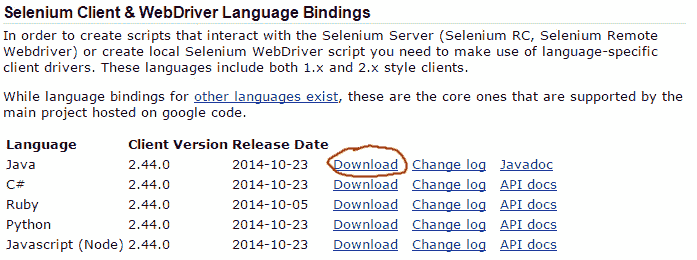

# Selenium Java 教程

> 原文： [https://javatutorial.net/selenium-java-tutorial](https://javatutorial.net/selenium-java-tutorial)

本教程将说明如何使用 Java 运行 Selenium WebDriver

[Selenium](http://www.seleniumhq.org/ "Selenium") 是用于测试 Web 应用程序的强大框架。 使用 Selenium，您可以自动浏览，单击和提交网页上的表单。 对网络应用程序进行更改后，最好通过一些手动和自动测试来运行它并验证一切是否正常运行。 本教程将向您展示如何使用 Java 编程语言编写测试脚本。 我假设您已经对 Java 有一定的经验。 如果没有阅读，请先阅读我们的 [Java 初学者教程](http://javatutorial.net/category/java-basics "Java Beginner Tutorials")。

## Selenium Maven 构建

如果您使用 [Maven](https://javatutorial.net/how-to-install-maven-on-windows-linux-and-mac) 来构建项目，请在`.pom`文件中使用以下依赖项

```java
<dependency>
    <groupId>org.seleniumhq.selenium</groupId>
    <artifactId>selenium-java</artifactId>
    <version>2.44.0</version>
</dependency>
```

## `Selenium.jar`文件

如果您喜欢老式的方法，则必须从 Selenium 网站下载所需的`.jar`。

1. 转到[ Selenium 下载页面](http://www.seleniumhq.org/download/)

2. 下载 Java 2.xx zip 文件

    

3. 将`selenium-java-2.44.0.jar`和所有 jar 从`libs`文件夹复制到您的项目中

## Selenium 控制台示例

这是一个基本的 Selenium Java 示例。 它使用默认的`HtmlUnitDriver`以类似控制台的样式提取页面标题。

```java
import org.openqa.selenium.WebDriver;
import org.openqa.selenium.htmlunit.HtmlUnitDriver;

public class SeleniumConsoleExample {
	public static void main(String[] args) {
		// Create HTML Unit Driver - this is the build in Selenium client
        	WebDriver driver = new HtmlUnitDriver();

        	// go to url
        	driver.get("http://javatutorial.net");

        	// Check the title of the page
        	System.out.println("Page title is: " + driver.getTitle());

        	driver.quit();
	}
}
```

## Selenium Firefox 示例

在许多情况下，您将需要 Selenium 与动态创建的元素一起使用。 为此，您将需要一个类似 Firefox 或 Google Chrome 的浏览器窗口。

以下示例需要在默认位置安装 Firefox Web 浏览器。

1. Selenium 将打开一个单独的 Firefox 窗口并转到 https://javatutorial.net

2. 查看此页面顶部的搜索按钮（放大镜），是 - 当前正在阅读的页面顶部 🙂 Selenium 将光标移至该位置以显示搜索字段

3. 它将输入搜索词“java”并提交表格

4. 等待 5 秒钟，然后关闭浏览器窗口

```java
import org.openqa.selenium.By;
import org.openqa.selenium.WebDriver;
import org.openqa.selenium.WebElement;
import org.openqa.selenium.firefox.FirefoxDriver;
import org.openqa.selenium.interactions.Actions;
import org.openqa.selenium.support.ui.ExpectedConditions;
import org.openqa.selenium.support.ui.WebDriverWait;

public class SeleniumFirefoxExample {
	public static void main(String[] args) throws Exception {
		// create a Firefox Web Driver
		WebDriver driver = new FirefoxDriver();
		// open the browser and go to JavaTutorial Network Website
		driver.get("https://javatutorial.net");

		// find the search button on the page
		WebElement searchButton = driver.findElement(By
				.className("search-submit"));
		// create an action handler
		Actions actions = new Actions(driver);
		// use the action handler to move the cursor to given element
		actions.moveToElement(searchButton).perform();

		// wait until the search field is presented on the webpage and create an
		// element
		WebElement searchField = (new WebDriverWait(driver, 10))
				.until(ExpectedConditions.presenceOfElementLocated(By.name("s")));

		// puts the text "java" into the search field
		searchField.sendKeys("java");
		// submit the search (submit the form)
		searchField.submit();

		// wait 5 seconds and close the browser
		Thread.sleep(5000);
		driver.quit();
	}
}

```

## Selenium Chrome 示例

要使 Selenium 使用 Google Chrome 浏览器，您需要下载并运行独立的 Chrome WebDriver。

1.下载适用于您操作系统的 [Chrome Web 驱动程序](http://chromedriver.storage.googleapis.com/index.html?path=2.13/)，该归档文件包含一个可执行文件

2.启动可执行文件 – 它将在端口 9515 上运行本地服务器

3.在您的代码中像这样创建 WebDriver：

```java
URL local = new URL("http://localhost:9515");
WebDriver driver = new RemoteWebDriver(local, DesiredCapabilities.chrome());
```

这是与上述使用 Chrome 网络驱动程序相同的示例：

```java
import java.net.URL;

import org.openqa.selenium.By;
import org.openqa.selenium.WebDriver;
import org.openqa.selenium.WebElement;
import org.openqa.selenium.interactions.Actions;
import org.openqa.selenium.remote.DesiredCapabilities;
import org.openqa.selenium.remote.RemoteWebDriver;
import org.openqa.selenium.support.ui.ExpectedConditions;
import org.openqa.selenium.support.ui.WebDriverWait;

public class SeleniumChromeExample {
	public static void main(String[] args) throws Exception {
		// create a Chrome Web Driver
		URL local = new URL("http://localhost:9515");
		WebDriver driver = new RemoteWebDriver(local, DesiredCapabilities.chrome());

		// open the browser and go to JavaTutorial Network Website
		driver.get("http://javatutorial.net");

		// find the search button on the page
		WebElement searchButton = driver.findElement(By
				.className("search-submit"));
		// create an action handler
		Actions actions = new Actions(driver);
		// use the action handler to move the cursor to given element
		actions.moveToElement(searchButton).perform();

		// wait until the search field is presented on the webpage and create an
		// element
		WebElement searchField = (new WebDriverWait(driver, 10))
				.until(ExpectedConditions.presenceOfElementLocated(By.name("s")));

		// puts the text "java" into the search field
		searchField.sendKeys("java");
		// submit the search (submit the form)
		searchField.submit();

		// wait 5 seconds and close the browser
		Thread.sleep(5000);
		driver.quit();
	}
}
```