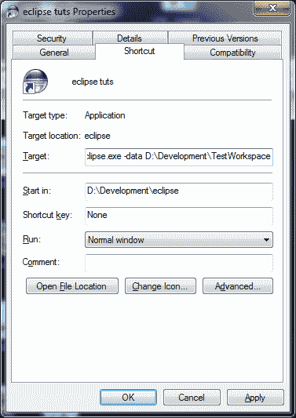

# 使用特定工作区运行 Eclipse

> 原文： [https://javatutorial.net/run-eclipse-with-specific-workspace](https://javatutorial.net/run-eclipse-with-specific-workspace)

如果您维护大量项目，则在不同的工作区中拆分工作是一个好习惯。 例如。 您有一个工作区用于 Android 开发，一个工作区用于测试，一个工作区用于生产。

工作区按目录组织。 您必须为每个工作区创建单独的目录。 之后，您可以使用`-data`命令行参数将日食指向特定的工作空间

```java
[path to eclipse] -data [workspace path]
```

在 Windows 环境中，右键单击 Eclipse 快捷方式，然后选择“属性”。



Eclipse 属性对话框

例如，如果要使用 TestWorkspace 启动 Eclipse，请在“目标”字段中输入以下内容：

```java
D:\Development\eclipse\eclipse.exe -data D:\Development\TestWorkspace
```