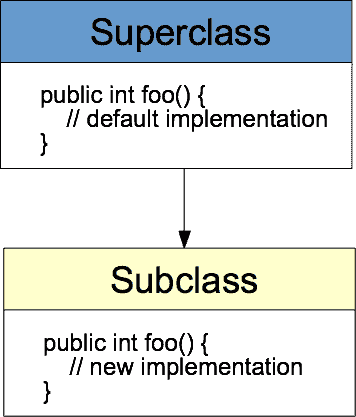

# Java 中的方法重载与方法覆盖

> 原文： [https://javatutorial.net/method-overloading-vs-method-overriding-in-java](https://javatutorial.net/method-overloading-vs-method-overriding-in-java)

本文通过示例演示了 Java 中方法重载和方法覆盖之间的区别

**方法重载**和**方法覆盖**都是在各种 Java 实现中高度使用的 OOP（面向对象编程）概念。 在本文中，我们已经写了关于 OOP 的 4 个主要概念的文章。 如果您不熟悉 OOP，请先查看[此文章](https://javatutorial.net/java-oop)。

方法重载与方法重载是一个常见的 Java 工作面试问题。 去面试，我们不能不知道有什么区别。

## 什么是方法重载？

如下面的示例所示，方法重载使我们能够使用**相同名称，相同或不同返回类型**的多个方法。 方法重载的重要之处在于，对于同一个返回类型，所有这些方法必须具有**不同的参数**。 通常的做法是保留参数最多的方法的实现，而其他方法（参数较少的）仅重定向到较多方法，为缺少的参数提供默认值，如下所示：

```java
public int calculate(int data[]) {
	return calculate("Default calculation", data, 0);
}
public int calculate(String name, int data[]) {
	return calculate(name, data, 0);
}
public int calculate(String name, int data[], int offset) {
	// do all the calculations here
}
```

## 什么是方法覆盖？

方法覆盖是 [Java 继承](https://javatutorial.net/java-inheritance-example) OOP 原理的一部分。 方法覆盖的思想是在子类中更改给定方法的实现。 换句话说，您使用方法的相同签名（名称，返回类型，参数）“替代”了父类方法的实现，但是在覆盖方法内部实现了不同的功能。



Java 中的方法覆盖

## Java 中的方法重载示例

下面的示例演示方法重载的用法。 我们有 4 个名称相同，参数和返回类型不同的方法

```java
package net.javatutorial;

public class OverloadingExample {

	static int sumOf(int a, int b) {
		return a+b;
	}

	static int sumOf(int a, int b, int c) {
		return a+b+c;
	}

	static double sumOf(double a, double b) {
		return a+b;
	}

	static double sumOf(double a, double b, double c) {
		return a+b+c;
	}

	public static void main(String[] args) {
		System.out.println(sumOf(1,2));
		System.out.println(sumOf(10d,20d,30d));
	}
}
```

该程序的输出为：

```java
3
60.0
```

如您在上面的示例中看到的，基于我们使用的参数调用了另一种方法。 这是增加程序可读性的好方法。

## Java 中的方法覆盖示例

动物超类

```java
package net.javatutorial;

public class Animal {

	public void makeSound() {
		System.out.println("the animal makes sounds");
	}

}
```

狗子类具有相同的方法，但行为不同

```java
package net.javatutorial;

public class Dog extends Animal{

	@Override
	public void makeSound() {
		System.out.println("the dog barks");
	}

}
```

请注意`@Override`注解的用法。 这不是强制性的，但是最好对被覆盖的方法进行注解，以提高代码的可读性。