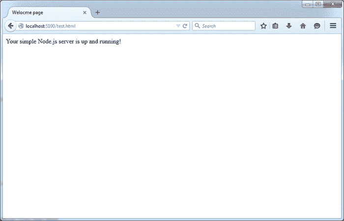

# 如何运行 NodeJS 服务器

> 原文： [https://javatutorial.net/how-to-run-nodejs-server](https://javatutorial.net/how-to-run-nodejs-server)

在此页面上，我将向您展示如何设置和运行 Node.js Web 服务器以在本地计算机上托管静态 Web 应用程序。

Node.js 轻巧高效。 我们可以使用它来将 Web 应用程序部署到我们的本地主机或远程主机。 它非常易于使用和设置

## 下载 Node.js

转到 Node.js 下载页面。 [https://nodejs.org/download/](https://nodejs.org/download/) 。 每个操作系统都有 2 个选项 - 安装程序和独立可执行文件。 您可以下载适合您的操作系统的文件。

## 设置 Node.js

浏览到已安装（或解压缩）node.js 的文件夹。

在与节点可执行文件相同的文件夹中创建一个名为`public_html`的文件夹 - 我们将使用此文件夹进行 Web 项目

在与节点可执行文件相同的文件夹中创建具有以下内容的新文件`webserver.js`

```java
var connect = require('connect');
var serveStatic = require('serve-static');

var app = connect();
app.use(serveStatic("public_html"));
app.listen(5100);
```

这个简单的 JavaScript 代码实现了一个 Web 服务器，该服务器为 [http://localhost:5100](http://localhost:5100) 上托管的静态 HTML 文件提供 HTTP 请求。 假定您在`node.exe`（适用于 Windows）或节点可执行文件（OSX 和 Linux）所在的同一文件夹中创建`public_html`文件夹

现在，从 Node.js 安装文件夹中运行这两个命令（这将安装运行静态页面所需的两个模块）

```java
npm install connect
npm install serve-static
```

使用以下命令启动新服务器

```java
node webserver.js
```

## 创建示例页面并测试服务器

在`public_html`文件夹中创建一个名为`test.html`的新文件，其内容如下：

```java
<!DOCTYPE html>
<html>
<head>
	<title>Welocme page</title>
</head>
<body>
	Your simple Node.js server is up and running!
</body>
</html>
```

现在打开浏览器并输入 [http://localhost:5100/test.html](http://localhost:5100/test.html)

如果一切顺利，您应该在浏览器中看到以下内容



Node.js 测试页

如果您喜欢本教程，请分享并发表评论。