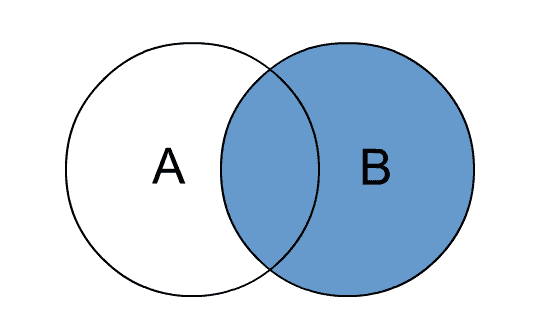
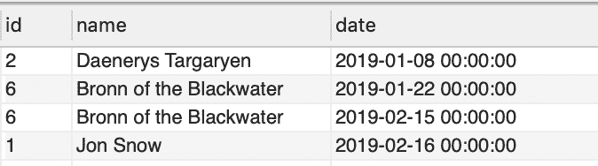

# SQL 右连接示例

> 原文： [https://javatutorial.net/sql-right-join-example](https://javatutorial.net/sql-right-join-example)

本文介绍了 SQL `RIGHT JOIN`语法，并提供了有关如何使用`RIGHT JOIN`的示例

**右连接**返回右表中的所有值，以及左表中的匹配值。 如果左表中没有与右表中给定记录匹配的结果，则返回的结果将为`NULL`。

`RIGHT JOIN`和`RIGHT OUTER JOIN`的术语相同。

您可以使用以下链接查看不同类型的 SQL `JOIN`：

1.  [内连接](https://javatutorial.net/sql-inner-join-example)
2.  [左连接](https://javatutorial.net/sql-left-join-example)
3.  [右连接](https://javatutorial.net/sql-right-join-example)
4.  [外连接](https://javatutorial.net/sql-outer-join-example)

## 右连接视觉表示



SQL 右连接

## 右连接语法

该查询将返回左表（表 A）中的所有记录，无论这些记录中的任何一个在右表（表 B）中是否匹配

```java
SELECT Table_A.column1, Table_B.column2...
FROM Table_A A
RIGHT JOIN Table_B B
ON A.Key = B.Key
```

## 右连接示例

我们将创建 3 个表

1.  `CUSTOMER`
2.  `PRODUCT`
3.  `ORDER`

客户可以订购产品。 在`ORDER`表中，我们保存了客户 ID 和客户已订购的每种产品的数量。


数据库图显示客户，产品和订单关系

使用以下 SQL 脚本创建三个表。

创建`CUSTOMER`表

```java
CREATE TABLE `CUSTOMER` (
  `id` INT NOT NULL,
  `name` VARCHAR(45) NOT NULL,
  PRIMARY KEY (`id`));
```

创建`PRODUCT`表

```java
CREATE TABLE `PRODUCT` (
  `id` INT NOT NULL,
  `name` VARCHAR(45) NOT NULL,
  `price` DECIMAL(7,2) NOT NULL,
  PRIMARY KEY (`id`));
```

创建`ORDER`表

```java
CREATE TABLE `ORDER` (
  `id` INT NOT NULL,
  `date` DATETIME NOT NULL,
  `customer_id` INT NOT NULL,
  `product_id` INT NOT NULL,
  `quantity` INT NOT NULL,
  PRIMARY KEY (`id`),
  INDEX `product_id_idx` (`product_id` ASC) VISIBLE,
  INDEX `customer_id_idx` (`customer_id` ASC) VISIBLE,
  CONSTRAINT `customer_id`
    FOREIGN KEY (`customer_id`)
    REFERENCES `CUSTOMER` (`id`),
  CONSTRAINT `product_id`
    FOREIGN KEY (`product_id`)
    REFERENCES `PRODUCT` (`id`));
```

在`CUSTOMER`表中插入数据

```java
INSERT INTO `CUSTOMER` (`id`, `name`) VALUES ('1', 'Jon Snow');
INSERT INTO `CUSTOMER` (`id`, `name`) VALUES ('2', 'Daenerys Targaryen');
INSERT INTO `CUSTOMER` (`id`, `name`) VALUES ('3', 'Sansa Stark');
INSERT INTO `CUSTOMER` (`id`, `name`) VALUES ('4', 'Arya Stark');
INSERT INTO `CUSTOMER` (`id`, `name`) VALUES ('5', 'Jorah Mormont');
INSERT INTO `CUSTOMER` (`id`, `name`) VALUES ('6', 'Bronn of the Blackwater');

```

在`PRODUCT`表中插入数据

```java
INSERT INTO `PRODUCT` (`id`, `name`, `price`) VALUES ('1', 'Dragon', '5000');
INSERT INTO `PRODUCT` (`id`, `name`, `price`) VALUES ('2', 'Castle', '1000');
INSERT INTO `PRODUCT` (`id`, `name`, `price`) VALUES ('3', 'Sword', '5');
```

在`ORDER`表中插入数据

```java
INSERT INTO `ORDER` (`id`, `date`, `customer_id`, `product_id`, `quantity`) VALUES ('1', '2019-01-08 00:00:00', '2', '1', '3');
INSERT INTO `ORDER` (`id`, `date`, `customer_id`, `product_id`, `quantity`) VALUES ('2', '2019-01-22 00:00:00', '6', '3', '1');
INSERT INTO `ORDER` (`id`, `date`, `customer_id`, `product_id`, `quantity`) VALUES ('3', '2019-02-15 00:00:00', '6', '2', '1');
INSERT INTO `ORDER` (`id`, `date`, `customer_id`, `product_id`, `quantity`) VALUES ('4', '2019-02-16 00:00:00', '1', '3', '1');

```

### 数据库表

现在这就是我们表中的内容：


客户表


产品表


订单表

### 右连接表

现在，让我们使用`RIGHT JOIN`连接这些表

该查询返回客户详细信息和购买日期

```java
SELECT `CUSTOMER`.id, `CUSTOMER`.name, `ORDER`.date
FROM `CUSTOMER`
RIGHT JOIN `ORDER` 
ON `CUSTOMER`.id = `ORDER`.customer_id;
```



右连接结果集

**免责声明**：上面显示的示例已经在 MySQL 上进行了测试。 根据您的 SQL 数据库，`CREATE TABLE`语法可能有所不同。