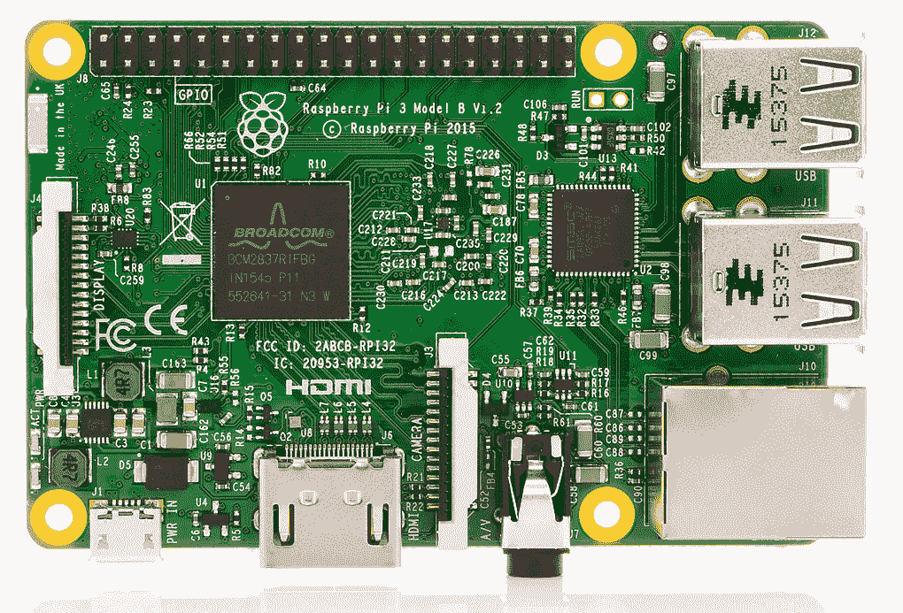
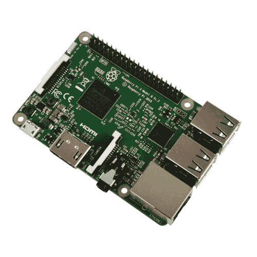
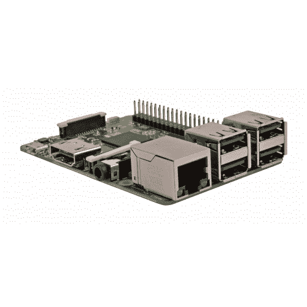

# Raspberry Pi 3 规格

> 原文： [https://javatutorial.net/raspberry-pi-3](https://javatutorial.net/raspberry-pi-3)

对所有 Raspberry Pi 迷来说都是好消息 – **Raspberry Pi 3 Model B** 现在正式发售

Raspberry Pi 3 模型 B

Raspberry Pi 2 发行一年后，以及最初的 Raspberry Pi Model B 首次发行后正好四年，自 2016 年 2 月 29 日以来，**现已正式发售最畅销的信用卡大小的第三代计算机**。

四年来，Raspberry Pi 开始了一场革命。 全世界的人们都在用小型木板建造无数的项目，例如机器人，自动宠物喂食器，比特币农场，海盗无线电发射器等等。 有了这个板，“您的想象力是唯一的极限”一词成真了。 根据制造商的说法，Raspberry Pi 3 将带来巨大的性能提升，因此请保留所有即将出现的新发明。

树莓派 3

**新型号的价格为 $35** ，与现有 Raspberry Pi 2 的价格相同。创作者说，他们已经设法改善了制造工艺。 由于它，Pi 3 以与版本 2 相同的价格提供了 Pi 1 的 10 倍的功能。

由于世界范围内的需求仍然很高，因此不会停止生产旧型号。 Pi 1 Model B+ 将继续以 25 美元的价格出售，Pi 2 Model B+ 将保持 35 美元的价格。

## Raspberry Pi 3 有什么新功能？

*   新的 **1.2GHz 64 位四核** ARM Cortex-A53 CPU。 该型号为 Broadcom BCM2837，ARM 7 版处理器
*   1 GB 的 RAM 类型 DDR2 PoP（包装上的包装）
*   Broadcom VideoCore IV GPU 能够**以 60 fps 播放 1080p 视频**
*   1 x 10/100 以太网连接
*   **集成 802.11n 无线 LAN** 
*   **集成蓝牙 4.1**
*   4 个 2.0 USB
*   1 个 HDMI

还与 Raspberry Pi 1 和 2 完全兼容。 所有连接器都位于同一位置，并且具有相同的功能，并且该板仍可通过 5V 微型 USB 电源适配器运行。

Raspberry Pi 3 端口

## 去哪买？

由于需求量大，目前大多数零售商缺货。 但是，您可能会遇到一些运气，并在接下来的几天内实现交付。

这是零售商列表。 如果您找到其他来源，请在以下评论中添加它们：

[RS](http://uk.rs-online.com/web/generalDisplay.html?id=raspberrypi)