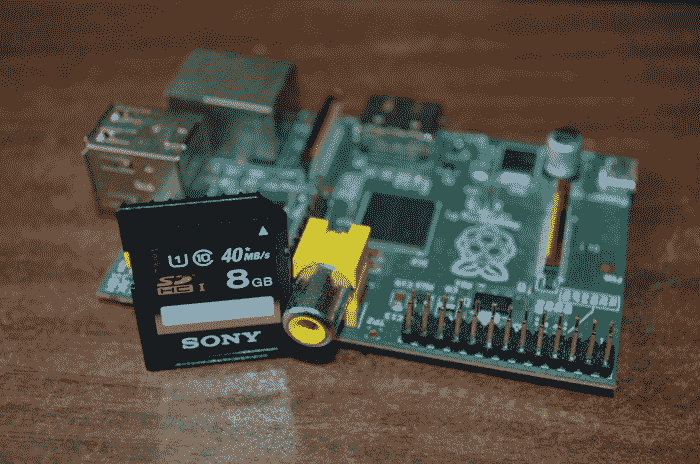
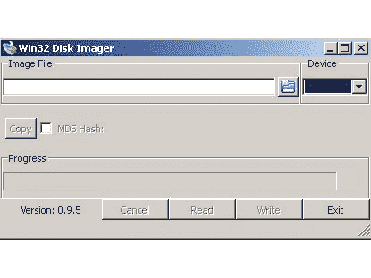

# 将 Raspbian 安装到 SD 卡

> 原文： [https://javatutorial.net/install-raspbian-to-sd-card](https://javatutorial.net/install-raspbian-to-sd-card)

本教程将向您展示如何将 Raspbian OS 安装到 SD 卡



## 前提条件

现在，您将需要一台内置 SD 卡或内置 SD 卡的 PC / Mac。 我建议至少使用 4GB SD 卡 Class 10。该卡必须是 FAT 32 格式，然后才能对其应用 Raspbian 映像。

## 下载 Raspbian

尽管有几种可能的 Raspberry Pi 操作系统可供下载，但我还是建议您使用 Raspbian –它具有许多高级功能，并且是 NOOBS 出现之前的官方 Raspberry OS。

要下载 Raspbian 映像，请转到[下载页面](http://www.raspberrypi.org/downloads/ "Raspberry Pi Download page")，然后选择“ZIP 或 Torrent”。 如果您下载 ZIP，请解压缩以解压缩`.img`文件

## 使用 Windows 将 Raspian 映像安装到 SD 卡



1. 下载 [Win32DiskImager](http://sourceforge.net/projects/win32diskimager/ "Win32DiskImager") 实用程序并安装它

2. 以管理员身份运行程序

3. 浏览您最近下载的`.img`文件

4. 在设备–下拉列表中选择 SD 卡的名称

5. 按“写入”按钮

## 使用 Mac OS 将 Raspian 映像安装到 SD 卡

1.  从 Apple 菜单中，选择“关于本机”，然后单击“系统报告”。

2.  单击读卡器，然后在窗口右上方搜索您的 SD 卡。 单击它，然后在右下方搜索 BSD 名称； 它看起来像`diskn`，其中`n`是一个数字（例如`disk2`）。 确保记下这个数字

3.  打开磁盘工具并卸载 SD 卡。 不要弹出

4.  打开终端并运行：

    ```java
    sudo dd bs=1m if=path_of_your_image.img of=/dev/diskn
    ```

    不要忘记将第 2 步中的磁盘名称替换为 diskn

5.  在将映像内容移至 SD 卡之前，请耐心等待，具体取决于您的硬件，此过程可能需要 20 分钟或更长时间

在我的下一个教程[“Raspberry 首次启动”](http://javatutorial.net/raspberry-pi-first-start "Raspberry Pi First Start") 中，我将说明如何插入电缆并首次启动 Raspberry。