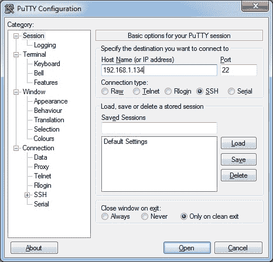
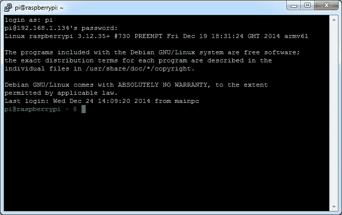
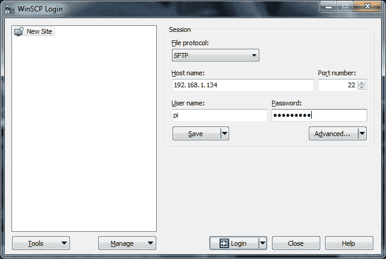

# 远程连接到 Raspberry Pi

> 原文： [https://javatutorial.net/connect-remotely-to-raspberry-pi](https://javatutorial.net/connect-remotely-to-raspberry-pi)

在本教程中，我将向您展示如何从 PC 或 Mac 远程连接到 Raspberry Pi。

在[首次启动 Raspberry](http://javatutorial.net/raspberry-pi-first-start "Raspberry Pi First Start") 之后，您无需使其与鼠标，键盘和显示器一直保持连接状态–您可以使用 Mac 或 PC 进行远程控制。 对于本教程，仅保留 LAN 电缆和电源连接。 当然，您还必须启动 Raspberry。 绿色指示灯亮起后，即可开始远程连接。

## 在 Raspbian 上启用 SSH

从 2016 年 11 月版本开始，Raspbian 默认禁用 SSH 服务器。 可以启用：

**从桌面手动**

1.  从`Preferences`菜单启动`Raspberry Pi Configuration`
2.  转到`Interfaces`标签
3.  选择`SSH`旁边的`Enabled`
4.  点击`OK`

**或者，可以使用`raspi-config`**

1.  在终端窗口中输入`sudo raspi-config`
2.  选择`Interfacing Options`
3.  导航并选择`SSH`
4.  选择`Yes`
5.  选择`Ok`
6.  选择`Finish`

**用于无头设置**

可以通过将名为`ssh`的文件（没有任何扩展名）放置在 SD 卡的启动分区上来启用 SSH。 Pi 启动时，它会寻找`ssh`文件。 如果找到，则启用 SSH，并删除该文件。 文件的内容无关紧要：它可以包含文本，也可以完全不包含任何文本。

## 与电脑连接

PuTTY 是 Windows 的免费 SSH 客户端。 [从官方页面下载](http://www.chiark.greenend.org.uk/~sgtatham/putty/download.html)可执行文件（`putty.exe`）。

启动 PuTTY。 在“主机名（或 IP 地址）”下输入 Raspberry 的 IP，并将端口保留为 22。现在按“打开”按钮。



在下一个屏幕中，输入您的用户名和密码。

默认的 Raspbian 用户是：`pi`

密码为：`raspberry`



好的！ 现在您已连接，您可以执行所需的任何 linux 命令。

注意：我建议从路由器为 Raspberry 分配一个静态 IP。 这样，您无需在路由器每次为其分配新 IP 时检查 Raspberry 的 IP。

## 在 PC 和 Raspberry Pi 之间传输文件

我想向您展示的另一个有用的工具是 WinSCP。 这是一个安全的 FTP 客户端，使您能够从 Raspberry Pi 传输文件或将文件传输到 Raspberry Pi。

您可以从[官方项目网站](http://winscp.net/eng/download.php)下载 WinSCP。



下载并安装后，输入 Raspberry 的 IP，用户名和密码，然后单击“登录”按钮。

## 从 Mac 连接

打开终端并输入：

```java
ssh pi@192.168.1.134
```

系统将提示您输入密码。

不要忘记在此处替换`pi@192.168.1.134`的用户名`pi`（如果已更改）和该 IP，以您当前的 Raspberry Pi IP